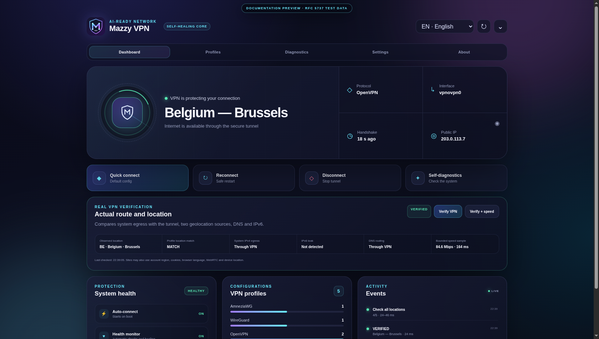

# Mazzy VPN — English guide

Created and maintained by
[Nik m (@mazurovn)](https://github.com/mazurovn).

Mazzy VPN is a source-available AI-ready VPN client for Linux with Desktop, tray,
an interactive terminal UI and an automation-friendly CLI. It is built for
stable AI sessions and agents, learning, video, the open web, remote work and
corporate portals. It combines AmneziaWG, WireGuard, OpenVPN and NetworkManager
L2TP/IPsec, safely imports profiles, measures every location, verifies actual
egress/location/DNS/IPv6, maintains one managed tunnel and rolls back to the
previously active managed or external VPN after failure.

It is a client and control plane rather than a hosted VPN subscription. Use
profiles from your VPN provider or organization; Mazzy VPN requires no project
account and collects no telemetry.

The current release source line is [CLI/TUI 1.4.7](https://github.com/mazurovn/mazzy-vpn/releases/tag/v1.4.7)
and the [Desktop 0.4.8 DEB release](https://github.com/mazurovn/mazzy-vpn/releases/tag/desktop-v0.4.8).
A version is published only when its linked tag and GitHub Release page exist.
Linux Desktop bundles and starts its compatible engine without requiring a
separately installed or running CLI. Existing CLI installations remain
compatible. Windows, macOS, Android, AppImage and RPM artifacts are not
published in this DEB-only release line; package-managed updates use APT/dpkg.
Issue #31 is closed with the reviewed
upstream `glib` backport, exact source-provenance verification and clean
default-branch RustSec, Dependabot and CodeQL results.

The versioned catalog now contains 13 protocols. Functional Linux connection
backends remain AmneziaWG, WireGuard, OpenVPN and L2TP/IPsec. VLESS/REALITY,
Hysteria 2, Mieru, NaiveProxy, TUIC v5, Shadowsocks 2022, Trojan, AnyTLS and
ShadowTLS v3 now have a validated registry, redacted capability API and safe
share URI/JSON classification where unambiguous. All nine also have a closed
neutral profile validator and atomic secret-safe Linux import. Six have a
closed sing-box config renderer, while Mieru/Naive sidecars and the ShadowTLS
inner chain remain planned. Connection adapters remain explicitly `planned`
until engine supply and TUN/routing/rollback/leak integration tests pass.

The primary command is `mazzy-vpn`. The installer also creates the compatibility
aliases `vpnctl` and `mazzyvpn`.

[Architecture and operation diagrams](docs/ARCHITECTURE.en.md) ·
[local API v1 contract](docs/API_CONTRACT.en.md) ·
[protocol and AI orchestration](docs/PROTOCOL_ORCHESTRATION.en.md) ·
[reverse agent-control architecture](docs/AGENT_CONTROL_ARCHITECTURE.en.md) ·
[deep target architecture and delivery DAG (RU)](docs/TARGET_ARCHITECTURE_2026-08-02.ru.md) ·
[R0a mutation single-flight specification (RU)](docs/R0_MUTATION_SINGLE_FLIGHT.ru.md) ·
[Архитектура на русском](docs/ARCHITECTURE.ru.md)

Release 1.4.0 moves API lifecycle, direct CLI, recovery,
health remediation and service-policy commands onto the shared
`/run/vpnctl/.mutation.lock`. This removes the confirmed split-lock race but is
not the target `mazzy-vpnd`: a common journal for every root path and proof of
route/DNS/firewall/leak restoration remain P0 work.

Agent-safe protocol inventory and detection:

```bash
mazzy-vpn protocols list --json
mazzy-vpn protocols diagnose --json
mazzy-vpn protocols adapters --json
printf '%s\n' "$SHARE_URI" | mazzy-vpn protocols detect --stdin --json
mazzy-vpn protocols managed-validate --stdin --json < profile.json
mazzy-vpn protocols managed-import profile.json --dry-run --json
mazzy-vpn agent-transports list --json
mazzy-vpn agent-transports diagnose --json
```

The agent-control catalog is a separate reverse-control layer for Web, CLI and
Telegram clients. Desktop 0.4 adds Codex/Claude discovery and
catalog diagnostics only. Provider start/pair/stop is absent from renderer and
Tauri IPC until native approval, trusted executable resolution and process-tree
containment exist.
The separately packaged Linux `mazzy-agentd` implements the paired local
LAN-WSS egress capability slice. It does not make the Desktop diagnostics screen
an agent launcher: the other six adapters, relay/E2EE, Web/Telegram clients and
agent-provider lifecycle remain planned. Diagnostics distinguishes an installed
binary from a configured, running instance.

## Go native CLI (v2.1.0)

The v2 line ships a single, statically-linked Go binary (`mazzy-vpn`) that
**embeds** the AmneziaWG/WireGuard engine (vendored `amneziawg-go` v3.1). It
needs **no** `awg`, `awg-quick`, `wg` or `jq`, and `CGO_ENABLED=0` makes it
portable across Linux hosts. Sources: [`core/`](core/) (engine) and
[`mazzy-vpn-cli/`](mazzy-vpn-cli/) (CLI + TUI).

```bash
# From the v2.1.0 release tarball:
tar xzf mazzy-vpn-go-2.1.0-linux-amd64.tar.gz
cd release-v2.1.0 && sudo ./install.sh    # static binary, no apt/compilation

mazzy-vpn language --list        # en/ru/de/zh/ja/ko (default English)
mazzy-vpn language               # interactive language menu
mazzy-vpn best                   # connect the cleanest live server
mazzy-vpn providers              # AI provider reachability
mazzy-vpn stealth                # detection score
mazzy-vpn control id             # control-plane identity (AI-native)
```

**Six UI languages**, English by default; the language is resolved from the
saved setting, then `MAZZY_LANG`/`LC_ALL`/`LC_MESSAGES`/`LANG`, with no
hardcoding. Full reference:
[Go CLI wiki](https://github.com/mazurovn/mazzy-vpn/wiki/Go-CLI).

## Install (legacy bash CLI)

```bash
cd /path/to/mazzy-vpn
sudo ./install.sh --yes
mazzy-vpn
```

Interactive installation starts with a choice of Russian, English, German,
Chinese, Japanese or Korean. For unattended installation:

```bash
sudo ./install.sh --lang en --yes
```

Useful installer options:

```bash
sudo ./install.sh --config-dir ~/VPN-configs
sudo ./install.sh --config-dir ~/VPN-configs --force-configs
sudo ./install.sh --no-deps
sudo ./install.sh --live-test
./install.sh --dry-run --yes
./install.sh --destdir /tmp/mazzy-stage --no-deps
```

By default the installer:

1. verifies the source package and Bash syntax;
2. runs the bundled regression suite;
3. installs supported dependencies;
4. installs `mazzy-vpn`, aliases, Bash completion, profiles and systemd units;
5. validates systemd units and every installed profile;
6. runs `mazzy-vpn self-test --offline`.

`--live-test` is intentionally opt-in because it connects every valid profile
one by one. Each live test has a timeout and a rollback transaction.

## Import a folder of VPN profiles

Create a clean folder structure:

```bash
mazzy-vpn init-config-dir ~/MazzyConfigs
```

This creates:

```text
MazzyConfigs/
├── amneziawg/
├── wireguard/
├── openvpn/
└── l2tp/
```

Profiles may also be mixed or nested. Scan without changing the system:

```bash
mazzy-vpn import-dir ~/VPN-configs --dry-run
```

Import all recognized and valid profiles:

```bash
sudo mazzy-vpn import-dir ~/VPN-configs
```

Mazzy VPN recognizes:

- AmneziaWG and WireGuard `*.conf` files by their sections and directives;
- OpenVPN `*.ovpn` or `*.conf` files by their OpenVPN directives;
- NetworkManager L2TP `*.nmconnection` files by their VPN service type.

Every recognized file is validated before copying. Unsafe executable hooks,
OpenVPN plugins, nested OpenVPN configs and incomplete profiles are rejected.
Installed profiles receive mode `600`. Existing files with different content
are not overwritten unless `--force` is explicitly supplied.

The same scan/import/create actions are available from TUI menu item 15.

## Main commands

```bash
mazzy-vpn                         # interactive TUI
mazzy-vpn quick                   # connect the saved default profile
mazzy-vpn dashboard               # connection checks in one view
mazzy-vpn list
mazzy-vpn connect amneziawg 1
mazzy-vpn disconnect
mazzy-vpn reconnect
mazzy-vpn status
mazzy-vpn status --json
mazzy-vpn status --api-json        # raw local API v1 envelope
mazzy-vpn profiles --api-json      # opaque IDs; no engine filenames
mazzy-vpn diagnose
mazzy-vpn verify                       # actual egress, geo, DNS and IPv6
mazzy-vpn verify --speed               # explicit bounded 5 MB speed sample
mazzy-vpn verify-service all --timeout 5 --json
                                      # explicit NotebookLM/OpenAI egress eligibility
mazzy-vpn validate all
mazzy-vpn probe all --timeout 3 --jobs 4
mazzy-vpn probe all --timeout 3 --jobs 4 --json
mazzy-vpn self-test
mazzy-vpn self-test --offline
sudo mazzy-vpn test amneziawg 1 --timeout 45
sudo mazzy-vpn test-all openvpn --timeout 30
sudo mazzy-vpn emergency --timeout 20
sudo mazzy-vpn autostart on
mazzy-vpn logs
mazzy-vpn language
mazzy-vpn language de
```

After installation, CLI/TUI status, list/dashboard and lifecycle commands use
the protected `/run/mazzy-vpn/api-v1.sock` without `sudo`. The installer adds
the user to the `mazzy-vpn` group and automatically installs `jq`, `socat`,
`nftables` and `python3` (used for a suspend-safe monotonic health grace); a new
login session may be required after initial installation. Tests, imports,
Doctor fixes and other system operations not migrated yet still request root
explicitly.

The dashboard appears above the interactive menu and is also available as
`mazzy-vpn dashboard`. It shows the live tunnel and Internet check, selected
location, protocol, default config, interface, handshake age, public IP,
autostart, health monitor, fallback and profile counts.

`mazzy-vpn quick` connects the saved default config without another selection.
If no default exists, the TUI asks for a profile and saves it as the default.
Change the language immediately with menu item 16 or
`mazzy-vpn language ru|en|de|zh|ja|ko`.

## Desktop control center and tray



The Tauri Desktop 0.4 Linux preview provides Dashboard, Profiles, Diagnostics,
Settings and About screens plus a system tray. DEB/RPM own the compatible
engine, systemd units and base runtime dependencies through the package
manager with a package-internal engine.
Desktop checks installed versions and dependencies and can repair supported
missing protocol packages after authorization. Profile file/folder import,
search, connect, sortable whole-list latency checks, fastest reachable
selection, actual egress/location/DNS/IPv6 verification, transactional tests,
clickable events, Doctor fixes, self-tests, bounded logs, autostart and
recovery-monitor controls are available
without first installing the CLI by hand. The supported Linux package is DEB,
DEB and RPM.

DEB/RPM upgrade and removal deliberately preserve `/etc/vpnctl` profiles and
`/var/lib/vpnctl` state. The 0.4 release source retains the issue #31 fix with the
exact upstream `glib` backport and verifies the crate checksum and complete
source delta before cargo-deny; the advisory ignore list remains empty.
Production status also requires clean-device install/upgrade/remove,
rollback/fault and signing gates on every supported distribution.

About records the Desktop/engine/platform versions, author, copyright, license
license, privacy principles and safe-operation rules.

Desktop 0.4 is a functional Linux control-center preview, not the final
standalone Desktop 1.0 product. The language-neutral API v1 schema, protected
Linux service and CLI/TUI/Desktop lifecycle clients are implemented, while
remaining operation domains have not yet moved to the shared dispatcher.
Other gates include complete mode/fallback settings, full six-language
coverage for the new screens, signed update/rollback, and native macOS and
Windows VPN backends. Development is synchronized through the
[Desktop 1.0 plan](docs/DESKTOP_ROADMAP.en.md) and
[capability matrix](docs/FEATURE_PARITY.md).

The GUI never reads VPN files after import and never reads keys. It consumes
sanitized status/profile caches without endpoints or paths, and sends only
typed operations from a fixed allowlist to the privileged engine. See the
[Desktop guide](docs/DESKTOP.en.md) for installation, limitations and
troubleshooting.

## Safe live tests and rollback

`test` starts one profile in an isolated transaction, verifies its interface and
public Internet access through that interface, and restores the previous state
unless `--keep` is specified:

```bash
sudo mazzy-vpn test amneziawg 1 --timeout 45
sudo mazzy-vpn test openvpn 2 --timeout 60 --keep
```

Rollback runs after success, failure, timeout or termination signal. An
independent transient systemd guard and boot recovery unit cover a killed CLI or
reboot. When configured, Mazzy VPN also detects legacy `wg0` scripts and
AdGuard VPN. It stops active external tunnels before a managed test and restores
only the one that was active before the transaction.

If an OpenVPN server reports `Too many connections`, the test identifies the
server-side session limit, restores the original VPN immediately and stops a
batch run instead of producing a long chain of misleading timeouts.

## Validation and diagnostics

- `validate all` checks format, required fields, endpoint values, permissions
  and unsafe directives for every installed profile.
- `probe all` checks the full location list with bounded parallel DNS,
  ICMP-latency and TCP-service probes. It reports `reachable`, `unknown`,
  `unreachable` or `invalid`, current active state and sanitized JSON. A UDP
  endpoint with blocked ICMP is `unknown`, not a false failure; only a
  transactional live test proves VPN authentication and routing.
- `diagnose` checks the default route, DNS, service, tunnel interface,
  WireGuard/AmneziaWG handshake and public Internet access through the tunnel.
- `verify` compares interface-bound and system IPv4 egress, checks for a
  potential IPv6 leak, compares two geolocation providers, evaluates the VPN
  DNS route and optionally runs an explicit bounded speed sample. It reports
  `verified`, `warning` or `failed`; it does not confuse a selected profile
  name with the observed location.
- `verify-service [notebooklm|openai|all]` is a separate, explicit,
  credential-free HEAD check bound to the selected VPN interface. It reports
  only sanitized reachability/eligibility enums. It does not follow redirects,
  accept a caller URL, or test login, account, organization, subscription or
  content access; it is never used by background health or the planner.
- `doctor` checks dependencies, AmneziaWG backend, L2TP/IPsec stack, fallback
  handlers, systemd units, profiles and saved state.
- `self-test` combines validation, endpoint probes and doctor.
- `self-test --live` additionally tests every tunnel with rollback.

## Autostart and recovery

```bash
sudo mazzy-vpn autostart on
sudo mazzy-vpn autostart off
```

The existing internal unit names remain `vpnctl.service`,
`vpnctl-health.timer` and `vpnctl-test-recovery.service` for upgrade
compatibility. Their descriptions and executable use the Mazzy VPN brand and
`/usr/local/bin/mazzy-vpn`.

The service restarts after any unexpected process exit except the deliberate
policy exit status 77; systemd limits starts to five per ten minutes.
Independently, the
health timer checks the desired state, service, VPN interface and real HTTPS
access through that interface about every minute. An inactive desired
service is started immediately. A missing OpenVPN interface or an interface
whose data plane cannot yet pass HTTPS is ignored during a bounded 60-second
grace measured from systemd's monotonic active age. Two
consecutive traffic failures trigger exactly one restart without clearing the
counter or systemd's failure state; the next failed tick caps the counter at
three and pauses watchdog recovery while OpenVPN's native retry continues.
Success and explicit connect/reconnect/profile mutation reset the counter.
`doctor --fix` enables the monitor and repairs autostart when a valid default
profile has `DESIRED=up`.

The runtime cleans orphan `wg-quick` policy rules only when no WireGuard or
AmneziaWG interface is active; unrelated IPsec rule 220 is left untouched.

## Logs

```bash
mazzy-vpn logs
mazzy-vpn logs -f
systemctl status vpnctl.service
systemctl status vpnctl-health.timer
```

Private keys and long AmneziaWG concealment parameters are not written to the
extended test log.

## OpenVPN `Too many connections`

Some providers count AmneziaWG and OpenVPN against the same account session
limit. A server may continue to count a recently stopped WireGuard-like tunnel
for a short time. Its OpenVPN response is:

```text
Halt command was pushed by server ('Too many connections')
```

TLS and interface setup may already have completed at this point; the server is
rejecting the data channel. Mazzy VPN converts this otherwise successful
OpenVPN process exit into a retryable service failure, and systemd retries
after 15 seconds. A transactional `test` or `test-all` restores the previous
tunnel and reports the server rejection directly.

Stop other devices using the same VPN account or allow the previous server
session to expire, then retry:

```bash
mazzy-vpn connect openvpn "Example Server"
mazzy-vpn diagnose
```

Do not manually start AdGuard during `test-all`: it is an external fallback and
therefore intentionally changes the state that the transaction must restore.

## Publishing

Never push real private keys or personal VPN profiles to GitHub. The repository
`.gitignore` excludes `conf/`, release archives and checksums. Publish safe
templates only and keep operational profiles under `/etc/vpnctl/profiles` with
mode `600`.

## Author and license

Mazzy VPN was created by [Nik m (@mazurovn)](https://github.com/mazurovn).
Copyright © 2026 Nik m.

The project is **source-available** under the
[PolyForm Noncommercial License 1.0.0](LICENSE). It is **free for personal,
research/scientific, educational and charitable (noncommercial) use**.
**Commercial use requires a separate commercial license** — see
[COMMERCIAL.md](COMMERCIAL.md). An **Enterprise edition** is planned on top of
this core. This is source-available software, not an OSI-approved open-source
license; preserve the original authorship notices. See
[AUTHORS.md](AUTHORS.md) and [CONTRIBUTING.md](CONTRIBUTING.md).
