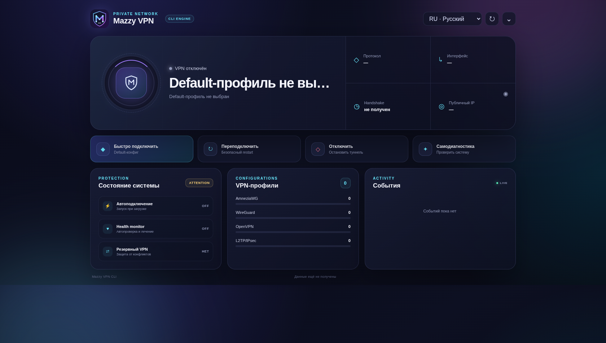

# Mazzy VPN — инструкция на русском

Автор и сопровождающий проекта:
[Nik m (@mazurovn)](https://github.com/mazurovn).

Mazzy VPN — открытый AI-ready VPN-клиент для Linux с Desktop, tray,
интерактивным TUI и CLI для автоматизации. Он предназначен для устойчивых
AI-сессий и агентов, обучения, видео, открытого веба, удалённой работы и
корпоративных порталов. Клиент объединяет OpenVPN, WireGuard, AmneziaWG и
L2TP/IPsec, безопасно импортирует профили, измеряет все локации, проверяет
фактический egress/локацию/DNS/IPv6 и восстанавливает предыдущее соединение
после ошибки.

Это клиент и контур управления, а не собственная VPN-подписка. Используйте
профили своего VPN-провайдера или организации; учётная запись Mazzy VPN и
телеметрия не требуются.

Текущая release-source линия — [CLI/TUI 1.4.6](https://github.com/mazurovn/mazzy-vpn/releases/tag/v1.4.6)
и [Desktop 0.4.7 preview](https://github.com/mazurovn/mazzy-vpn/releases/tag/desktop-v0.4.7).
Версия опубликована только тогда, когда существуют её tag и GitHub Release page.
Linux Desktop содержит и сам запускает совместимый engine: отдельно
устанавливать или предварительно запускать CLI не требуется. Уже установленный
CLI остаётся совместимым. Windows и macOS artifacts
остаются UI preview без native VPN backend и OS code signing. Installable
updater artifacts имеют Tauri-подпись и всегда требуют consent. Issue #31 закрыт проверенным
upstream backport `glib`, точной проверкой source provenance и чистыми
default-branch результатами RustSec, Dependabot и CodeQL.

Версионированный каталог расширен до 13 протоколов. Реальные Linux connect
backends по-прежнему готовы для AmneziaWG, WireGuard, OpenVPN и L2TP/IPsec.
VLESS/REALITY, Hysteria 2, Mieru, NaiveProxy, TUIC v5, Shadowsocks 2022,
Trojan, AnyTLS и ShadowTLS v3 получили проверяемый registry, очищенный API и
безопасную классификацию однозначных share URI и JSON. Для всех девяти теперь
есть закрытая neutral schema и атомарный Linux import без отражения секретов;
для шести — закрытый sing-box config renderer. Mieru/Naive sidecar и inner chain
ShadowTLS ещё не готовы. Подключение всех девяти остаётся `planned`, пока не
закрыты поставка engines, TUN/routing/rollback и leak integration tests.

Основная команда — `mazzy-vpn`. Совместимые aliases: `vpnctl` и `mazzyvpn`.

[Архитектура и схемы работы](docs/ARCHITECTURE.ru.md) ·
[контракт локального API v1](docs/API_CONTRACT.ru.md) ·
[протоколы и AI-оркестрация](docs/PROTOCOL_ORCHESTRATION.ru.md) ·
[обратное управление AI-агентами](docs/AGENT_CONTROL_ARCHITECTURE.ru.md) ·
[целевая архитектура и delivery DAG](docs/TARGET_ARCHITECTURE_2026-08-02.ru.md) ·
[техническая спецификация R0a](docs/R0_MUTATION_SINGLE_FLIGHT.ru.md) ·
[Architecture in English](docs/ARCHITECTURE.en.md)

Релиз 1.4.0 переводит API lifecycle,
прямой CLI, recovery, health remediation и service-policy команды на общий
`/run/vpnctl/.mutation.lock`. Это устраняет обнаруженную split-lock гонку, но
ещё не является целевым `mazzy-vpnd`: общий action journal для всех root paths
и доказательство восстановления routes/DNS/firewall/leak state остаются P0.

## Установка

```bash
git clone https://github.com/mazurovn/mazzy-vpn.git
cd mazzy-vpn
sudo ./install.sh
sudo mazzy-vpn doctor --fix
mazzy-vpn
```

В начале интерактивной установки выберите язык: русский, английский, немецкий,
китайский, японский или корейский. Для автоматической установки:

```bash
sudo ./install.sh --lang ru --yes
```

Установка с дополнительной папкой конфигов:

```bash
sudo ./install.sh --config-dir ~/VPN-configs
sudo ./install.sh --config-dir ~/VPN-configs --force-configs
```

Installer сам определяет протокол по содержимому, валидирует каждый профиль и
копирует только безопасные конфиги. Перед копированием он запускает syntax и
regression-тесты, после установки — проверку systemd, всех профилей и
`mazzy-vpn self-test --offline`. Живое подключение всех профилей включается
только явно: `sudo ./install.sh --live-test`.

Установщик:

- определяет Debian/Ubuntu, Fedora/RHEL, Arch или openSUSE;
- устанавливает OpenVPN, WireGuard и NetworkManager L2TP/IPsec;
- проверяет отдельно инструменты и модуль ядра AmneziaWG;
- копирует профили в `/etc/vpnctl/profiles` с правами `600`;
- устанавливает `vpnctl.service` и таймер самовосстановления;
- не заменяет изменённый системный профиль при повторной установке.

На Ubuntu для отсутствующего AmneziaWG установщик предлагает официальный PPA
`amnezia/ppa`. На Debian он не подключает Ubuntu PPA автоматически. Для
проверки действий без изменений:

```bash
./install.sh --dry-run
```

## Основные команды

```bash
mazzy-vpn list
mazzy-vpn quick
mazzy-vpn dashboard
mazzy-vpn connect amneziawg 1
mazzy-vpn connect openvpn "Example Server"
mazzy-vpn reconnect
mazzy-vpn disconnect
mazzy-vpn status
mazzy-vpn status --json
mazzy-vpn status --api-json        # сырой envelope local API v1
mazzy-vpn profiles --api-json      # opaque ID без имён файлов движка
mazzy-vpn protocols list --json    # каталог и честная готовность
mazzy-vpn protocols diagnose --json
mazzy-vpn protocols adapters --json # process graph и release gates
mazzy-vpn agent-transports list --json
mazzy-vpn agent-transports diagnose --json
# share URI передаётся через stdin и не печатается обратно
printf '%s\n' "$SHARE_URI" | mazzy-vpn protocols detect --stdin --json
mazzy-vpn protocols managed-validate --stdin --json < profile.json
mazzy-vpn protocols managed-import profile.json --dry-run --json
mazzy-vpn diagnose
mazzy-vpn verify                       # реальный egress, geo, DNS и IPv6
mazzy-vpn verify --speed               # явный ограниченный sample 5 MB
mazzy-vpn verify-service all --timeout 5 --json
                                      # явная eligibility NotebookLM/OpenAI
mazzy-vpn validate all
mazzy-vpn probe all --timeout 3 --jobs 4
mazzy-vpn probe all --timeout 3 --jobs 4 --json
sudo mazzy-vpn test openvpn 2 --timeout 60
sudo mazzy-vpn test-all openvpn --timeout 30
sudo mazzy-vpn emergency --timeout 20
sudo mazzy-vpn doctor --fix
sudo mazzy-vpn autostart on
mazzy-vpn logs
mazzy-vpn language
mazzy-vpn language en
```

Agent-control catalog является отдельным слоем обратного управления из Web,
CLI, Desktop и Telegram. В Desktop 0.4 есть обнаружение Codex/Claude
и catalog diagnostics без исполняемых действий. Provider start/pair/stop
отсутствует в renderer и Tauri IPC до реализации native approval, trusted
executable resolution и process-tree containment. Это не планируемый first-party
`mazzy-agentd`: семь каталогизированных network adapters, включая iroh,
Web/Telegram и сам `mazzy-agentd` пока не
release-ready; diagnostics не скрывает этот blocker.

После установки status, list/dashboard и lifecycle-команды CLI/TUI используют
защищённый `/run/mazzy-vpn/api-v1.sock` без `sudo`. Установщик добавляет
пользователя в группу `mazzy-vpn` и автоматически ставит `jq`, `socat`,
`nftables` и `python3` (для suspend-safe monotonic grace); после первой
установки может потребоваться повторный вход в сеанс. Test, import,
Doctor fixes и остальные ещё не перенесённые системные операции по-прежнему
явно запрашивают root.

Без аргументов `mazzy-vpn` открывает интерактивное меню. `autostart on` включает
подключение выбранного профиля после загрузки. Watchdog текущего соединения
работает независимо и перезапускает сервис после двух подтверждённых
последовательных ошибок, а не после единичного тайм-аута.

Над интерактивным меню расположен единый dashboard. Он выполняет короткую
проверку реального подключения и показывает состояние туннеля и интернета,
выбранную локацию, протокол, конфиг по умолчанию, интерфейс, свежесть handshake,
внешний IP, автозапуск, health-monitor, fallback и количество профилей.

`mazzy-vpn quick` без повторного выбора подключает сохранённый default-конфиг.
Если default ещё не задан, TUI предложит выбрать сервер; этот выбор станет
новым конфигом по умолчанию.

Из меню доступны
подключение, отключение, проверка одного или всех туннелей, проверка конфигов и
ping серверов, emergency recovery, doctor, автозапуск и журнал.

Язык меняется командой `mazzy-vpn language CODE` или пунктом 16 меню. Выбор из
меню сохраняется для текущего пользователя и применяется сразу. Системный язык
задаёт installer.

Системные профили и state закрыты от чтения обычными процессами. При запуске
установленного меню или команды, которой нужен `/etc/vpnctl`, CLI автоматически
переходит через `sudo`; пароль вводится стандартному `sudo`, а не самому
`mazzy-vpn`.

## Desktop control center и tray



Tauri Desktop 0.4 для Linux содержит экраны Dashboard, Profiles, Diagnostics,
Settings и «О программе», а также системный tray. DEB/RPM устанавливают
совместимый engine, systemd units и базовые runtime-зависимости через package
manager; AppImage сохраняет явно разрешённый embedded installer. Клиент
проверяет версии и зависимости и после разрешения может исправить недостающие
поддерживаемые protocol packages. Доступны импорт файлов и
папок, поиск и выбор профиля, сортировка всего списка по ping, выбор самой
быстрой доступной локации, проверка фактического egress/локации/DNS/IPv6,
транзакционные тесты, кликабельные события, Doctor с исправлениями, self-test,
ограниченный журнал, расширенный tray, autostart и
управление recovery monitor. Предварительно устанавливать CLI вручную не нужно.
Linux-пакеты выпускаются как AppImage, DEB и RPM.

Upgrade и remove DEB/RPM намеренно сохраняют профили `/etc/vpnctl` и state
`/var/lib/vpnctl`. В release source preview 0.4 сохранено исправление issue #31 с точным
upstream backport `glib` с проверкой checksum и всей source delta до cargo-deny;
advisory ignore list остаётся пустым. До production также нужны clean-device
install/upgrade/remove, rollback/fault и signing gates на каждом
поддерживаемом дистрибутиве.

«О программе» показывает версии Desktop/engine/platform, автора, copyright,
лицензию AGPL, принципы приватности и правила безопасной работы.

Desktop 0.4 — полноценный центр управления Linux в статусе preview, но ещё не
финальный самостоятельный Desktop 1.0. Язык-независимая схема API v1,
защищённый Linux service и lifecycle-клиенты CLI/TUI/Desktop уже реализованы,
но остальные operation domains ещё не переведены на единый dispatcher. Для
снятия preview также остаются полные настройки режимов/fallback, перевод новых
экранов на все шесть языков, подписанное обновление/rollback и нативные VPN
backends для macOS и Windows. Разработка синхронизируется через
[план Desktop 1.0](docs/DESKTOP_ROADMAP.ru.md) и
[матрицу паритета](docs/FEATURE_PARITY.md).

GUI после импорта не открывает VPN-конфиги и никогда не читает ключи. Он
получает очищенные status/profile caches без endpoint и путей и передаёт
привилегированному engine только типизированные операции из фиксированного
allowlist. Подробная установка, ограничения и диагностика:
[Desktop-инструкция](docs/DESKTOP.ru.md).

## Безопасное тестирование

Команда `test` временно переключает туннель, проверяет интерфейс и реальный
выход в интернет через него, а затем возвращает исходное соединение:

```bash
sudo mazzy-vpn test amneziawg 1
sudo mazzy-vpn test openvpn "Example Server" --timeout 60
sudo mazzy-vpn test wireguard 2 --timeout 30 --keep
```

По умолчанию таймаут равен 45 секундам, допустимый диапазон от 2 до 600.
`--keep` оставляет успешно проверенный профиль активным; без этого параметра
исходное состояние восстанавливается даже после успешного теста.

Для последовательной живой проверки всех профилей одного протокола:

```bash
sudo mazzy-vpn test-all openvpn --timeout 30
sudo mazzy-vpn test-all all --timeout 20
```

Каждый профиль запускается отдельной защищённой транзакцией. После успеха,
ошибки, таймаута или сигнала восстанавливается соединение, которое было активно
до теста. Итоговая таблица показывает `passed`, `failed` и `skipped`.

Если OpenVPN-сервер отвечает `Too many connections`, тест распознаёт именно
серверный лимит, немедленно возвращает исходный VPN и останавливает пакетную
проверку. Это предотвращает серию ложных таймаутов и потерю рабочего
соединения.

При соответствующей установке `mazzy-vpn` распознаёт два внешних резервных подключения:

- опциональный legacy AmneziaWG `wg0`, если пути к его setup/stop-скриптам
  явно заданы через `VPNCTL_LEGACY_START` и `VPNCTL_LEGACY_STOP`;
- AdGuard VPN CLI, подключённый в TUN-режиме.

Перед запуском управляемого туннеля активный внешний VPN сохраняется в
транзакции и останавливается. При ошибке запуска, неуспешном тесте, сигнале,
защитном таймауте или boot recovery восстанавливается только тот внешний VPN,
который был активен. При успешном `--keep`, `connect` или `emergency` внешний
VPN остаётся выключенным, чтобы маршруты и адреса туннелей не конфликтовали.
Если одновременно обнаружены `wg0` и AdGuard, оба останавливаются, а для
rollback выбирается AdGuard.

Перед новым запуском, когда WireGuard/AmneziaWG-интерфейсов уже нет, `mazzy-vpn`
удаляет только orphan/duplicate policy rules из диапазона таблиц `wg-quick`
`51820..51899`. Сторонние правила, включая IPsec priority/table `220`, не
изменяются. Внешние daemon-процессы запускаются с закрытыми lock-дескрипторами,
поэтому восстановленный AdGuard не блокирует следующую команду меню.

На время теста включается расширенный журнал:

- OpenVPN запускается с `verb 6`;
- WireGuard и AmneziaWG записывают сокращённый status, адреса, routes и rules
  без раскрытия приватного ключа и длинных concealment-параметров;
- L2TP записывает состояние NetworkManager и IP-параметры без вывода секретов.

Перед тестом сохраняются профиль и состояние старого сервиса. Откат выполняют
сразу три механизма: основной процесс `mazzy-vpn`, transient systemd timer и
`vpnctl-test-recovery.service` при следующей загрузке. Если управляемый сервис
завис при остановке, после 15 секунд принудительно завершается только
`vpnctl.service`.

## Emergency recovery

`emergency` перебирает безопасные профили и оставляет первый туннель, который
создал интерфейс и дал доступ в интернет:

```bash
sudo mazzy-vpn emergency
sudo mazzy-vpn emergency --timeout 15
sudo mazzy-vpn emergency --protocol openvpn --timeout 25
```

Таймаут применяется к каждому кандидату. Сначала проверяется ранее выбранный
профиль, затем AmneziaWG, WireGuard, OpenVPN и L2TP. Протоколы без рабочего
runtime или модуля ядра пропускаются. Если не работает ни один профиль,
восстанавливается соединение, активное до запуска emergency.

## Профили

Создать удобную структуру:

```bash
mazzy-vpn init-config-dir ~/MazzyConfigs
```

Будут созданы каталоги `amneziawg/`, `wireguard/`, `openvpn/` и `l2tp/`.
Файлы разрешено складывать и в смешанную вложенную структуру: импорт сканирует
её рекурсивно.

Проверить распознавание без изменений:

```bash
mazzy-vpn import-dir ~/VPN-configs --dry-run
```

Импортировать все распознанные и валидные файлы:

```bash
sudo mazzy-vpn import-dir ~/VPN-configs
```

Одноимённый изменённый профиль не перезаписывается без явного `--force`.
Эти же действия доступны в пункте 15 TUI «Папки и импорт VPN-конфигов».

Системные каталоги:

| Протокол | Каталог | Формат |
|---|---|---|
| AmneziaWG | `/etc/vpnctl/profiles/amneziawg` | `*.conf` |
| WireGuard | `/etc/vpnctl/profiles/wireguard` | `*.conf` |
| OpenVPN | `/etc/vpnctl/profiles/openvpn` | `*.ovpn`, `*.conf` |
| L2TP/IPsec | `/etc/vpnctl/profiles/l2tp` | `*.nmconnection` |

Добавлять профиль лучше командой, которая проверяет формат и закрывает права:

```bash
sudo mazzy-vpn import wireguard ~/Downloads/server.conf
sudo mazzy-vpn import l2tp ~/Downloads/office.nmconnection
```

L2TP реализован через NetworkManager и `NetworkManager-l2tp`. Пример
keyfile с маркерами `CHANGE_ME_*` находится в
`conf/l2tp/example.nmconnection.template`. Заполненная копия содержит пароль и
IPsec PSK, поэтому должна иметь права `600`; импорт устанавливает их
автоматически.

## Диагностика

`mazzy-vpn diagnose` проверяет маршрут, DNS, выбранный сервер, интерфейс,
WireGuard/AmneziaWG handshake и доступ в интернет именно через VPN-интерфейс.
`mazzy-vpn validate all` безопасно разбирает все профили без подключения, блокирует
исполняемые или вложенные директивы, проверяет обязательные поля, endpoint,
права файлов и передаёт OpenVPN-профили встроенному parser.

`mazzy-vpn probe all` ограниченно-параллельно проверяет весь список локаций:
DNS, ICMP latency и TCP service. Для каждого профиля выводятся
`reachable`/`unknown`/`unreachable`/`invalid`, ping и текущий флаг `active`;
`--json` возвращает те же очищенные данные без endpoint. UDP с работающим DNS,
но заблокированным ICMP получает `unknown`, а не ложный отказ. Окончательное
доказательство VPN-авторизации и маршрутизации даёт только
`mazzy-vpn test`/`test-all`.

`mazzy-vpn doctor` проверяет пакеты, модуль AmneziaWG, systemd units, доступность
legacy/AdGuard fallback, форматы и права всех профилей. `doctor --fix`:

- устанавливает недостающие поддерживаемые пакеты;
- исправляет права профилей на `600`;
- создаёт закрытые state/runtime-каталоги;
- перечитывает systemd и запускает health timer для текущей сессии;
- проверяет timeout guard и boot recovery для тестовых подключений.

Если официальный Amnezia PPA не публикует текущую версию Ubuntu, установщик не
подключает несовместимый suite. Вместо этого он предлагает закреплённые версии
официальных `amneziawg-tools` и `amneziawg-go`; `doctor` принимает как kernel,
так и userspace backend.

OpenVPN DNS применяется через `resolvectl` или `resolvconf` и откатывается при
остановке. Конфиги OpenVPN с исполняемыми hook-директивами и конфиги
WireGuard с `PreUp`/`PostUp`/`PreDown`/`PostDown` блокируются: сервис читает
профили от root, поэтому выполнение команд из импортированного файла
небезопасно.

## Лимит OpenVPN `Too many connections`

Некоторые провайдеры считают AmneziaWG и OpenVPN одной учётной сессией.
После остановки WireGuard-подобного туннеля сервер может ещё некоторое время
считать его активным. В журнале это выглядит так:

```text
Halt command was pushed by server ('Too many connections')
```

Это не ошибка сертификата, parser или локального интерфейса: TLS уже завершён,
но сервер запрещает data channel. Mazzy VPN преобразует такой штатный выход
OpenVPN в retryable failure; systemd повторяет подключение с интервалом
15 секунд. В `test`/`test-all` повторное ожидание не скрывает результат:
исходный туннель восстанавливается, а пользователь получает точную причину.

Если лимит не освобождается, остановите другие устройства с тем же VPN-аккаунтом
или подождите истечения старой серверной сессии, затем выполните:

```bash
mazzy-vpn connect openvpn "Example Server"
mazzy-vpn diagnose
```

Не запускайте AdGuard вручную во время `test-all`: он является внешним
fallback и намеренно меняет состояние, которое транзакция должна вернуть.

## Журнал и восстановление

```bash
mazzy-vpn logs
mazzy-vpn logs -f
systemctl status vpnctl.service
systemctl status vpnctl-health.timer
```

OpenVPN также использует собственное переподключение. Для WireGuard и
AmneziaWG systemd перезапускает процесс после любого неожиданного завершения.
Независимый health timer примерно каждую минуту проверяет сохранённое
состояние, сервис, VPN-интерфейс и реальный HTTPS-доступ именно через него. Если
при `DESIRED=up` сервис остановлен, он запускается сразу. Отсутствие OpenVPN
interface или ещё не передающий HTTPS data plane игнорируется в ограниченный
60-секундный startup grace по монотонному возрасту systemd. На второй
последовательной ошибке watchdog выполняет ровно
один restart, не обнуляя счётчик и systemd failure state. Следующая ошибка
насыщает счётчик значением 3 и приостанавливает watchdog recovery, оставляя
native retry OpenVPN. Успех, явные connect/reconnect и mutation профиля
сбрасывают счётчик. `vpnctl.service` допускает пять starts за десять минут и не
перезапускает намеренный exit status 77. `doctor --fix` включает мониторинг и
восстанавливает автозапуск при наличии корректного профиля по умолчанию.

`verify-service [notebooklm|openai|all]` — отдельная явная credential-free
HEAD-проверка через выбранный VPN interface. Она не следует redirects, не
принимает URL пользователя и возвращает только очищенные enum-результаты. Она
не проверяет login, account, organization, subscription или content access и
не используется фоновым health monitor или planner.

## Публикация проекта

Реальные приватные ключи и персональные VPN-профили нельзя отправлять в GitHub.
Каталоги `conf/`, установочные архивы и checksums исключены через `.gitignore`.
В публичном репозитории следует оставлять только безопасные шаблоны; рабочие
профили хранятся в `/etc/vpnctl/profiles` с правами `600`.

## Автор и лицензия

Mazzy VPN создан [Nik m (@mazurovn)](https://github.com/mazurovn).
Copyright © 2026 Nik m.

Проект распространяется по открытой лицензии
[GNU AGPL v3.0 или более поздней](LICENSE). Разрешены изучение, использование,
изменение и распространение, но производные версии обязаны соблюдать условия
AGPL и сохранять уведомления об исходном авторстве. Подробнее:
[AUTHORS.md](AUTHORS.md) и [CONTRIBUTING.md](CONTRIBUTING.md).
