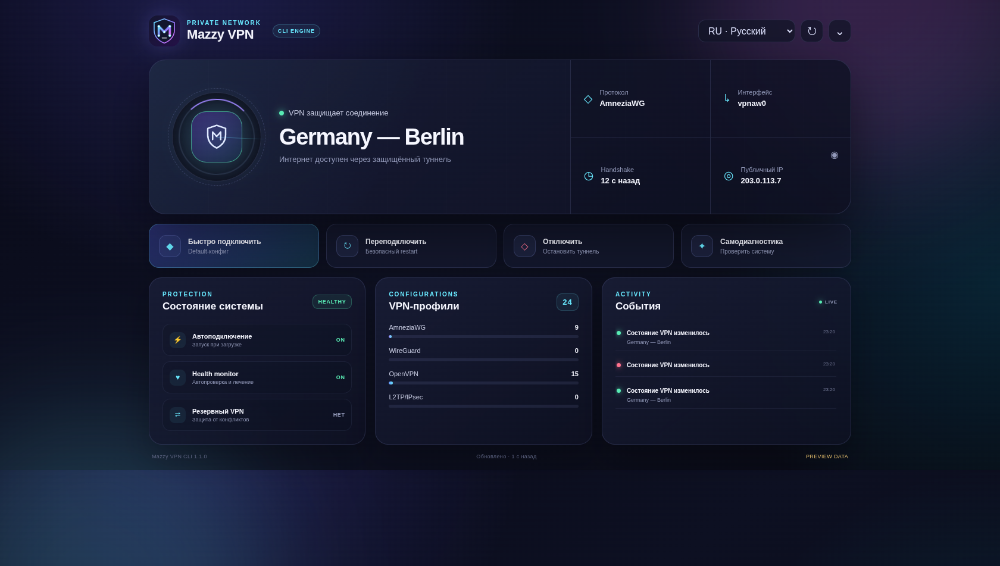

# Mazzy VPN — инструкция на русском

Автор и сопровождающий проекта:
[Nik m (@mazurovn)](https://github.com/mazurovn).

Mazzy VPN — менеджер VPN для Linux с интерактивным терминальным интерфейсом и
CLI для автоматизации. Он объединяет OpenVPN, WireGuard, AmneziaWG и
L2TP/IPsec: распознаёт и безопасно импортирует профили, проверяет каждый
endpoint, запускает только один управляемый туннель, выполняет живые тесты в
транзакции и возвращает предыдущее рабочее соединение после ошибки.

Основная команда — `mazzy-vpn`. Совместимые aliases: `vpnctl` и `mazzyvpn`.

[Архитектура и схемы работы](docs/ARCHITECTURE.ru.md) ·
[Architecture in English](docs/ARCHITECTURE.en.md)

## Установка

```bash
git clone https://github.com/mazurovn/mazzy-vpn.git
cd mazzy-vpn
sudo ./install.sh
sudo mazzy-vpn doctor --fix
mazzy-vpn
```

В начале интерактивной установки выберите язык: русский, английский, немецкий,
китайский, японский или корейский. Для автоматической установки:

```bash
sudo ./install.sh --lang ru --yes
```

Установка с дополнительной папкой конфигов:

```bash
sudo ./install.sh --config-dir ~/VPN-configs
sudo ./install.sh --config-dir ~/VPN-configs --force-configs
```

Installer сам определяет протокол по содержимому, валидирует каждый профиль и
копирует только безопасные конфиги. Перед копированием он запускает syntax и
regression-тесты, после установки — проверку systemd, всех профилей и
`mazzy-vpn self-test --offline`. Живое подключение всех профилей включается
только явно: `sudo ./install.sh --live-test`.

Установщик:

- определяет Debian/Ubuntu, Fedora/RHEL, Arch или openSUSE;
- устанавливает OpenVPN, WireGuard и NetworkManager L2TP/IPsec;
- проверяет отдельно инструменты и модуль ядра AmneziaWG;
- копирует профили в `/etc/vpnctl/profiles` с правами `600`;
- устанавливает `vpnctl.service` и таймер самовосстановления;
- не заменяет изменённый системный профиль при повторной установке.

На Ubuntu для отсутствующего AmneziaWG установщик предлагает официальный PPA
`amnezia/ppa`. На Debian он не подключает Ubuntu PPA автоматически. Для
проверки действий без изменений:

```bash
./install.sh --dry-run
```

## Основные команды

```bash
mazzy-vpn list
sudo mazzy-vpn quick
mazzy-vpn dashboard
sudo mazzy-vpn connect amneziawg 1
sudo mazzy-vpn connect openvpn "Example Server"
sudo mazzy-vpn reconnect
sudo mazzy-vpn disconnect
mazzy-vpn status
mazzy-vpn status --json
mazzy-vpn diagnose
mazzy-vpn validate all
mazzy-vpn probe all --timeout 3
sudo mazzy-vpn test openvpn 2 --timeout 60
sudo mazzy-vpn test-all openvpn --timeout 30
sudo mazzy-vpn emergency --timeout 20
sudo mazzy-vpn doctor --fix
sudo mazzy-vpn autostart on
mazzy-vpn logs
mazzy-vpn language
mazzy-vpn language en
```

Без аргументов `mazzy-vpn` открывает интерактивное меню. `autostart on` включает
подключение выбранного профиля после загрузки. Watchdog текущего соединения
работает независимо и перезапускает сервис после двух подтверждённых
последовательных ошибок, а не после единичного тайм-аута.

Над интерактивным меню расположен единый dashboard. Он выполняет короткую
проверку реального подключения и показывает состояние туннеля и интернета,
выбранную локацию, протокол, конфиг по умолчанию, интерфейс, свежесть handshake,
внешний IP, автозапуск, health-monitor, fallback и количество профилей.

`mazzy-vpn quick` без повторного выбора подключает сохранённый default-конфиг.
Если default ещё не задан, TUI предложит выбрать сервер; этот выбор станет
новым конфигом по умолчанию.

Из меню доступны
подключение, отключение, проверка одного или всех туннелей, проверка конфигов и
ping серверов, emergency recovery, doctor, автозапуск и журнал.

Язык меняется командой `mazzy-vpn language CODE` или пунктом 16 меню. Выбор из
меню сохраняется для текущего пользователя и применяется сразу. Системный язык
задаёт installer.

Системные профили и state закрыты от чтения обычными процессами. При запуске
установленного меню или команды, которой нужен `/etc/vpnctl`, CLI автоматически
переходит через `sudo`; пароль вводится стандартному `sudo`, а не самому
`mazzy-vpn`.

## Desktop Dashboard и tray



Tauri Desktop даёт те же основные действия в красивом окне и системном tray:
Quick Connect, Reconnect, Disconnect, Refresh и Self-diagnostics. Linux-версия
работает поверх установленного CLI и выпускается как AppImage, DEB и RPM.
macOS и Windows пока являются только preview интерфейса до реализации нативных
VPN backends.

GUI не читает конфиги или ключи: он получает очищенный status cache без endpoint
и запускает только фиксированный набор CLI-команд. Подробная установка,
ограничения и диагностика: [Desktop-инструкция](docs/DESKTOP.ru.md).

## Безопасное тестирование

Команда `test` временно переключает туннель, проверяет интерфейс и реальный
выход в интернет через него, а затем возвращает исходное соединение:

```bash
sudo mazzy-vpn test amneziawg 1
sudo mazzy-vpn test openvpn "Example Server" --timeout 60
sudo mazzy-vpn test wireguard 2 --timeout 30 --keep
```

По умолчанию таймаут равен 45 секундам, допустимый диапазон от 2 до 600.
`--keep` оставляет успешно проверенный профиль активным; без этого параметра
исходное состояние восстанавливается даже после успешного теста.

Для последовательной живой проверки всех профилей одного протокола:

```bash
sudo mazzy-vpn test-all openvpn --timeout 30
sudo mazzy-vpn test-all all --timeout 20
```

Каждый профиль запускается отдельной защищённой транзакцией. После успеха,
ошибки, таймаута или сигнала восстанавливается соединение, которое было активно
до теста. Итоговая таблица показывает `passed`, `failed` и `skipped`.

Если OpenVPN-сервер отвечает `Too many connections`, тест распознаёт именно
серверный лимит, немедленно возвращает исходный VPN и останавливает пакетную
проверку. Это предотвращает серию ложных таймаутов и потерю рабочего
соединения.

При соответствующей установке `mazzy-vpn` распознаёт два внешних резервных подключения:

- опциональный legacy AmneziaWG `wg0`, если пути к его setup/stop-скриптам
  явно заданы через `VPNCTL_LEGACY_START` и `VPNCTL_LEGACY_STOP`;
- AdGuard VPN CLI, подключённый в TUN-режиме.

Перед запуском управляемого туннеля активный внешний VPN сохраняется в
транзакции и останавливается. При ошибке запуска, неуспешном тесте, сигнале,
защитном таймауте или boot recovery восстанавливается только тот внешний VPN,
который был активен. При успешном `--keep`, `connect` или `emergency` внешний
VPN остаётся выключенным, чтобы маршруты и адреса туннелей не конфликтовали.
Если одновременно обнаружены `wg0` и AdGuard, оба останавливаются, а для
rollback выбирается AdGuard.

Перед новым запуском, когда WireGuard/AmneziaWG-интерфейсов уже нет, `mazzy-vpn`
удаляет только orphan/duplicate policy rules из диапазона таблиц `wg-quick`
`51820..51899`. Сторонние правила, включая IPsec priority/table `220`, не
изменяются. Внешние daemon-процессы запускаются с закрытыми lock-дескрипторами,
поэтому восстановленный AdGuard не блокирует следующую команду меню.

На время теста включается расширенный журнал:

- OpenVPN запускается с `verb 6`;
- WireGuard и AmneziaWG записывают сокращённый status, адреса, routes и rules
  без раскрытия приватного ключа и длинных concealment-параметров;
- L2TP записывает состояние NetworkManager и IP-параметры без вывода секретов.

Перед тестом сохраняются профиль и состояние старого сервиса. Откат выполняют
сразу три механизма: основной процесс `mazzy-vpn`, transient systemd timer и
`vpnctl-test-recovery.service` при следующей загрузке. Если управляемый сервис
завис при остановке, после 15 секунд принудительно завершается только
`vpnctl.service`.

## Emergency recovery

`emergency` перебирает безопасные профили и оставляет первый туннель, который
создал интерфейс и дал доступ в интернет:

```bash
sudo mazzy-vpn emergency
sudo mazzy-vpn emergency --timeout 15
sudo mazzy-vpn emergency --protocol openvpn --timeout 25
```

Таймаут применяется к каждому кандидату. Сначала проверяется ранее выбранный
профиль, затем AmneziaWG, WireGuard, OpenVPN и L2TP. Протоколы без рабочего
runtime или модуля ядра пропускаются. Если не работает ни один профиль,
восстанавливается соединение, активное до запуска emergency.

## Профили

Создать удобную структуру:

```bash
mazzy-vpn init-config-dir ~/MazzyConfigs
```

Будут созданы каталоги `amneziawg/`, `wireguard/`, `openvpn/` и `l2tp/`.
Файлы разрешено складывать и в смешанную вложенную структуру: импорт сканирует
её рекурсивно.

Проверить распознавание без изменений:

```bash
mazzy-vpn import-dir ~/VPN-configs --dry-run
```

Импортировать все распознанные и валидные файлы:

```bash
sudo mazzy-vpn import-dir ~/VPN-configs
```

Одноимённый изменённый профиль не перезаписывается без явного `--force`.
Эти же действия доступны в пункте 15 TUI «Папки и импорт VPN-конфигов».

Системные каталоги:

| Протокол | Каталог | Формат |
|---|---|---|
| AmneziaWG | `/etc/vpnctl/profiles/amneziawg` | `*.conf` |
| WireGuard | `/etc/vpnctl/profiles/wireguard` | `*.conf` |
| OpenVPN | `/etc/vpnctl/profiles/openvpn` | `*.ovpn`, `*.conf` |
| L2TP/IPsec | `/etc/vpnctl/profiles/l2tp` | `*.nmconnection` |

Добавлять профиль лучше командой, которая проверяет формат и закрывает права:

```bash
sudo mazzy-vpn import wireguard ~/Downloads/server.conf
sudo mazzy-vpn import l2tp ~/Downloads/office.nmconnection
```

L2TP реализован через NetworkManager и `NetworkManager-l2tp`. Пример
keyfile с маркерами `CHANGE_ME_*` находится в
`conf/l2tp/example.nmconnection.template`. Заполненная копия содержит пароль и
IPsec PSK, поэтому должна иметь права `600`; импорт устанавливает их
автоматически.

## Диагностика

`mazzy-vpn diagnose` проверяет маршрут, DNS, выбранный сервер, интерфейс,
WireGuard/AmneziaWG handshake и доступ в интернет именно через VPN-интерфейс.
`mazzy-vpn validate all` безопасно разбирает все профили без подключения, блокирует
исполняемые или вложенные директивы, проверяет обязательные поля, endpoint,
права файлов и передаёт OpenVPN-профили встроенному parser.

`mazzy-vpn probe all` проверяет DNS и ICMP ping каждого endpoint. Для TCP OpenVPN
также проверяется порт, если установлен `nc`. Отсутствие ответа ICMP выводится
как предупреждение: сервер может блокировать ping, поэтому окончательное
доказательство работоспособности даёт только `mazzy-vpn test`/`test-all`.

`mazzy-vpn doctor` проверяет пакеты, модуль AmneziaWG, systemd units, доступность
legacy/AdGuard fallback, форматы и права всех профилей. `doctor --fix`:

- устанавливает недостающие поддерживаемые пакеты;
- исправляет права профилей на `600`;
- создаёт закрытые state/runtime-каталоги;
- перечитывает systemd и запускает health timer для текущей сессии;
- проверяет timeout guard и boot recovery для тестовых подключений.

Если официальный Amnezia PPA не публикует текущую версию Ubuntu, установщик не
подключает несовместимый suite. Вместо этого он предлагает закреплённые версии
официальных `amneziawg-tools` и `amneziawg-go`; `doctor` принимает как kernel,
так и userspace backend.

OpenVPN DNS применяется через `resolvectl` или `resolvconf` и откатывается при
остановке. Конфиги OpenVPN с исполняемыми hook-директивами и конфиги
WireGuard с `PreUp`/`PostUp`/`PreDown`/`PostDown` блокируются: сервис читает
профили от root, поэтому выполнение команд из импортированного файла
небезопасно.

## Лимит OpenVPN `Too many connections`

Некоторые провайдеры считают AmneziaWG и OpenVPN одной учётной сессией.
После остановки WireGuard-подобного туннеля сервер может ещё некоторое время
считать его активным. В журнале это выглядит так:

```text
Halt command was pushed by server ('Too many connections')
```

Это не ошибка сертификата, parser или локального интерфейса: TLS уже завершён,
но сервер запрещает data channel. Mazzy VPN преобразует такой штатный выход
OpenVPN в retryable failure; systemd повторяет подключение с интервалом
15 секунд. В `test`/`test-all` повторное ожидание не скрывает результат:
исходный туннель восстанавливается, а пользователь получает точную причину.

Если лимит не освобождается, остановите другие устройства с тем же VPN-аккаунтом
или подождите истечения старой серверной сессии, затем выполните:

```bash
sudo mazzy-vpn connect openvpn "Example Server"
mazzy-vpn diagnose
```

Не запускайте AdGuard вручную во время `test-all`: он является внешним
fallback и намеренно меняет состояние, которое транзакция должна вернуть.

## Журнал и восстановление

```bash
mazzy-vpn logs
mazzy-vpn logs -f
systemctl status vpnctl.service
systemctl status vpnctl-health.timer
```

OpenVPN также использует собственное переподключение. Для WireGuard и
AmneziaWG systemd перезапускает процесс после любого неожиданного завершения.
Независимый health timer примерно каждые 20 секунд проверяет сохранённое
состояние, сервис, VPN-интерфейс и реальный HTTPS-доступ именно через него. Если
при `DESIRED=up` сервис остановлен, он запускается сразу; две последовательные
ошибки трафика вызывают переподключение. `doctor --fix` включает мониторинг и
восстанавливает автозапуск при наличии корректного профиля по умолчанию.
Счётчик ошибок хранится только в `/run/vpnctl` и сбрасывается после успешной
проверки.

## Публикация проекта

Реальные приватные ключи и персональные VPN-профили нельзя отправлять в GitHub.
Каталоги `conf/`, установочные архивы и checksums исключены через `.gitignore`.
В публичном репозитории следует оставлять только безопасные шаблоны; рабочие
профили хранятся в `/etc/vpnctl/profiles` с правами `600`.

## Автор и лицензия

Mazzy VPN создан [Nik m (@mazurovn)](https://github.com/mazurovn).
Copyright © 2026 Nik m.

Проект распространяется по открытой лицензии
[GNU AGPL v3.0 или более поздней](LICENSE). Разрешены изучение, использование,
изменение и распространение, но производные версии обязаны соблюдать условия
AGPL и сохранять уведомления об исходном авторстве. Подробнее:
[AUTHORS.md](AUTHORS.md) и [CONTRIBUTING.md](CONTRIBUTING.md).
