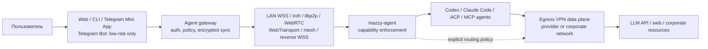

# Архитектура обратного управления AI-агентами

Copyright © 2026 [Nik m (@mazurovn)](https://github.com/mazurovn).

[English version](AGENT_CONTROL_ARCHITECTURE.en.md) ·
[реестр transport adapters](../agent-control/v1/registry.json) ·
[schema encrypted envelope](../agent-control/v1/envelope.schema.json)

## Статус

В текущей ветке реализован только версионированный machine-readable contract,
CLI `agent-transports list|diagnose --json`, package payload и security policy.
Transport runtimes, broker, Web/Telegram clients и agent daemon ещё не готовы и
не должны объявляться работающими. Их platform support остаётся `planned`.

## Два независимых сетевых слоя

`Egress VPN` меняет маршрут исходящего трафика устройства. `Agent control`
доставляет команды в обратную сторону к уже запущенному агенту. Это разные
trust boundaries, lifecycle и каталоги. iroh, WebRTC и libp2p не добавляются в
`protocols/v1` как VPN: они являются transport adapters для второго слоя.

## Что взято из аналогов

| Проект/stack | Сильная сторона | Ограничение для Mazzy |
|---|---|---|
| [Happy](https://github.com/slopus/happy) | HTTP + Socket.IO, durable sync, encrypted opaque payloads, Web/iOS/Android, Codex и Claude | Основной путь зависит от sync server; это не VPN и не multi-transport P2P orchestration |
| [Claude Bridge](https://github.com/HelpFreedom/claude-bridge/blob/main/ARCHITECTURE.md) | LAN WSS с TLS pinning, iroh/QUIC sidecar, direct/relay path, allowlist peer IDs, устойчивые PTY keeper processes | Узкая связка Linux + Android + Claude, нет durable multi-device sync, Web/Telegram ingress и общего capability protocol |
| [iroh](https://docs.iroh.computer/what-is-iroh) | QUIC streams, stable endpoint identity, NAT traversal и relay fallback, ALPN application protocols | Native/browser reach различается; один transport не покрывает UDP-blocked corporate networks |
| [libp2p](https://libp2p.io/docs/standalone-connectivity/) | QUIC/TCP, peer IDs, Circuit Relay/DCUtR, WebTransport/WebRTC и modular transports | Более тяжёлый stack, сложнее attack surface и эксплуатация relay/discovery |
| [WebRTC](https://webrtc.org/getting-started/peer-connections) | DataChannel работает из браузера, ICE/STUN/TURN дают direct/relay paths | Требуется отдельный signaling; TURN видит metadata и увеличивает стоимость |
| [Tailscale/Headscale](https://headscale.net/stable/about/features/) | WireGuard mesh, ACL/grants, DERP/peer relay, self-hosted control option | Это отдельная mesh identity/control system; нельзя скрывать эту зависимость внутри Mazzy |
| Reverse HTTPS/WSS | Проходит через обычный outbound TCP 443, поддерживает durable broker queue | Путь не P2P; broker видит routing metadata, хотя payload обязан оставаться E2EE |

Mazzy не выбирает одного победителя. Transport-neutral command protocol должен
переключаться между маршрутами без повторного выполнения команды.

## Transport adapters v1

Реестр [`agent-control/v1/registry.json`](../agent-control/v1/registry.json)
содержит семь adapters:

1. `lan-wss`: самый быстрый локальный путь после pairing и certificate/key pin.
2. `iroh-quic`: основной native P2P путь с direct/relay диагностикой.
3. `libp2p-quic`: self-hosted P2P альтернатива и будущий browser bridge.
4. `webrtc-datachannel`: browser/mobile P2P с ICE и TURN fallback.
5. `webtransport`: HTTP/3 stream path для first-party Web client.
6. `tailscale-headscale`: enterprise/self-hosted mesh adapter, только явно.
7. `reverse-wss-broker`: универсальный baseline и durable offline delivery.

Каждый adapter реализует один внутренний interface: `probe`, `pair`, `dial`,
`listen`, `send`, `ack`, `resume`, `close`, `path_metrics`. Transport получает
только зашифрованный envelope и не интерпретирует agent command.

## Message и security boundary

[`command.schema.json`](../agent-control/v1/command.schema.json) задаёт закрытый
v1 capability list. В нём намеренно нет произвольного `shell.exec`. Команда
шифруется в [`envelope.schema.json`](../agent-control/v1/envelope.schema.json):

- HPKE X25519/HKDF-SHA256/ChaCha20-Poly1305 защищает payload для конкретного
  paired recipient;
- Ed25519 подписывает immutable header и ciphertext;
- `message_id`, `sequence`, `issued_at` и `expires_at` обеспечивают
  idempotency, ordering, TTL и anti-replay;
- broker хранит ciphertext и минимальные routing IDs, но не plaintext;
- agent повторно проверяет actor, capability, target, risk и confirmation;
- transport success без application ACK не считается выполнением команды.

Это cryptographic contract, а не собственная реализация криптопримитивов.
Runtime обязан использовать проверяемые библиотеки и пройти отдельный threat
model, test vectors, key-rotation и compromise-recovery review.

## Web, CLI и Telegram

- First-party Web проходит pairing и использует E2EE envelope. Browser получает
  WebRTC/WebTransport/reverse-WSS paths, но не VPN profile secrets.
- CLI может управлять локально либо как paired first-party device. Raw argv и
  model output никогда не преобразуются в shell command на agent host.
- Обычный Telegram Bot API не является first-party E2EE каналом. Поэтому bot
  ограничен read-only/low-risk действиями: status, list, pause/cancel с
  коротким TTL. Prompt text, artifacts, credentials и approvals через него
  запрещены по умолчанию.
- Для полного управления Telegram открывает first-party Mini App, где pairing,
  encryption и confirmation выполняет Mazzy Web client. Telegram остаётся
  только точкой входа и notification channel.
- High-risk capability всегда требует подтверждение paired first-party device,
  WebAuthn/TOTP или local UI согласно policy.

## Оркестрация маршрутов

1. Отбрасываются adapters без runtime, pairing, E2EE, anti-replay и channel-risk
   gates. Agent/LLM не может изменить эти hard constraints.
2. Валидный `lan-wss` выбирается сразу. Для internet paths одновременно
   проверяются не более двух кандидатов, чтобы не создавать traffic burst.
3. Score из registry учитывает route health, privacy, censorship fit, latency и
   battery cost. Managed relay не выбирается при доступном сопоставимом direct
   path без явной причины.
4. `reverse-wss-broker` держится как warm durable fallback, если пользователь
   разрешил broker mode. Переключение продолжает поток с последнего ACK sequence.
5. Повторно доставленный `message_id` возвращает прежний result и не выполняет
   side effect второй раз.
6. Path switch не ослабляет E2EE, peer authorization или risk policy.

Связь control plane с egress VPN задаётся отдельным режимом:

- `through-egress`: control transport идёт через активный VPN;
- `independent-underlay`: только явные control endpoints обходят VPN;
- `strict-coupled`: при отсутствии VPN reverse control запрещён.

Backend должен запретить route loops, сохранить control path на время
транзакционного VPN switch и показать пользователю metadata/privacy trade-off.
LLM не выбирает этот режим.

## Отдельный server repository

Рабочее имя следующего репозитория: `mazzy-agent-gateway`. Он не должен
встраиваться в привилегированный VPN backend. Минимальные компоненты:

- `mazzy-agent`: непривилегированный daemon рядом с Codex/Claude/ACP/MCP;
- `mazzy-gateway`: auth, policy, opaque event log, ACK/resume и device registry;
- transport plugins для iroh, reverse WSS и затем WebRTC/libp2p/mesh;
- first-party Web/PWA и Telegram Mini App;
- Telegram Bot adapter с low-risk policy;
- adapters к agent runtimes без PTY-specific wire protocol в core.

Первый production slice: LAN WSS + reverse WSS, pairing, status/list/prompt,
encrypted durable queue, idempotent ACK/resume и Linux agent. iroh добавляется
после тех же contract tests; WebRTC/libp2p/mesh остаются последующими adapters.

## Release gates

Runtime support нельзя повысить из `planned`, пока нет: pinned dependencies и
SBOM; clean install/upgrade/remove; peer revocation/key rotation; NAT and relay
matrix; packet loss/reconnect/offline queue tests; duplicate/replay/flood tests;
Telegram privilege tests; Desktop/Android/Web end-to-end tests; независимого
security review; documented rollback and incident recovery.
