# Архитектура обратного управления AI-агентами

Copyright © 2026 [Nik m (@mazurovn)](https://github.com/mazurovn).

[English version](AGENT_CONTROL_ARCHITECTURE.en.md) ·
[детальная целевая архитектура и delivery DAG](TARGET_ARCHITECTURE_2026-08-02.ru.md) ·
[исследование аналогов](RESEARCH_AGENT_REMOTE_CONTROL_2026-08-02.ru.md) ·
[реестр transport adapters](../agent-control/v1/registry.json) ·
[draft schema будущего encrypted envelope](../agent-control/v1/envelope.schema.json)

## Статус

В текущей ветке реализованы versioned machine-readable **draft contract**, CLI
`agent-transports list|diagnose --json`, package payload, security policy и
первый embedded Desktop ingress. Экран «AI-агенты» обнаруживает локальные
Codex/Claude Code, показывает discovery/catalog status семи paths и через
фиксированный типизированный adapter выполняет официальный experimental Codex Remote Control
`start|pair|stop`. Pairing code хранится только в памяти UI до expiry; полный
opaque vendor secret не передаётся в WebView.

Это **не** first-party Mazzy client-to-client gateway. Claude adapter пока
`discovery-only`; transport runtimes, broker, Web/Telegram clients и
`mazzy-agentd` ещё не готовы. Все семь сетевых paths остаются `planned` и не
должны объявляться release-ready.

Повторное независимое ревью выявило, что этот документ описывает правильное
направление, но не задаёт полный исполнимый protocol: нужны отдельные
pairing/result/event/ACK/error contracts, endpoint-derived policy, точный
canonical crypto input, key lifecycle, path state machine и один mutation owner
для egress. Нормативные решения и P0 blockers собраны в
[целевой архитектуре](TARGET_ARCHITECTURE_2026-08-02.ru.md).

## Два независимых сетевых слоя

```mermaid
flowchart LR
    User["Пользователь"]
    Ingress["Desktop / Web / CLI / Telegram Mini App<br/>Telegram Bot: low-risk only"]
    Gateway["Agent gateway<br/>auth, policy, encrypted sync"]
    Paths["LAN WSS / iroh / libp2p / WebRTC<br/>WebTransport / mesh / reverse WSS"]
    Agent["mazzy-agent<br/>capability enforcement"]
    Providers["Provider adapters<br/>Codex app-server / Claude / ACP"]
    Tools["Codex / Claude Code / ACP / MCP agents"]
    VPN["Egress VPN data plane<br/>provider or corporate network"]
    LLM["LLM API / web / corporate resources"]

    User --> Ingress --> Gateway --> Paths --> Agent --> Providers --> Tools
    Tools --> VPN --> LLM
    Agent -. explicit routing policy .-> VPN
```



`Egress VPN` меняет маршрут исходящего трафика устройства. `Agent control`
доставляет команды в обратную сторону к уже запущенному агенту. Это разные
trust boundaries, lifecycle и каталоги. iroh, WebRTC и libp2p не добавляются в
`protocols/v1` как VPN: они являются transport adapters для второго слоя.

## Что взято из аналогов

| Проект/stack | Сильная сторона | Ограничение для Mazzy |
|---|---|---|
| [Happy](https://github.com/slopus/happy) | HTTP + Socket.IO, durable sync, encrypted opaque payloads, Web/iOS/Android, Codex и Claude | Основной путь зависит от sync server; это не VPN и не multi-transport P2P orchestration |
| [Claude Bridge](https://github.com/HelpFreedom/claude-bridge/blob/main/ARCHITECTURE.md) | LAN WSS с TLS pinning, iroh/QUIC sidecar, direct/relay path, allowlist peer IDs, устойчивые PTY keeper processes | Узкая связка Linux + Android + Claude, нет durable multi-device sync, Web/Telegram ingress и общего capability protocol |
| [Paseo](https://github.com/getpaseo/paseo) | Локальный daemon владеет агентами; Desktop/mobile/Web/CLI используют общий API; есть E2EE relay и multi-provider adapters | Daemon получает полномочия пользователя; network isolation, pairing и approval boundary должны быть обязательной частью продукта |
| [Yep Anywhere](https://github.com/kzahel/yepanywhere) | Self-hosted Web UI, server-owned sessions, relay без аккаунтов/БД и повторное использование CLI history | Browser/server модель полезна как ingress, но не заменяет native direct path и transport failover |
| [Codex app-server](https://developers.openai.com/codex/app-server) | Типизированный JSON-RPC для rich clients: sessions, approvals и streamed events; local stdio/Unix socket дают естественную границу | Remote WebSocket экспериментальный; non-local endpoint требует TLS/auth и не должен публиковаться напрямую |
| [Claude Remote Control и Channels](https://code.claude.com/docs/en/remote-control) | Официальное продолжение локальной сессии из Web/mobile; Channels принимают Telegram/Discord/webhook events | Vendor-native path зависит от provider cloud/policy; Telegram channel не превращается в first-party Mazzy E2EE |
| [iroh](https://docs.iroh.computer/what-is-iroh) | QUIC streams, stable endpoint identity, NAT traversal и relay fallback, ALPN application protocols | Native/browser reach различается; один transport не покрывает UDP-blocked corporate networks |
| [libp2p](https://libp2p.io/docs/standalone-connectivity/) | QUIC/TCP, peer IDs, Circuit Relay/DCUtR, WebTransport/WebRTC и modular transports | Более тяжёлый stack, сложнее attack surface и эксплуатация relay/discovery |
| [WebRTC](https://webrtc.org/getting-started/peer-connections) | DataChannel работает из браузера, ICE/STUN/TURN дают direct/relay paths | Требуется отдельный signaling; TURN видит metadata и увеличивает стоимость |
| [Tailscale/Headscale](https://headscale.net/stable/about/features/) | WireGuard mesh, ACL/grants, DERP/peer relay, self-hosted control option | Это отдельная mesh identity/control system; нельзя скрывать эту зависимость внутри Mazzy |
| Reverse HTTPS/WSS | Проходит через обычный outbound TCP 443, поддерживает durable broker queue | Путь не P2P; broker видит routing metadata, хотя payload обязан оставаться E2EE |

Mazzy не выбирает одного победителя. Transport-neutral command protocol должен
переключаться между маршрутами без повторного выполнения команды.

## Provider adapters и локальная граница

Transport и agent provider являются ортогональными слоями. Transport отвечает
за доставку E2EE envelope, provider adapter — за преобразование разрешённой
capability в типизированный API конкретного агента:

```text
Desktop/Web/Telegram -> command capability -> mazzy-agent policy
                     -> provider adapter -> Codex app-server / Claude / ACP
                     -> event stream -> encrypted ACK/resume
```

Приоритет интерфейсов: официальный app-server/SDK или ACP, затем строго
ограниченный wrapper. Raw PTY допустим только как изолированный legacy adapter:
его escape sequences, shell state и свободный текст не могут быть auth,
authorization или wire protocol. Credentials агента остаются у provider CLI;
gateway не копирует API keys.

Текущий Desktop adapter намеренно уже этой архитектуры: он принимает только три
enum operation и использует фиксированные argv без shell. Текущая механика —
12-секундный timeout direct child и renderer confirmation для start/pair;
process-group/job-object termination, bounded reader join и native
command-bound approval остаются R0 blockers. Pairing не сохраняется. Это
experimental vendor-native Codex relay, не first-party `mazzy-agentd`.

## Transport adapters v1

Реестр [`agent-control/v1/registry.json`](../agent-control/v1/registry.json)
содержит семь adapters:

1. `reverse-wss-broker`: обязательный durable baseline и offline delivery.
2. `lan-wss`: локальный accelerator после pairing и certificate/key pin.
3. `iroh-quic`: native direct/relay accelerator после conformance suite.
4. `tailscale-headscale`: enterprise/self-hosted substrate, только явно.
5. `webrtc-datachannel`: поздний browser/mobile accelerator с TURN fallback.
6. `webtransport`: поздний HTTP/3 client-server path, не P2P.
7. `libp2p-quic`: deferred до конкретной interoperability потребности.

Каждый adapter реализует один внутренний interface: `probe`, `pair`, `dial`,
`listen`, `send`, `ack`, `resume`, `close`, `path_metrics`. Transport получает
только зашифрованный envelope и не интерпретирует agent command.

## Message и security boundary — target, не runtime

[`command.schema.json`](../agent-control/v1/command.schema.json) задаёт закрытый
v1 capability list. В нём намеренно нет произвольного `shell.exec`. Draft
[`envelope.schema.json`](../agent-control/v1/envelope.schema.json) только
объявляет целевой набор алгоритмов; готового E2EE runtime и canonical vectors
пока нет. В целевой реализации:

- HPKE X25519/HKDF-SHA256/ChaCha20-Poly1305 защищает payload для конкретного
  paired recipient;
- Ed25519 подписывает immutable header и ciphertext;
- `message_id`, `sequence`, `issued_at` и `expires_at` обеспечивают
  idempotency, ordering, TTL и anti-replay;
- broker хранит ciphertext и минимальные routing IDs, но не plaintext;
- agent повторно проверяет actor, capability, target, risk и confirmation;
- transport success без application ACK не считается выполнением команды.

Это cryptographic contract, а не собственная реализация криптопримитивов.
Runtime обязан использовать проверяемые библиотеки и пройти отдельный threat
model, test vectors, key-rotation и compromise-recovery review.

## Web, CLI и Telegram — target, не runtime

- First-party Web проходит pairing и использует E2EE envelope. Browser получает
  WebRTC/WebTransport/reverse-WSS paths, но не VPN profile secrets.
- CLI может управлять локально либо как paired first-party device. Raw argv и
  model output никогда не преобразуются в shell command на agent host.
- Обычный Telegram Bot API не является first-party E2EE каналом. Поэтому bot
  ограничен read-only/low-risk действиями: status, list, pause/cancel с
  коротким TTL. Prompt text, artifacts, credentials и approvals через него
  запрещены по умолчанию.
- Для полного управления Telegram открывает first-party Mini App, где pairing,
  encryption и confirmation выполняет Mazzy Web client. Telegram остаётся
  только точкой входа и notification channel.
- High-risk capability всегда требует подтверждение paired first-party device,
  WebAuthn/TOTP или local UI согласно policy.
- Официальные Claude Channels можно подключить как отдельный provider-native
  adapter. Их permission relay и Telegram polling не ослабляют Mazzy policy:
  third-party chat всё равно получает только разрешённые low-risk события.

## Оркестрация маршрутов — target, не runtime

1. Отбрасываются adapters без runtime, pairing, E2EE, anti-replay и channel-risk
   gates. Agent/LLM не может изменить эти hard constraints.
2. `reverse-wss-broker` является обязательным доступным baseline; H2/SSE
   используется, если proxy блокирует WebSocket Upgrade.
3. Валидный `lan-wss` может стать foreground accelerator. Для internet paths
   одновременно проверяются не более двух кандидатов, чтобы не создавать burst.
4. Iroh и последующие paths допускаются только после своих release gates.
   Переключение продолжает поток с последнего ACK sequence.
5. Повторно доставленный `message_id` возвращает прежний result и не выполняет
   side effect второй раз.
6. Path switch не ослабляет E2EE, peer authorization или risk policy.

Связь control plane с egress VPN задаётся отдельным режимом:

- `through-egress`: control transport идёт через активный VPN;
- `independent-underlay`: только явные control endpoints обходят VPN;
- `strict-coupled`: при отсутствии VPN reverse control запрещён.

Backend должен запретить route loops, сохранить control path на время
транзакционного VPN switch и показать пользователю metadata/privacy trade-off.
LLM не выбирает этот режим.

## Отдельный server repository

Принятое имя следующего monorepo: `mazzy-agent-control` (раннее рабочее имя:
`mazzy-agent-gateway`). Он не должен
встраиваться в привилегированный VPN backend. Минимальные компоненты:

- `mazzy-agentd`: непривилегированный per-user daemon рядом с
  Codex/Claude/ACP; он владеет endpoint policy, sessions и event log;
- `relay`: rendezvous, abuse controls, opaque ciphertext queue и ACK delivery;
- transport plugins для iroh, reverse WSS и затем WebRTC/libp2p/mesh;
- first-party Web/PWA и Telegram Mini App;
- Telegram Bot adapter с low-risk policy;
- adapters к agent runtimes без PTY-specific wire protocol в core.

Порядок vertical slices:

1. **Partial в этой ветке:** embedded Desktop provider discovery, официальный
   experimental Codex Remote Control lifecycle/pairing и fail-closed catalog
   diagnostics; trusted approval/process-group gates остаются open.
2. Локальный непривилегированный `mazzy-agentd` с Unix-socket API, provider
   adapters Codex app-server/Claude/ACP и read-only `status/list/events`.
3. Pairing, E2EE reverse WSS, encrypted durable queue, idempotent ACK/resume и
   first-party Desktop/Web prompt + approvals.
4. LAN WSS, затем iroh direct/relay за теми же contract tests.
5. Low-risk Telegram Bot notifications/commands и first-party Mini App для
   prompt/approval; после этого WebRTC/libp2p/mesh adapters.

## Release gates

Runtime support нельзя повысить из `planned`, пока нет: pinned dependencies и
SBOM; clean install/upgrade/remove; peer revocation/key rotation; NAT and relay
matrix; packet loss/reconnect/offline queue tests; duplicate/replay/flood tests;
Telegram privilege tests; Desktop/Android/Web end-to-end tests; независимого
security review; documented rollback and incident recovery.
