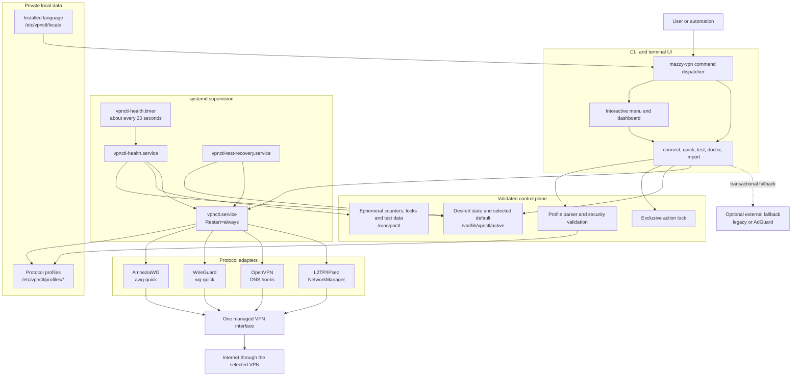
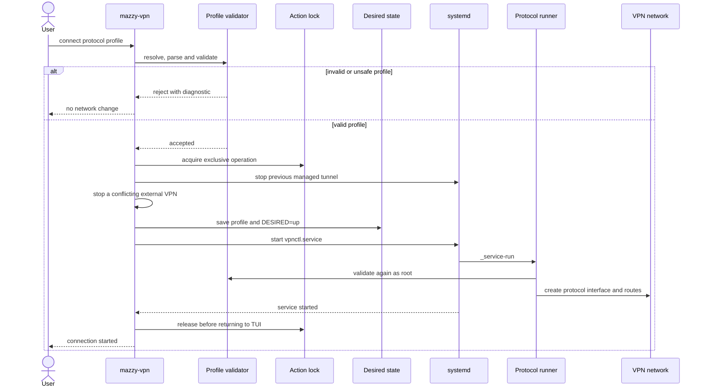
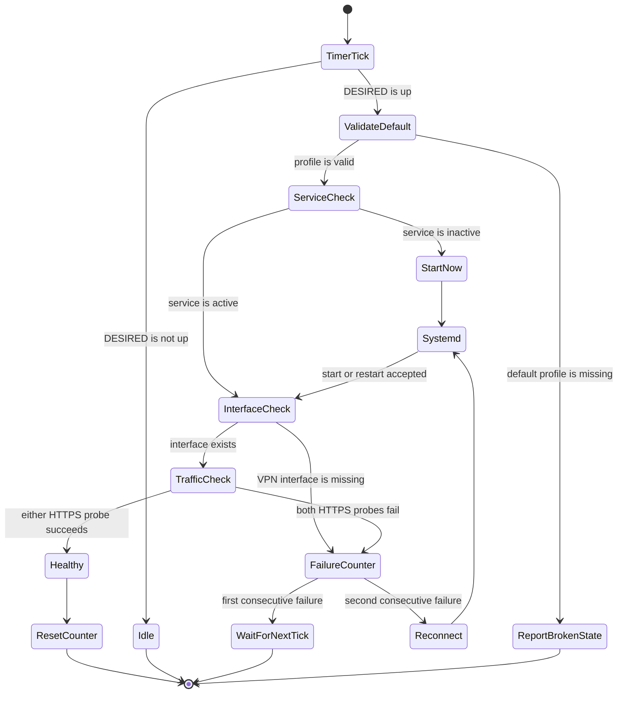
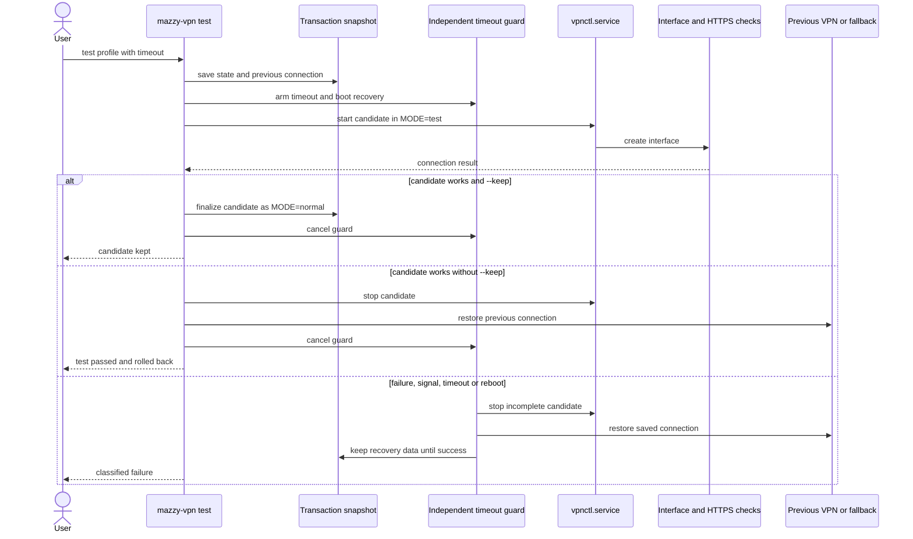

# Mazzy VPN architecture

Copyright © 2026 [Nik m (@mazurovn)](https://github.com/mazurovn).

[Русская версия](ARCHITECTURE.ru.md) · [Project README](../README.md)

Mazzy VPN is a Bash CLI/TUI and a small set of systemd units. It keeps protocol
profiles outside the source tree, uses one canonical desired-state file and
delegates tunnel lifetime to systemd. The interactive menu and automation
commands use the same functions, validation rules and state transitions.

## Component architecture

The control plane never embeds a provider key in source code. The public
repository contains the manager, tests and documentation only. Operational
profiles stay root-readable with mode `600`.

## Normal connection flow

Validation happens before privilege-sensitive execution and again inside the
root service. Unsafe OpenVPN includes or executable hooks, unsafe WireGuard
hooks, incomplete profiles and open file permissions are rejected.

## Automatic monitoring and self-healing

There are two independent recovery layers:

1. `vpnctl.service` uses `Restart=always` and a five-second delay. An unexpected
   process exit is recovered without waiting for the timer.
2. The health timer checks desired state, service state, the local VPN
   interface and two HTTPS paths. A desired but inactive service starts
   immediately. A locally active but unusable tunnel is restarted after two
   consecutive failed checks.

Manual `disconnect` writes `DESIRED=down` before stopping the service, so the
health monitor does not undo an intentional disconnect. An idle TUI does not
retain the action lock.

## Transactional live test and rollback

The transaction distinguishes a provider rejection, authentication failure,
timeout and local runtime error. Recovery state is removed only after the
previous connection has been restored successfully.

## State and security boundaries

| Path or unit | Purpose | Lifetime / access |
|---|---|---|
| `/etc/vpnctl/profiles/{amneziawg,wireguard,openvpn,l2tp}` | Private profiles | Persistent, directories `700`, files `600` |
| `/etc/vpnctl/locale` | Installed interface language | Persistent, non-secret |
| `/var/lib/vpnctl/active` | Selected protocol, default profile, `DESIRED`, test metadata | Persistent, root-owned |
| `/var/lib/vpnctl/test.*` | Transaction and rollback snapshot | Exists only while recovery may be needed |
| `/run/vpnctl` | Locks, health counter and sanitized runtime log | Cleared at boot |
| `vpnctl.service` | Owns the active managed tunnel | Long-running, systemd supervised |
| `vpnctl-health.timer` | Schedules independent health checks | Enabled for unattended recovery |
| `vpnctl-test-recovery.service` | Repairs interrupted tests after boot | Boot-time oneshot |

Security invariants:

- one managed tunnel and one serialized state-changing operation;
- profile type is detected from content, then validated before import;
- no private key, credential, personal path or operational profile belongs in
  Git;
- extended logs conceal private and AmneziaWG obfuscation parameters;
- test failure never silently replaces the last known working connection;
- external VPN fallback is optional and is not required for normal recovery.

## Verification map

| Concern | Command or automated check |
|---|---|
| Active route, DNS, interface, handshake and internet | `mazzy-vpn diagnose` |
| Dashboard and saved default | `mazzy-vpn dashboard` |
| All profile formats and permissions | `mazzy-vpn validate all` |
| Endpoint DNS and ping | `mazzy-vpn probe all --timeout 3` |
| Installation and systemd health | `mazzy-vpn doctor` |
| Safe automatic repairs | `sudo mazzy-vpn doctor --fix` |
| Offline full check | `mazzy-vpn self-test --offline` |
| Transactional live checks | `sudo mazzy-vpn test-all all` |
| Public-tree leak policy | `tests/audit-public.sh` and Gitleaks in CI |

