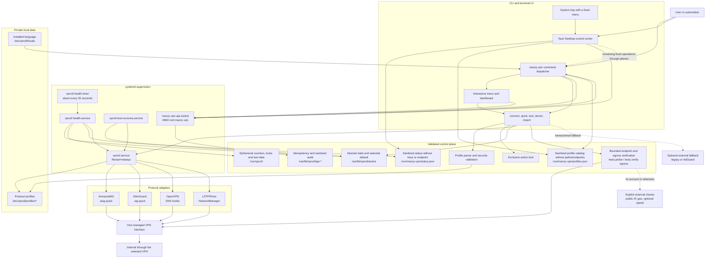
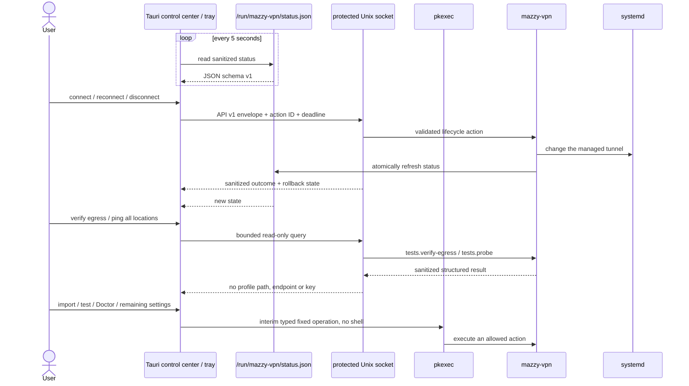
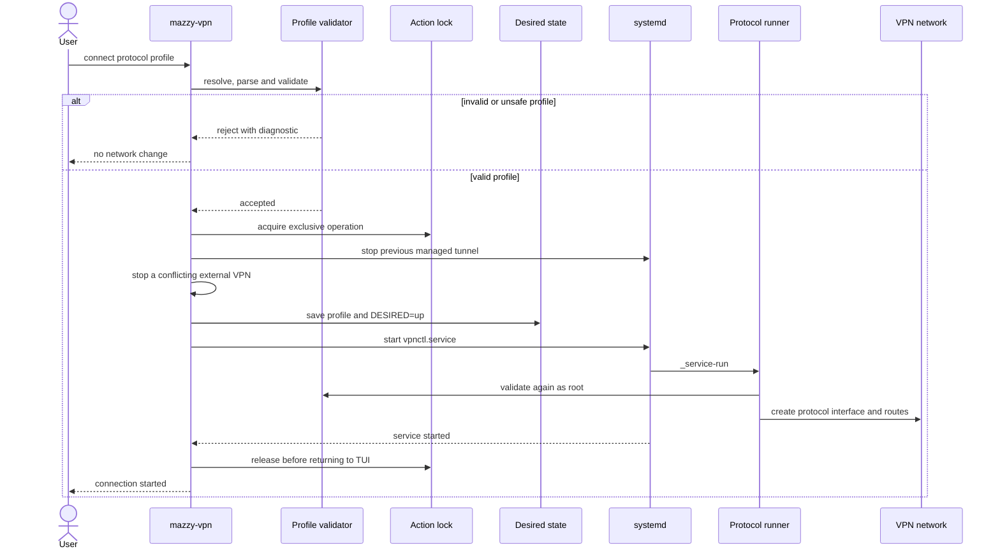
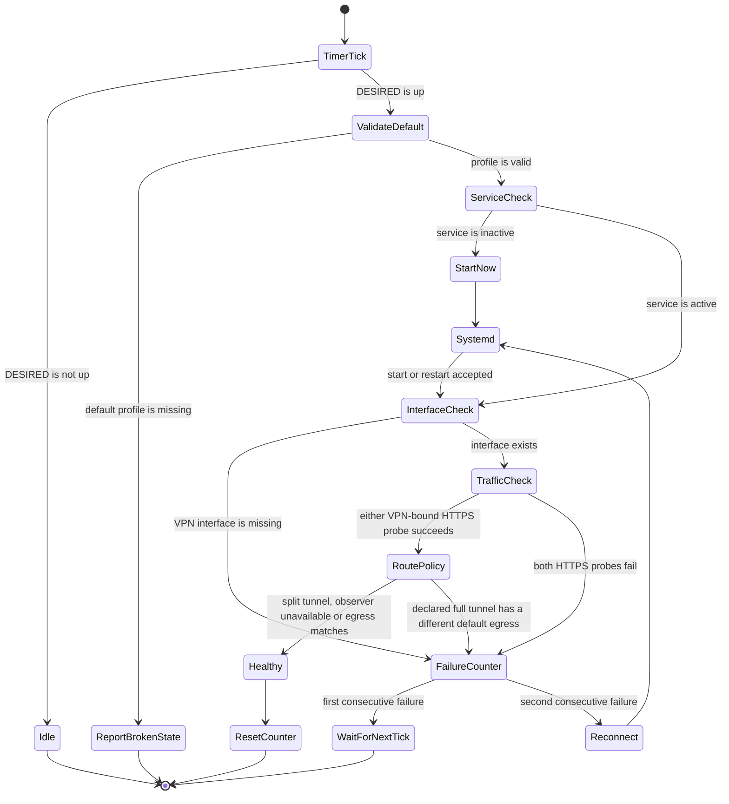
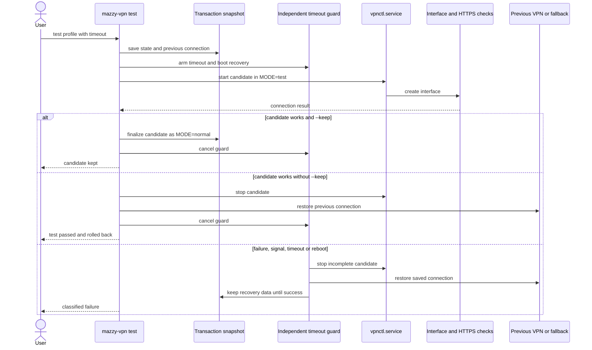

# Mazzy VPN architecture

Copyright © 2026 [Nik m (@mazurovn)](https://github.com/mazurovn).

[Русская версия](ARCHITECTURE.ru.md) · [Project README](../README.md)

This document describes the current CLI/TUI and Desktop 0.3 architecture. See
the [Desktop 1.0 plan](DESKTOP_ROADMAP.en.md) for the target standalone
architecture with a shared core and versioned API. The
[feature-parity matrix](FEATURE_PARITY.md) prevents a preview from being
presented as a complete standalone application.

Mazzy VPN is a Bash CLI/TUI, a Tauri Desktop Dashboard and a small set of
systemd units. It keeps protocol profiles outside the source tree, uses one
canonical desired-state file and delegates tunnel lifetime to systemd.
Unprivileged CLI, TUI and Desktop clients use the protected local API for
status/profile queries and lifecycle operations; remaining commands are being
moved incrementally from the compatible direct CLI control plane.

## Component architecture

The control plane never embeds a provider key in source code. The public
repository contains the manager, tests and documentation only. Operational
profiles stay root-readable with mode `600`.

The profile catalog is derived at runtime. Endpoints come only from protocol
directives (`remote`, `Endpoint=`, or NetworkManager `gateway`/`remote`);
display metadata may come from exact `mazzy-name`, `mazzy-location` and
`mazzy-country-code` comments. There is no server catalog or country/city
inference in the runtime. Without an explicit country code, verification shows
the observed country but leaves profile-country comparison `unknown` and the
overall verdict at `warning`.

OpenVPN uses DNS pushed by the server/profile. It never silently inserts a
public resolver; an administrator may configure an explicit
`VPNCTL_OPENVPN_FALLBACK_DNS` only when that policy is intentional.

## Protocol registry and orchestration boundary

[`protocols/v1/registry.json`](../protocols/v1/registry.json) separates
catalog, detection, import, diagnostics and per-platform connection readiness.
The catalog contains 13 protocols, while only AmneziaWG, WireGuard, OpenVPN and
L2TP/IPsec currently have implemented Linux connection adapters. The remaining
nine entries cannot enter lifecycle selection while their platform state is
`planned`.

`mazzy-vpn protocols list --json` and API `protocols.list` expose only public
capabilities. `protocols detect --stdin --json` recognizes unambiguous share
schemes but returns no host, user info, UUID, password, query or fragment.
Proxy protocols require an explicit TUN adapter; arbitrary user-provided
sing-box JSON is never a root execution format. See
[Protocol orchestration](PROTOCOL_ORCHESTRATION.en.md) for scoring, custom
server storage and agent constraints.

The implemented `planner.evaluate` query is deterministic and subordinate to
hard constraints computed by the backend: platform backend ready, profile
valid, backend-only secret access, rollback directories available and platform
support implemented. It returns a scored dry-run evaluation using opaque IDs
and reason codes. LLM output cannot construct a shell command, backend
configuration or bypass a gate. The operation does not connect or fail over;
future execution remains behind authorization/action-ID, audit and rollback
boundaries.

The CLI/TUI client reaches the Unix socket through automatically installed
`socat`. It bounds response size and time, validates envelope identity and
retries an indeterminate transport with the same request and `action_id`. The
root API dispatcher marks its server context, so an internal engine call cannot
re-enter the socket recursively. A direct `sudo` fallback is forbidden after a
request may have been sent. The published schema-v1 `--json` output remains
stable for existing automation; `--api-json` explicitly returns the raw v1
envelope. Optional safe status fields restore terminal detail without exposing
the VPN endpoint, profile filename/path or configuration.

## Desktop control center and tray

Desktop opens user-selected files only long enough to pass their canonical paths
to the validated import operation; it never parses a VPN profile or reads a key.
A root CLI process atomically updates mode-`0640 root:mazzy-vpn` status and
profile-catalog JSON caches. They contain service state, selected display name,
protocol, interface,
handshake age, public VPN address, autostart/health-monitor state and sanitized
profile labels. Profile paths, server endpoints, keys and configuration
directives are not exported.

Closing the window hides it to the tray. The Linux package bundles a compatible
engine installer and can bootstrap or repair missing dependencies after
explicit authorization, so a separate manual CLI installation is not required.
The incremental Linux API now handles sanitized status/profile queries,
read-only whole-list endpoint probes, egress verification, and the connect,
reconnect and disconnect lifecycle. It persists mutation action IDs, enforces
deadlines and reports rollback outcomes. Import, live tests, Doctor and service
settings still use the typed `pkexec` adapter until their API handlers are
implemented. Completing that migration remains a Desktop 1.0 gate. macOS and
Windows builds are UI previews and are not advertised as working VPN clients
until native backends exist.

Egress verification makes bounded HTTPS requests through the selected
interface. Public-IP and two geolocation services run only after an explicit
verify action; the five-megabyte speed endpoint runs only after the additional
speed choice. Responses are validated against exact IP families, provider
identity, the interface-bound IPv4 and cross-provider country agreement before
reaching the webview. Results are transient and are not written to the
repository. See [PRIVACY.md](../PRIVACY.md) for endpoints and disclosure.

## Normal connection flow

Validation happens before privilege-sensitive execution and again inside the
root service. Unsafe OpenVPN includes or executable hooks, unsafe WireGuard
hooks, incomplete profiles and open file permissions are rejected.

## Automatic monitoring and self-healing

There are two independent recovery layers:

1. `vpnctl.service` uses `Restart=always` and a five-second delay. An unexpected
   process exit is recovered without waiting for the timer.
2. The health timer checks desired state, service state, the local VPN
   interface and two HTTPS paths. For profiles that declare a full tunnel, its
   automatic policy also compares default and interface-bound IPv4. A desired
   but inactive service starts immediately. A locally active but unusable
   tunnel, or two confirmed full-tunnel egress mismatches, triggers restart.
   An unavailable comparison observer does not trigger recovery.

Manual `disconnect` writes `DESIRED=down` before stopping the service, so the
health monitor does not undo an intentional disconnect. An idle TUI does not
retain the action lock.

## Transactional live test and rollback

The transaction distinguishes a provider rejection, authentication failure,
timeout and local runtime error. Recovery state is removed only after the
previous connection has been restored successfully.

## State and security boundaries

| Path or unit | Purpose | Lifetime / access |
|---|---|---|
| `/etc/vpnctl/profiles/{amneziawg,wireguard,openvpn,l2tp}` | Private profiles | Persistent, directories `700`, files `600` |
| `/etc/vpnctl/locale` | Installed interface language | Persistent, non-secret |
| `/var/lib/vpnctl/active` | Selected protocol, default profile, `DESIRED`, test metadata | Persistent, root-owned |
| `/var/lib/vpnctl/test.*` | Transaction and rollback snapshot | Exists only while recovery may be needed |
| `/var/lib/vpnctl/api-actions` | Completed/running action IDs, rollback snapshots and sanitized outcomes | Persistent, directory `700`, records `600`; newest 512 completed outcomes by default |
| `/var/lib/vpnctl/api-audit.jsonl{,.1}` | Operation, authorization decision and outcome | Persistent, mode `600`; no payload/backend output; 2 MiB rotation with one archive |
| `/var/lib/vpnctl/api-recovery-required.json` | Failed/missing rollback snapshot marker | Persistent mode `600`; blocks API mutations until explicit administrator acknowledgement |
| `/run/vpnctl` | Locks, health counter and sanitized runtime log | Cleared at boot |
| `/run/mazzy-vpn/status.json` | Sanitized Desktop status | Recreated by root, `0640 root:mazzy-vpn`, without keys or endpoint |
| `/run/mazzy-vpn/api-v1.sock` | Versioned local API transport | Socket `0660 root:mazzy-vpn`, systemd activated |
| `vpnctl.service` | Owns the active managed tunnel | Long-running, systemd supervised |
| `vpnctl-health.timer` | Schedules independent health checks | Enabled for unattended recovery |
| `vpnctl-test-recovery.service` | Repairs interrupted tests after boot | Boot-time oneshot |

Security invariants:

- one managed tunnel and one serialized state-changing operation;
- an interrupted API action is reconciled from its pre-action snapshot before
  another mutation starts;
- profile type is detected from content, then validated before import;
- no private key, credential, personal path or operational profile belongs in
  Git;
- extended logs conceal private and AmneziaWG obfuscation parameters;
- Desktop accepts enum actions only and never passes user input to a shell;
  Rust strictly deserializes both runtime caches, and exact opaque
  `profile_id`/basename identity prevents duplicate display names from
  impersonating the active profile; the caches contain no endpoint or profile
  contents;
- external verification is explicit, bounded, validated and never treated as
  telemetry or proof of application-level availability;
- test failure never silently replaces the last known working connection;
- external VPN fallback is optional and is not required for normal recovery.

## Verification map

| Concern | Command or automated check |
|---|---|
| Active route, DNS, interface, handshake and internet | `mazzy-vpn diagnose` |
| Dashboard and saved default | `mazzy-vpn dashboard` |
| Machine-readable sanitized status | `mazzy-vpn status --json` |
| All profile formats and permissions | `mazzy-vpn validate all` |
| Bounded batch endpoint reachability and latency | `mazzy-vpn probe all --timeout 3 --jobs 4 [--json]` |
| Actual default/interface egress, geo agreement, DNS and IPv6 signals | `mazzy-vpn verify [--speed] [--json]` |
| Installation and systemd health | `mazzy-vpn doctor` |
| Safe automatic repairs | `sudo mazzy-vpn doctor --fix` |
| Offline full check | `mazzy-vpn self-test --offline` |
| Transactional live checks | `sudo mazzy-vpn test-all all` |
| Public-tree leak policy | `tests/audit-public.sh` and Gitleaks in CI |
