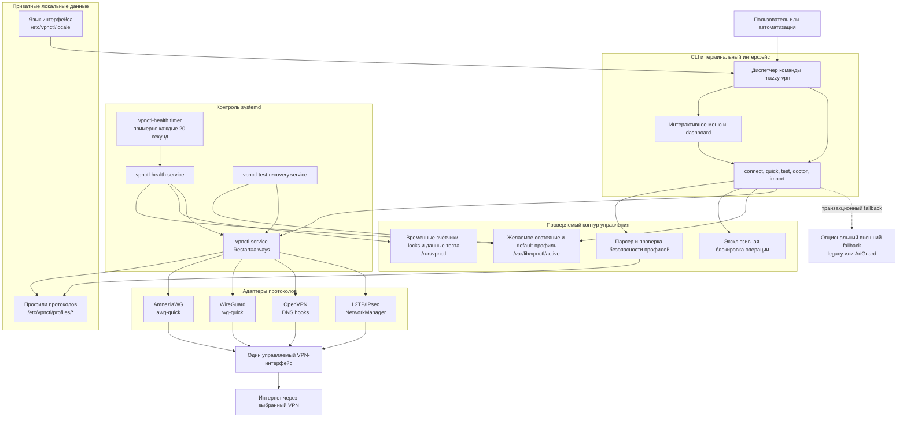
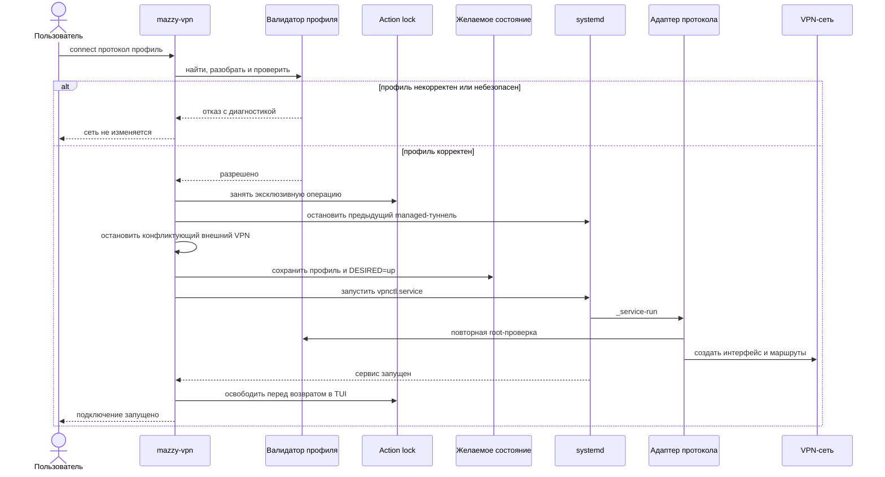
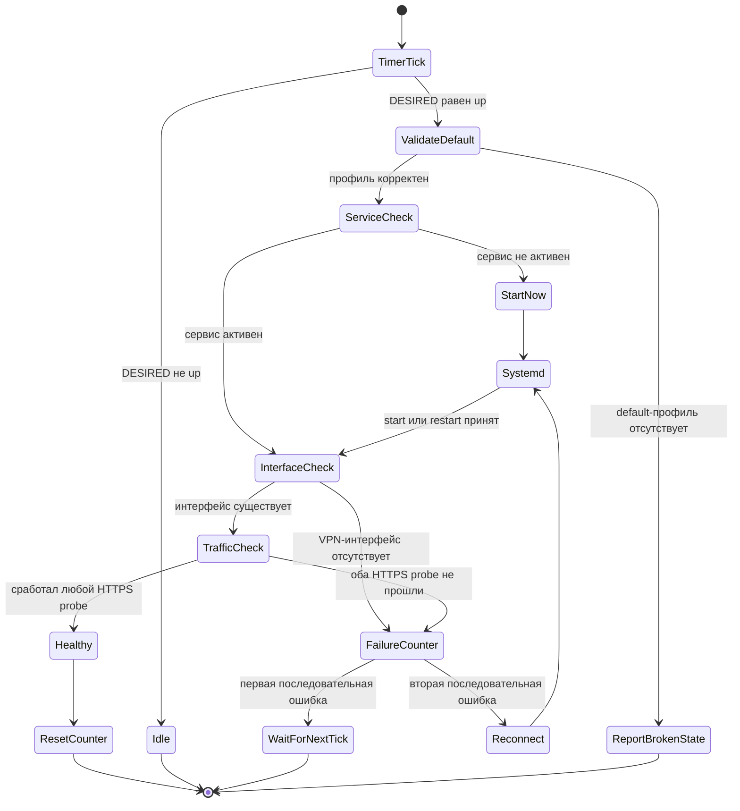
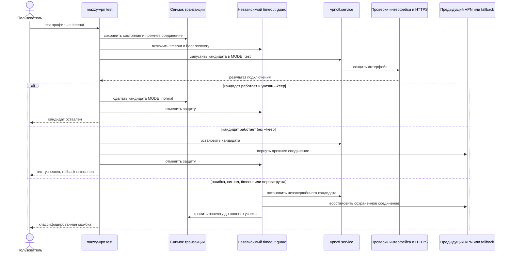

# Архитектура Mazzy VPN

Copyright © 2026 [Nik m (@mazurovn)](https://github.com/mazurovn).

[English version](ARCHITECTURE.en.md) · [Главная страница](../README.md)

Mazzy VPN состоит из Bash CLI/TUI и небольшого набора systemd units. Профили
протоколов хранятся вне исходного кода, выбранное состояние записывается в один
канонический файл, а временем жизни туннеля управляет systemd. Интерактивное
меню и команды автоматизации используют одинаковые функции, правила проверки и
переходы состояния.

## Компонентная архитектура

Контур управления не содержит ключей провайдера в исходном коде. В публичном
репозитории находятся только менеджер, тесты и документация. Рабочие профили
остаются доступными только root и имеют права `600`.

## Обычное подключение

Проверка выполняется до привилегированной операции и повторно внутри root
service. Запрещаются OpenVPN includes и executable hooks, небезопасные
WireGuard hooks, неполные профили и открытые права файлов.

## Автоматическое наблюдение и лечение

Работают два независимых уровня восстановления:

1. `vpnctl.service` использует `Restart=always` и задержку пять секунд.
   Неожиданно завершившийся процесс восстанавливается без ожидания таймера.
2. Health timer проверяет желаемое состояние, systemd service, локальный
   VPN-интерфейс и два HTTPS-маршрута. Требуемый, но остановленный сервис
   запускается сразу. Формально активный, но не передающий трафик туннель
   перезапускается после двух последовательных неудачных проверок.

Ручной `disconnect` записывает `DESIRED=down` до остановки сервиса, поэтому
монитор не отменяет осознанное отключение. Ожидающее ввода TUI не удерживает
action lock.

## Транзакционный live-test и rollback

Транзакция различает отказ провайдера, ошибку авторизации, timeout и ошибку
локального runtime. Recovery-состояние удаляется только после успешного
возврата предыдущего соединения.

## Состояние и границы безопасности

| Путь или unit | Назначение | Время жизни / доступ |
|---|---|---|
| `/etc/vpnctl/profiles/{amneziawg,wireguard,openvpn,l2tp}` | Приватные профили | Постоянно, каталоги `700`, файлы `600` |
| `/etc/vpnctl/locale` | Выбранный язык | Постоянно, не является секретом |
| `/var/lib/vpnctl/active` | Протокол, default-профиль, `DESIRED`, метаданные теста | Постоянно, root |
| `/var/lib/vpnctl/test.*` | Снимок транзакции и rollback | Пока может понадобиться recovery |
| `/run/vpnctl` | Locks, health-счётчик и очищенный runtime log | Очищается при загрузке |
| `vpnctl.service` | Владеет активным managed-туннелем | Долгоживущий, под контролем systemd |
| `vpnctl-health.timer` | Планирует независимые health-проверки | Включён для автовосстановления |
| `vpnctl-test-recovery.service` | Исправляет прерванный тест после загрузки | Boot-time oneshot |

Инварианты безопасности:

- один managed-туннель и одна изменяющая состояние операция одновременно;
- тип профиля определяется по содержимому, затем проверяется до импорта;
- приватные ключи, credentials, личные пути и рабочие профили не попадают в
  Git;
- расширенный журнал скрывает приватные и AmneziaWG obfuscation-параметры;
- неудачный тест не заменяет молча последнее рабочее соединение;
- внешний VPN fallback опционален и не нужен обычному автовосстановлению.

## Карта проверок

| Что проверяется | Команда или автоматическая проверка |
|---|---|
| Маршрут, DNS, интерфейс, handshake и интернет | `mazzy-vpn diagnose` |
| Dashboard и сохранённый default | `mazzy-vpn dashboard` |
| Формат и права всех профилей | `mazzy-vpn validate all` |
| DNS и ping endpoint | `mazzy-vpn probe all --timeout 3` |
| Установка и systemd | `mazzy-vpn doctor` |
| Безопасное автоматическое исправление | `sudo mazzy-vpn doctor --fix` |
| Полная offline-проверка | `mazzy-vpn self-test --offline` |
| Транзакционные live-тесты | `sudo mazzy-vpn test-all all` |
| Утечки в публичном дереве | `tests/audit-public.sh` и Gitleaks в CI |

