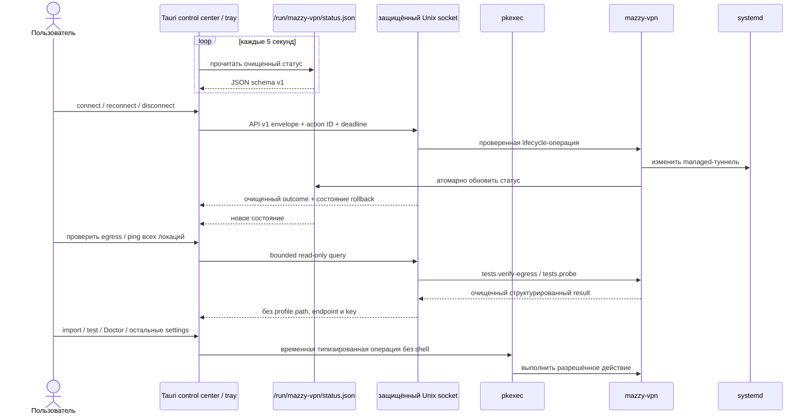
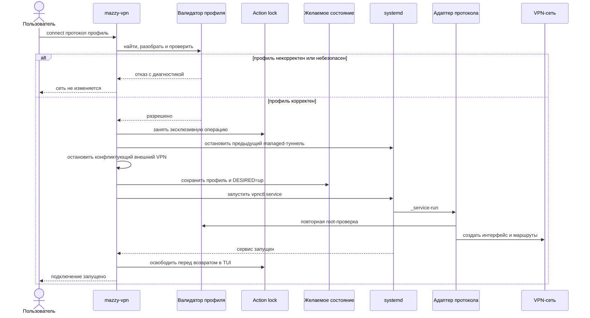
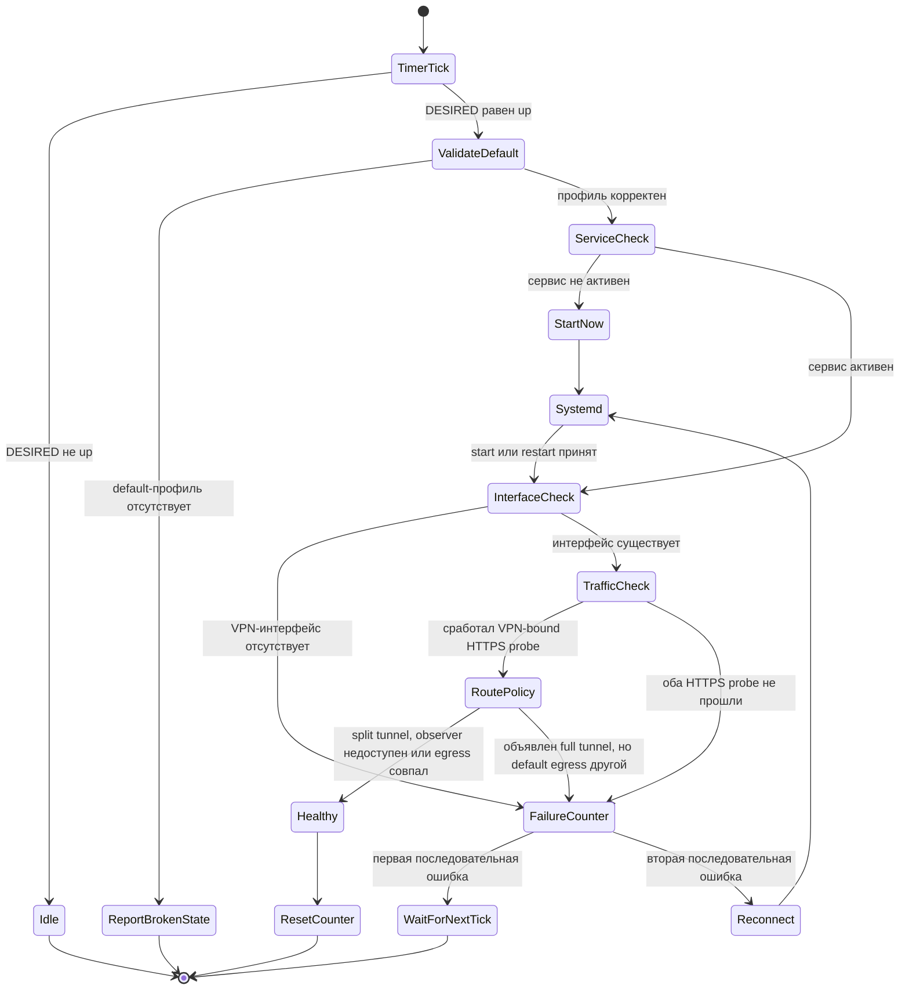
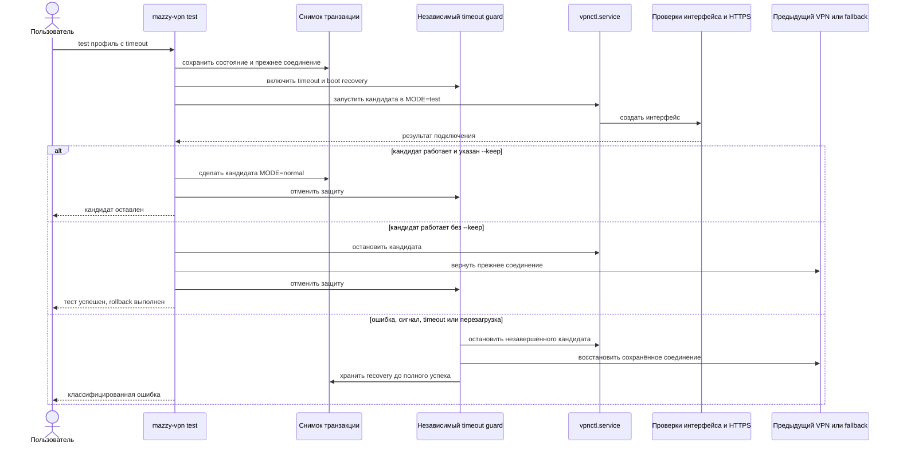

# Архитектура Mazzy VPN

Copyright © 2026 [Nik m (@mazurovn)](https://github.com/mazurovn).

[English version](ARCHITECTURE.en.md) · [Главная страница](../README.md)

Этот документ описывает действующую архитектуру CLI/TUI и Desktop 0.3.
Целевая архитектура самостоятельного Desktop 1.0 с общим core и versioned API:
[план Desktop 1.0](DESKTOP_ROADMAP.ru.md). Матрица
[паритета функций](FEATURE_PARITY.md) не позволяет выдать preview за готовое
самостоятельное приложение.

Mazzy VPN состоит из Bash CLI/TUI, Tauri Desktop Dashboard и небольшого набора
systemd units. Профили протоколов хранятся вне исходного кода, выбранное
состояние записывается в один канонический файл, а временем жизни туннеля
управляет systemd. Непривилегированные CLI, TUI и Desktop используют защищённый
локальный API для status/profile queries и lifecycle; остальные команды
постепенно переносятся из совместимого прямого CLI-контура.

## Компонентная архитектура

```mermaid
flowchart TB
    User["Пользователь или автоматизация"]

    subgraph UX["CLI и терминальный интерфейс"]
        Entry["Диспетчер команды mazzy-vpn"]
        TUI["Интерактивное меню и dashboard"]
        Desktop["Tauri Desktop control center"]
        Tray["Системный tray и фиксированное меню"]
        Commands["connect, quick, test, doctor, import"]
    end

    subgraph Control["Проверяемый контур управления"]
        Validation["Парсер и проверка безопасности профилей"]
        ActionLock["Эксклюзивная блокировка операции"]
        State["Желаемое состояние и default-профиль<br/>/var/lib/vpnctl/active"]
        Runtime["Временные счётчики, locks и данные теста<br/>/run/vpnctl"]
        ActionJournal["Idempotency и очищенный audit<br/>/var/lib/vpnctl/api-*"]
        StatusCache["Очищенный статус без ключей и endpoint<br/>/run/mazzy-vpn/status.json"]
        ProfileCache["Очищенный каталог профилей без путей/endpoint<br/>/run/mazzy-vpn/profiles.json"]
        Verification["Ограниченные endpoint/egress проверки<br/>tests.probe / tests.verify-egress"]
        Registry["Версионированный реестр протоколов<br/>capabilities + policy"]
        Planner["Read-only planner<br/>backend gates + advisory score"]
    end

    subgraph Supervisor["Контроль systemd"]
        Service["vpnctl.service<br/>Restart=always"]
        Timer["vpnctl-health.timer<br/>примерно каждые 20 секунд"]
        Health["vpnctl-health.service"]
        BootRecovery["vpnctl-test-recovery.service"]
        ApiSocket["mazzy-vpn-api.socket<br/>0660 root:mazzy-vpn"]
    end

    subgraph Data["Приватные локальные данные"]
        Profiles["Профили протоколов<br/>/etc/vpnctl/profiles/*"]
        Locale["Язык интерфейса<br/>/etc/vpnctl/locale"]
    end

    subgraph Engines["Адаптеры протоколов"]
        AWG["AmneziaWG<br/>awg-quick"]
        WG["WireGuard<br/>wg-quick"]
        OVPN["OpenVPN<br/>DNS hooks"]
        L2TP["L2TP/IPsec<br/>NetworkManager"]
    end

    Tunnel["Один управляемый VPN-интерфейс"]
    Internet["Интернет через выбранный VPN"]
    ProbeProviders["Явные внешние проверки<br/>public IP, geo, optional speed"]
    External["Опциональный внешний fallback<br/>legacy или AdGuard"]

    User --> Entry
    User --> Desktop
    Entry --> TUI
    Entry --> Commands
    TUI --> Commands
    Entry --> ApiSocket
    TUI --> ApiSocket
    Tray --> Desktop
    Desktop --> StatusCache
    Desktop --> ProfileCache
    Desktop --> ApiSocket
    ApiSocket --> Entry
    ApiSocket --> ActionJournal
    Entry --> Registry
    Entry --> Planner
    Planner --> Registry
    Planner --> ProfileCache
    Planner --> Validation
    Desktop -. остальные фиксированные операции через pkexec .-> Entry
    Commands --> Validation
    Validation --> Profiles
    Commands --> ActionLock
    Commands --> State
    Commands --> Service
    Commands --> Verification
    Verification --> Tunnel
    Verification -. без аккаунта и telemetry .-> ProbeProviders
    Commands -. транзакционный fallback .-> External
    Timer --> Health
    Health --> State
    Health --> Runtime
    Health --> StatusCache
    Entry --> ProfileCache
    Health --> Service
    BootRecovery --> State
    BootRecovery --> Service
    Service --> Profiles
    Service --> AWG
    Service --> WG
    Service --> OVPN
    Service --> L2TP
    AWG --> Tunnel
    WG --> Tunnel
    OVPN --> Tunnel
    L2TP --> Tunnel
    Tunnel --> Internet
    Locale --> Entry
```

Контур управления не содержит ключей провайдера в исходном коде. В публичном
репозитории находятся только менеджер, тесты и документация. Рабочие профили
остаются доступными только root и имеют права `600`.

Каталог профилей формируется во время работы. Endpoint берётся только из
директив протокола (`remote`, `Endpoint=` либо NetworkManager
`gateway`/`remote`), а отображаемые metadata — из точных комментариев
`mazzy-name`, `mazzy-location` и `mazzy-country-code`. В runtime нет списка
серверов и эвристики country/city. Без явного country code проверка показывает
наблюдаемую страну, но оставляет сравнение с профилем в состоянии `unknown`, а
общий итог — в `warning`.

OpenVPN использует DNS, переданный сервером/профилем. Публичный resolver молча
не добавляется; администратор может явно задать
`VPNCTL_OPENVPN_FALLBACK_DNS`, только если это соответствует его политике.

## Реестр протоколов и граница оркестрации

[`protocols/v1/registry.json`](../protocols/v1/registry.json) раздельно хранит
готовность catalog, detection, import, diagnostics и connection для каждой
платформы. Каталог содержит 13 протоколов, но Linux connection adapters сейчас
реализованы только для AmneziaWG, WireGuard, OpenVPN и L2TP/IPsec. Остальные
девять записей не участвуют в lifecycle selection со статусом `planned`.

`mazzy-vpn protocols list --json` и API `protocols.list` возвращают только
публичные capabilities. `protocols detect --stdin --json` классифицирует
однозначные share URI и ограниченные JSON-структуры, но не выводит host, user
info, UUID, password, query или fragment. Классифицированный JSON не считается
валидированным runtime config. Proxy-протоколам нужен отдельный TUN adapter;
произвольный пользовательский sing-box JSON никогда не является root execution
format.
Полная модель описана в
[документе об оркестрации](PROTOCOL_ORCHESTRATION.ru.md).

Реализованный query `planner.evaluate` подчинён вычисляемым backend hard
constraints: platform backend готов, профиль валиден, секрет доступен только
backend, защищённый rollback storage готов и platform support имеет статус
`implemented`. Storage gate подтверждает место для защищённого journal/snapshot,
но не доказывает rollback конкретного кандидата. Planner возвращает scored
dry-run evaluation с opaque IDs и reason codes. LLM не создаёт shell
command/backend config и не обходит gate. Operation не подключает VPN и не
выполняет failover; будущее execution остаётся за authorization/action-ID,
audit и rollback boundaries.

Граница доверия задана явно:

| Вход/состояние | Владелец | Использование planner |
|---|---|---|
| Наличие runtime, текущий parse профиля, права файла, rollback storage и platform support | backend | eligibility gates; caller не может их изменить |
| Recent outcome, reachability, latency/loss и возраст измерения | caller в текущем срезе | только health score; evidence старше 900 секунд даёт ноль |
| Censorship fit и workload fit | backend catalog + workload | score; caller не назначает эти значения |
| Произвольный текст модели | недоверенный | никогда не разбирается как shell command, профиль или backend config |

Для одинакового локального snapshot и evidence rank/reason codes
детерминированы; `evaluated_at` намеренно меняется. Один абсолютный monotonic
deadline проходит через candidate validation и OpenVPN parser. Поэтому timeout
parser возвращается как `deadline-exceeded`, а не продолжает работу после
исчерпания API budget.

CLI/TUI-клиент подключается к Unix socket через автоматически установленный
`socat`. Он ограничивает размер и время ответа, проверяет identity envelope и
при сетевой неопределённости повторяет тот же request с тем же `action_id`.
Root API-dispatch помечает server context, поэтому внутренний вызов движка не
может рекурсивно вернуться в socket. После возможной отправки запроса прямой
`sudo` fallback запрещён. Опубликованный schema-v1 вывод `--json` остаётся
стабильным для существующей автоматизации; `--api-json` явно возвращает raw v1
envelope. Необязательные безопасные status fields возвращают детали терминала
без раскрытия VPN endpoint, имени/пути файла профиля или конфигурации.

## Desktop control center и tray

Desktop открывает выбранные пользователем файлы только для передачи их
канонических путей проверяемой операции импорта; сам он не разбирает
VPN-профиль и не читает ключи. Root-процесс CLI атомарно обновляет status и
profile-catalog JSON caches с правами `0640 root:mazzy-vpn`. В них есть
состояние сервиса,
выбранное отображаемое имя, протокол, интерфейс, возраст handshake, публичный
VPN-адрес, состояния autostart/health monitor и очищенные label профилей. Пути,
endpoint, ключи и конфигурационные директивы не экспортируются.

Закрытие окна скрывает приложение в tray. Linux-пакет содержит совместимый
installer engine и после явного разрешения может установить или восстановить
отсутствующие зависимости, поэтому отдельная ручная установка CLI не нужна.
Постепенный Linux API уже обслуживает очищенные status/profile queries,
read-only массовый endpoint probe, egress verification и connect, reconnect,
disconnect. Для mutations он сохраняет action IDs, применяет deadlines и
возвращает итог rollback. Import, live tests, Doctor и service settings пока
используют типизированный `pkexec` adapter до появления соответствующих API
handlers. Завершение миграции остаётся gate версии Desktop 1.0. Сборки macOS и
Windows пока являются preview интерфейса и не заявляются как рабочий VPN-клиент
до реализации нативных backends.

Egress verification выполняет bounded HTTPS requests через выбранный
интерфейс. Public-IP и два geo services вызываются только явной командой
verify; 5-МБ speed endpoint — только после дополнительного выбора скорости.
До передачи в webview ответы проверяются по семейству IP, identity provider,
равенству interface-bound IPv4 и согласию страны между providers. Результат
временный и не записывается в репозиторий. Endpoints и disclosure перечислены
в [PRIVACY.md](../PRIVACY.md).

## Обычное подключение

Проверка выполняется до привилегированной операции и повторно внутри root
service. Запрещаются OpenVPN includes и executable hooks, небезопасные
WireGuard hooks, неполные профили и открытые права файлов.

## Автоматическое наблюдение и лечение

Работают два независимых уровня восстановления:

1. `vpnctl.service` использует `Restart=always` и задержку пять секунд.
   Неожиданно завершившийся процесс восстанавливается без ожидания таймера.
2. Health timer проверяет желаемое состояние, systemd service, локальный
   VPN-интерфейс и два HTTPS-маршрута. Для профиля, объявляющего full tunnel,
   auto policy также сравнивает default и interface-bound IPv4. Требуемый, но
   остановленный сервис запускается сразу. Не передающий трафик туннель или два
   подтверждённых full-tunnel egress mismatch вызывают restart. Недоступность
   observer сама по себе recovery не запускает.

Ручной `disconnect` записывает `DESIRED=down` до остановки сервиса, поэтому
монитор не отменяет осознанное отключение. Ожидающее ввода TUI не удерживает
action lock.

## Транзакционный live-test и rollback

Транзакция различает отказ провайдера, ошибку авторизации, timeout и ошибку
локального runtime. Recovery-состояние удаляется только после успешного
возврата предыдущего соединения.

## Состояние и границы безопасности

| Путь или unit | Назначение | Время жизни / доступ |
|---|---|---|
| `/etc/vpnctl/profiles/{amneziawg,wireguard,openvpn,l2tp}` | Приватные профили | Постоянно, каталоги `700`, файлы `600` |
| `/etc/vpnctl/locale` | Выбранный язык | Постоянно, не является секретом |
| `/var/lib/vpnctl/active` | Протокол, default-профиль, `DESIRED`, метаданные теста | Постоянно, root |
| `/var/lib/vpnctl/test.*` | Снимок транзакции и rollback | Пока может понадобиться recovery |
| `/var/lib/vpnctl/api-actions` | Action IDs, rollback snapshots и очищенные outcomes | Постоянно, каталог `700`, records `600`; по умолчанию 512 последних завершённых outcomes |
| `/var/lib/vpnctl/api-audit.jsonl{,.1}` | Operation, решение авторизации и outcome | Постоянно, `600`; без payload/backend output; ротация 2 МиБ с одним архивом |
| `/var/lib/vpnctl/api-recovery-required.json` | Marker отсутствующего/неудачного rollback snapshot | Постоянно, `600`; блокирует API mutations до явного подтверждения администратора |
| `/run/vpnctl` | Locks, health-счётчик и очищенный runtime log | Очищается при загрузке |
| `/run/mazzy-vpn/status.json` | Очищенный статус для Desktop | Пересоздаётся root, `0640 root:mazzy-vpn`, без ключей и endpoint |
| `/run/mazzy-vpn/api-v1.sock` | Versioned local API transport | Socket `0660 root:mazzy-vpn`, активируется systemd |
| `vpnctl.service` | Владеет активным managed-туннелем | Долгоживущий, под контролем systemd |
| `vpnctl-health.timer` | Планирует независимые health-проверки | Включён для автовосстановления |
| `vpnctl-test-recovery.service` | Исправляет прерванный тест после загрузки | Boot-time oneshot |

Инварианты безопасности:

- один managed-туннель и одна изменяющая состояние операция одновременно;
- прерванная API mutation согласуется по pre-action snapshot до запуска
  следующей изменяющей операции;
- тип профиля определяется по содержимому, затем проверяется до импорта;
- приватные ключи, credentials, личные пути и рабочие профили не попадают в
  Git;
- расширенный журнал скрывает приватные и AmneziaWG obfuscation-параметры;
- Desktop принимает только enum-действия и не передаёт пользовательскую строку
  в shell; Rust строго десериализует оба runtime cache, а точные opaque
  `profile_id`/basename не позволяют одинаковым display names подменить
  активный профиль; cache не содержат endpoint или содержимое профиля;
- внешняя verification запускается явно, ограничена, валидируется и не
  считается telemetry или доказательством доступности приложения;
- неудачный тест не заменяет молча последнее рабочее соединение;
- внешний VPN fallback опционален и не нужен обычному автовосстановлению.

## Карта проверок

| Что проверяется | Команда или автоматическая проверка |
|---|---|
| Маршрут, DNS, интерфейс, handshake и интернет | `mazzy-vpn diagnose` |
| Dashboard и сохранённый default | `mazzy-vpn dashboard` |
| Машиночитаемый очищенный статус | `mazzy-vpn status --json` |
| Формат и права всех профилей | `mazzy-vpn validate all` |
| Массовые reachability и latency endpoint | `mazzy-vpn probe all --timeout 3 --jobs 4 [--json]` |
| Фактические default/interface egress, geo agreement, DNS и IPv6 signals | `mazzy-vpn verify [--speed] [--json]` |
| Установка и systemd | `mazzy-vpn doctor` |
| Безопасное автоматическое исправление | `sudo mazzy-vpn doctor --fix` |
| Полная offline-проверка | `mazzy-vpn self-test --offline` |
| Транзакционные live-тесты | `sudo mazzy-vpn test-all all` |
| Утечки в публичном дереве | `tests/audit-public.sh` и Gitleaks в CI |
