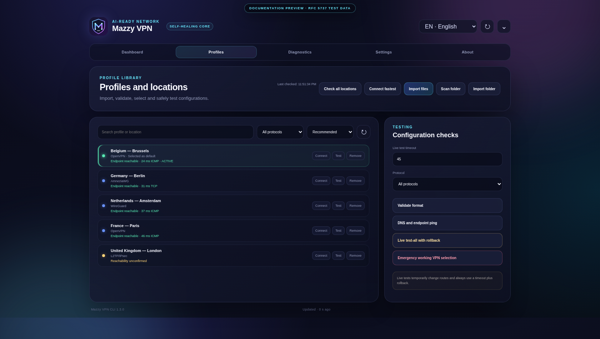
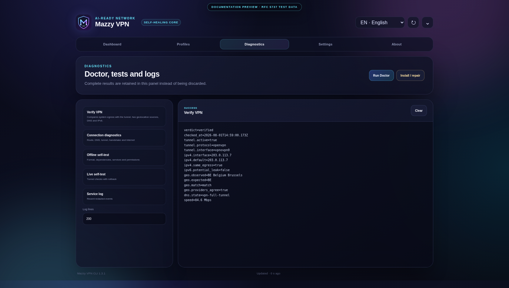
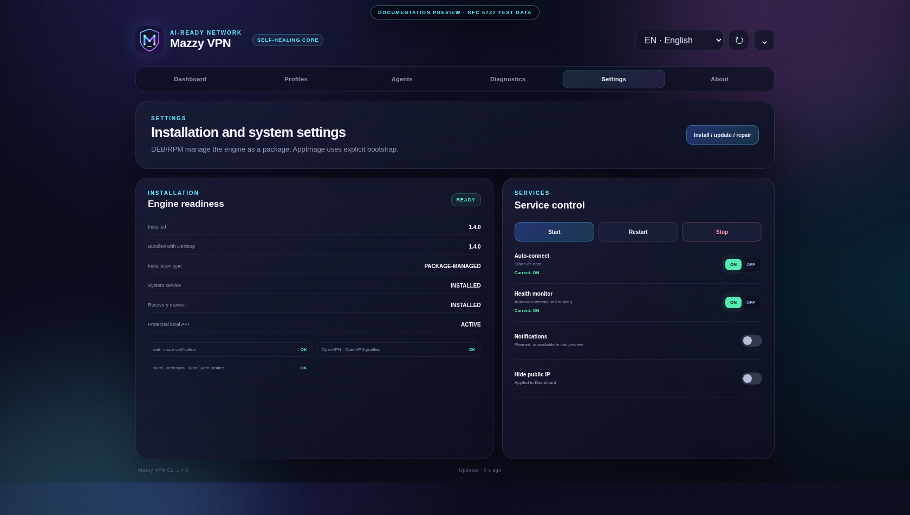

# Mazzy VPN Desktop: Linux Control Center and tray

Copyright © 2026 [Nik m (@mazurovn)](https://github.com/mazurovn).

[Русский](DESKTOP.ru.md) · [Architecture](ARCHITECTURE.en.md) ·
[Standalone Desktop 1.0 plan](DESKTOP_ROADMAP.en.md) ·
[Capability parity](FEATURE_PARITY.md) · [Project home](../README.md)


Mazzy VPN Desktop is a Tauri 2 application using the shared `mazzy-vpn`
engine. The Linux 0.3 bundle includes a compatible engine installer, so a
separate CLI installation is no longer a prerequisite. CLI and TUI remain
independent clients of the same engine and state.

> **0.3 status:** the Linux control center now covers the main workflow, but it
> remains preview until the [release gates](FEATURE_PARITY.md) pass. The
> candidate resolves issue #31 with the exact upstream `glib` 0.18 soundness
> backport, verified source provenance and an empty cargo-deny ignore list.
> Publication still waits for green PR #32/default-branch security checks and
> the GitHub release workflow. Desktop 1.0 still needs a native shared service,
> complete fallback-policy UI, six-language coverage for every screen, signed
> updates, clean-device integration tests and migration of the remaining typed
> `pkexec` operations to the partial versioned local API.

## Visual tour

All captures use RFC 5737 documentation addresses and a visible preview-data
banner. They contain no operational profile, endpoint or user IP.

| Profiles and measured location latency | Complete diagnostics output |
|---|---|
|  |  |

| Installation and explicit service state | Localized dashboards |
|---|---|
|  | [English](images/dashboard-en.png) · [Русский](images/dashboard-ru.png) · [Deutsch](images/dashboard-de.png) · [中文](images/dashboard-zh.png) · [日本語](images/dashboard-ja.png) · [한국어](images/dashboard-ko.png) |

## Platform status

| Platform | Status | Bundles |
|---|---|---|
| Linux x86_64 | Control Center with embedded shared-engine bootstrap | AppImage, DEB, RPM |
| macOS | UI preview; VPN backend is not implemented yet | app, DMG |
| Windows | UI preview; VPN backend is not implemented yet | MSI, NSIS EXE |

Do not use the macOS or Windows previews as traffic-protection tools. Complete
support requires native Network Extension/launchd and Windows service/Wintun
backends, code signing and platform-specific integration tests.

## Desktop 0.3 screens

1. **Dashboard** — tunnel, Internet, IP, handshake, health, recovery, actual
   egress verification and tray.
2. **Profiles** — safe file/folder import, search, protocol and location/default
   selection, removal, a whole-list endpoint check with per-location
   reachability/latency/active state, and per-profile live tests.
3. **Diagnostics** — validation, DNS/ping probes, transactional tests,
   `test-all`, emergency recovery, complete Doctor/self-test output and bounded
   systemd logs.
4. **Settings** — bundled/installed versions, dependency readiness,
   install/update/repair, autostart, monitor, privacy and notifications.
5. **About** — Desktop/engine/platform versions, author, license, privacy and
   safe-operation rules.

## Dashboard data

- systemd service and real VPN-interface state;
- public Internet access through the selected tunnel;
- selected location/default profile, protocol and interface;
- latest WireGuard/AmneziaWG handshake age;
- public VPN IP with a local privacy toggle;
- autostart, health monitor and external fallback state;
- profile counts for every protocol;
- local UI-session activity;
- cache freshness, so stale data cannot look current.

The health monitor automatically enforces default egress only for profiles
that declare a full tunnel. Split-tunnel profiles keep endpoint-only health
unless an administrator explicitly sets
`VPNCTL_HEALTH_REQUIRE_DEFAULT_EGRESS=yes`. Two confirmed default/interface
IPv4 mismatches trigger recovery; an unavailable observer does not. Geo and
speed checks never run in the background.

The UI reads `/run/mazzy-vpn/status.json` every five seconds and reads the
sanitized profile library from `/run/mazzy-vpn/profiles.json`. The root engine
atomically recreates both files as `0640 root:mazzy-vpn` inside a
`0750 root:mazzy-vpn` directory. They contain no endpoint, profile path,
private key, username, password or configuration directive. Rust deserializes
both caches into closed `deny_unknown_fields` types and checks their internal
invariants before exposing data to the WebView. The active row is matched by
opaque `profile_id` or exact config basename; a legacy display-name fallback is
accepted only when exactly one profile matches.

## Window and tray actions

| Action | CLI command |
|---|---|
| Quick Connect | `mazzy-vpn quick` |
| Reconnect | `mazzy-vpn reconnect` |
| Disconnect | `mazzy-vpn disconnect` |
| Verify actual egress/location | `mazzy-vpn verify` |
| Explicit bounded speed sample | `mazzy-vpn verify --speed` |
| Self-diagnostics | `mazzy-vpn doctor` |
| Active connection diagnostics | `mazzy-vpn diagnose` |
| Refresh Status | `mazzy-vpn _refresh-dashboard-cache` |
| Connect profile | `mazzy-vpn connect PROTOCOL PROFILE` |
| Import files/folder | `mazzy-vpn import-files` / `import-dir` |
| Validate / batch location probe | `mazzy-vpn validate` / `probe all --jobs 4 --json` |
| Transactional tests | `mazzy-vpn test` / `test-all` / `emergency` |
| Install / repair | package engine: `mazzy-vpn doctor --fix`; AppImage/manual install: bundled `install.sh` |
| Service settings | `mazzy-vpn autostart` / `monitor` |
| Logs | `mazzy-vpn logs --lines N` |

The tray now opens Dashboard, Profiles, Diagnostics, Settings or About
directly. It also exposes Quick Connect, Reconnect, Disconnect, actual egress
verification, whole-list location ping, refresh, Doctor, explicit
auto-connect/monitor on and off actions, and Quit. The descriptive first item
states that this is an AI-ready client with recovery and real egress checks;
it is intentionally not a connection-state indicator.

The location probe is deliberately distinct from a live VPN test. `reachable`
means DNS plus ICMP or TCP endpoint reachability; `unknown` preserves the common
case where a UDP VPN server blocks ICMP. It does not claim that credentials,
handshake or tunnel routing work. Use the confirmed live-test workflow for that
proof.

## Actual VPN verification

**Verify VPN** checks a different question from the location probe:

- the selected tunnel and interface are active;
- an IPv4 request bound to that interface has the same public egress as the
  system default route;
- two independent geolocation responses refer to that exact egress IPv4 and
  agree on the country;
- the observed country is compared with explicit `mazzy-country-code`
  metadata when the profile declares it; names and city labels are never used
  to guess the expected country, and missing metadata keeps the verdict at
  `warning`;
- default IPv6 is compared with interface-bound IPv6 to flag a potential leak;
- `systemd-resolved` is inspected for a `~.` DNS route on the VPN interface;
- an optional, user-initiated five-megabyte speed sample is bound to the VPN
  interface. It never runs in the background.

The result is `verified`, `warning` or `failed` and includes machine-readable
finding codes. Public IP values are hidden in the GUI by default. Verification
is deliberately conservative: one location source, disagreeing providers,
provider IP mismatch, a different system egress, potential IPv6 leak or
unconfirmed full-tunnel DNS cannot produce `verified`.

This is network evidence, not a promise that every site will accept the
session. A site may also use account region, organization policy, cookies,
browser language, WebRTC or device location. The check contacts the providers
listed in [PRIVACY.md](../PRIVACY.md).

The GUI never constructs a shell string. Its Rust backend accepts an enum and
maps it to a fixed request or argument array. Connect, reconnect and disconnect
use `/run/mazzy-vpn/api-v1.sock` when the installed engine provides it. The
socket is restricted to `root:mazzy-vpn`, and outcomes contain no raw backend
output. CLI/TUI use the same socket without `sudo` for lifecycle actions and
select profiles by opaque ID only. Remaining state-changing actions use system
`pkexec`, so the OS may
show its standard administrator prompt. Closing the window hides the
application to the tray; use **Quit Mazzy VPN** for a full exit.

On Linux, open the tray context menu with the right mouse button. Plain-click
events depend on the desktop environment.

## Linux installation

After a release exists and its RustSec gate is green, install one Desktop bundle
from the Releases page. DEB and RPM are now package-managed installations: the
archive owns the engine under `/usr/bin`,
its public runtime under `/usr/lib/mazzy-vpn`, systemd units/drop-ins under
`/usr/lib/systemd/system`, the tmpfiles policy and Bash completion. The package
manager installs the base runtime dependencies, while supported VPN protocol
packages are recommendations. The idempotent package script creates the
protected state layout, activates the socket/recovery monitor on a running
systemd host and verifies the engine/API manifest.

Existing `/etc/vpnctl` profiles and `/var/lib/vpnctl` state are not package
payload and are deliberately preserved during upgrade and removal. A legacy
manual `/etc/systemd/system` unit keeps its settings, while package drop-ins
select the package-owned `/usr/bin/mazzy-vpn`. When installation is run through
`sudo` or `pkexec`, the invoking user is added to the `mazzy-vpn` group; a new
login may be required before the protected socket is available. The package-safe
Repair action repeats that enrollment for packages installed by a graphical
package manager that did not preserve the invoking-user environment.

DEB:

```bash
sudo apt install "./Mazzy VPN Desktop_0.3.0_amd64.deb"
```

RPM:

```bash
sudo dnf install "./Mazzy VPN Desktop-0.3.0-1.x86_64.rpm"
```

For DEB/RPM, **Settings → Install / update / repair** runs package-safe
`mazzy-vpn doctor --fix`: it repairs supported missing protocol dependencies
and service state without copying package files into `/usr/local`. This slice is
still preview. The 0.3 candidate carries the verified issue #31 `glib`
backport and a clean RustSec graph; publishing awaits PR/default-branch checks.
Clean-device install/upgrade/remove tests across every supported distribution,
package rollback/fault injection, AmneziaWG distribution and signing also remain
open release gates.

AppImage:

```bash
chmod +x "Mazzy VPN Desktop_0.3.0_amd64.AppImage"
./"Mazzy VPN Desktop_0.3.0_amd64.AppImage"
```

AppImage cannot install its own privilege helper. Check `command -v pkexec`
first and install your distribution's polkit/pkexec package manually if it is
missing; otherwise the bundled engine bootstrap cannot start. AppImage still
uses the explicitly authorized embedded installer and is not package-managed.

Replace the sample version with the downloaded file name. Preview artifacts are
currently unsigned and the workflow does not yet publish signed checksum or
provenance metadata. Verify the source commit and its GitHub Actions run, but
do not treat an unsigned hash as proof of the publisher.

## Languages

The 0.1 dashboard supported Russian, English, German, Chinese, Japanese and
Korean. New 0.3 screens are complete in Russian and English and currently use
English fallback text for the other languages, so the localization gate
honestly remains `partial`. The choice stays local and is synchronized with
the shared engine.

```bash
mazzy-vpn language ru
mazzy-vpn language en
```

## Troubleshooting

If Dashboard has no data:

```bash
sudo mazzy-vpn _refresh-dashboard-cache
mazzy-vpn status --json
systemctl status vpnctl-health.timer
```

If an action fails, check the API socket, group membership, `pkexec` fallback
and then the CLI:

```bash
systemctl status mazzy-vpn-api.socket
id -nG | tr ' ' '\n' | grep -x mazzy-vpn
command -v pkexec
sudo mazzy-vpn doctor
sudo mazzy-vpn diagnose
```

If no tray icon appears, verify that the desktop environment supports
StatusNotifier/AppIndicator. The VPN continues to run under systemd even when
Desktop is closed.

## Build from source

```bash
cd desktop
npm ci
npm run test
cargo clippy --manifest-path src-tauri/Cargo.toml --all-targets -- -D warnings
npm run build:release
```

Linux builds place AppImage, DEB and RPM bundles under
`desktop/src-tauri/target/release/bundle/`. npm and Cargo dependencies are
locked. The release command remaps the builder's local home directory out of
Rust diagnostic strings. CI builds each OS on its matching GitHub runner; the
release workflow creates a draft preview release while artifacts remain unsigned
and the Linux RustSec advisory gate remains authoritative.
