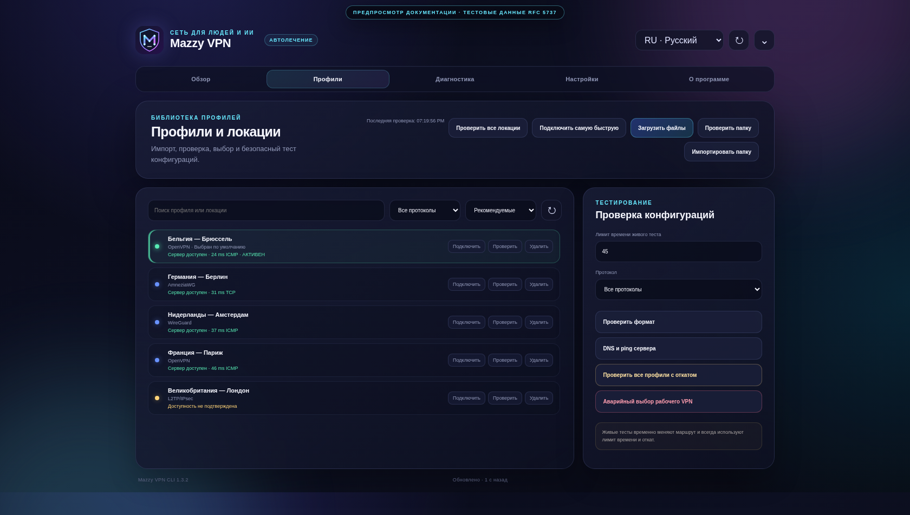
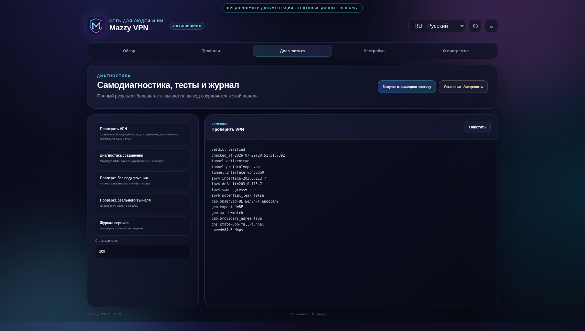
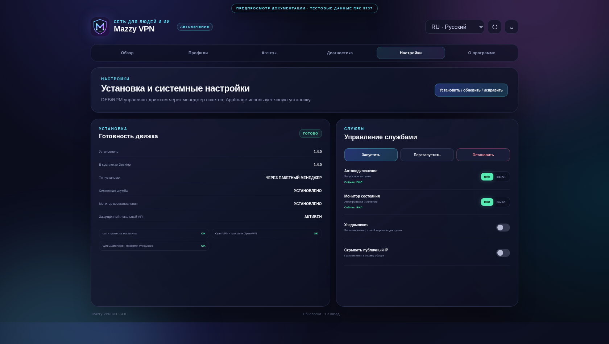

# Mazzy VPN Desktop: Linux Control Center и tray

Copyright © 2026 [Nik m (@mazurovn)](https://github.com/mazurovn).

[English](DESKTOP.en.md) · [Архитектура](ARCHITECTURE.ru.md) ·
[План самостоятельного Desktop 1.0](DESKTOP_ROADMAP.ru.md) ·
[Паритет функций](FEATURE_PARITY.md) · [Главная страница](../README.md)


Mazzy VPN Desktop — приложение на Tauri 2 с общим движком `mazzy-vpn`.
Linux-пакет 0.3 включает совместимый engine installer: отдельная предварительная
установка CLI больше не требуется. CLI и TUI остаются самостоятельными
клиентами того же движка и состояния.

> **Статус 0.3:** Linux control-center уже покрывает основной рабочий цикл, но
> опубликован как unsigned preview и остаётся preview до закрытия
> [production gates](FEATURE_PARITY.md). Issue #31 закрыт точным upstream
> backport `glib` 0.18 с проверенным source provenance и пустым cargo-deny
> ignore list. Для Desktop 1.0 ещё
> нужны общий native service, полный
> fallback-policy UI, перевод всех экранов на шесть языков, подписанные
> обновления, clean-device integration tests и перенос оставшихся typed
> `pkexec`-операций в частично реализованный versioned local API.

## Визуальный обзор

Все кадры используют документационные адреса RFC 5737 и видимый banner
тестовых данных. В них нет рабочего профиля, endpoint или IP пользователя.

| Профили, ping и выбор быстрой локации | Полный вывод диагностики |
|---|---|
|  |  |

| Установка и явное состояние служб | Dashboard на других языках |
|---|---|
|  | [English](images/dashboard-en.png) · [Русский](images/dashboard-ru.png) · [Deutsch](images/dashboard-de.png) · [中文](images/dashboard-zh.png) · [日本語](images/dashboard-ja.png) · [한국어](images/dashboard-ko.png) |

## Статус платформ

| Платформа | Статус | Пакеты |
|---|---|---|
| Linux x86_64 | Control Center с встроенным bootstrap общего движка | AppImage, DEB, RPM |
| macOS | Preview интерфейса, VPN backend ещё не реализован | app, DMG |
| Windows | Preview интерфейса, VPN backend ещё не реализован | MSI, NSIS EXE |

macOS и Windows preview не нужно использовать как средство защиты трафика.
Для полноценной поддержки нужны нативные Network Extension/launchd и Windows
service/Wintun backends, подпись кода и platform-specific тесты.

## Экраны Desktop 0.3

1. **Обзор** — туннель, интернет, IP, handshake, health, recovery, проверка
   фактического egress и tray.
2. **Профили** — безопасный импорт файлов/папок, поиск, протоколы, выбор
   локации/default-профиля, удаление, массовая проверка endpoint с отдельными
   reachability/latency/active и точечный live-test.
3. **Диагностика** — validate, DNS/ping probe, транзакционные тесты, `test-all`,
   emergency recovery, полный результат Doctor/self-test и ограниченный журнал
   systemd.
4. **Настройки** — версии bundled/installed engine, состояние зависимостей,
   Install/Update/Repair, autostart, health monitor, privacy и уведомления.
5. **О программе** — версии Desktop/engine/platform, автор, лицензия,
   приватность и правила безопасной работы.

## Что показывает Dashboard

- активность systemd service и реального VPN-интерфейса;
- доступ в интернет через выбранный туннель;
- локацию/default-профиль, протокол и имя интерфейса;
- возраст последнего WireGuard/AmneziaWG handshake;
- публичный VPN IP с кнопкой локального скрытия;
- автоподключение, health monitor и внешний fallback;
- количество профилей каждого протокола;
- локальный журнал действий текущего сеанса интерфейса;
- свежесть cache, чтобы устаревшие данные не выглядели актуальными.

Health monitor автоматически требует default egress только для профилей,
которые объявляют full tunnel. Split-tunnel сохраняет endpoint-only health,
если администратор явно не задал
`VPNCTL_HEALTH_REQUIRE_DEFAULT_EGRESS=yes`. Recovery запускается после двух
подтверждённых расхождений default/interface IPv4; недоступность observer сама
по себе не вызывает reconnect. Geo и speed проверки в фоне не выполняются.

Статус обновляется каждые пять секунд из `/run/mazzy-vpn/status.json`.
Санитизированная библиотека профилей читается из
`/run/mazzy-vpn/profiles.json`. Root engine пересоздаёт оба файла атомарно.
Файлы имеют права `0640 root:mazzy-vpn`, а каталог —
`0750 root:mazzy-vpn`. Они не содержат endpoint, пути профилей, приватные
ключи, логины, пароли или конфигурационные директивы. Rust десериализует оба
cache в закрытые `deny_unknown_fields` типы и проверяет внутренние инварианты
до передачи в WebView. Активная строка определяется по opaque `profile_id` или
точному basename конфига; legacy fallback по display name разрешён только при
единственном совпадении.

Desktop 0.3.2 также принимает legacy cache schema 0.2 без `profile_id` и
вычисляет тот же opaque ID, что и текущий CLI. Нечитаемый или некорректный cache
теперь показывается как недоступный, а не как пустая библиотека. Это исправляет
наблюдавшийся случай, когда Dashboard считал 24 профиля, а экран «Профили»
сообщал, что ничего не найдено.

Versioned protocol registry описывает 13 записей, но этот экран пока импортирует
и подключает только четыре реализованных Linux backend. Redacted URI detection
есть в stable 1.3.2, а unreleased ветка также классифицирует ограниченный JSON;
Desktop import, TUN adapters и умный выбор остаются gated work. См.
[Оркестрацию протоколов](PROTOCOL_ORCHESTRATION.ru.md).

## Действия в окне и tray

| Действие | CLI-команда |
|---|---|
| Quick Connect | `mazzy-vpn quick` |
| Reconnect | `mazzy-vpn reconnect` |
| Disconnect | `mazzy-vpn disconnect` |
| Проверить фактические egress/локацию | `mazzy-vpn verify` |
| Явный ограниченный speed sample | `mazzy-vpn verify --speed` |
| Self-diagnostics | `mazzy-vpn doctor` |
| Диагностика активного соединения | `mazzy-vpn diagnose` |
| Refresh Status | `mazzy-vpn _refresh-dashboard-cache` |
| Connect profile | `mazzy-vpn connect PROTOCOL PROFILE` |
| Import files/folder | `mazzy-vpn import-files` / `import-dir` |
| Validate / массовый probe локаций | `mazzy-vpn validate` / `probe all --jobs 4 --json` |
| Transactional tests | `mazzy-vpn test` / `test-all` / `emergency` |
| Install / repair | пакетный engine: `mazzy-vpn doctor --fix`; AppImage/manual: bundled `install.sh` |
| Service settings | `mazzy-vpn autostart` / `monitor` |
| Logs | `mazzy-vpn logs --lines N` |

Из tray теперь можно сразу открыть Обзор, Профили, Диагностику, Настройки или
«О программе». Там же доступны Quick Connect, Reconnect, Disconnect, проверка
фактического egress, ping всего списка локаций, refresh, Doctor, отдельные
включение/выключение автоподключения и monitor, а также Quit. Первая
неактивная строка описывает AI-ready клиент с recovery и реальными проверками;
она намеренно не выдаётся за индикатор текущего состояния.

Probe локаций намеренно отделён от живого VPN-теста. `reachable` подтверждает
DNS и доступность ICMP или TCP endpoint; `unknown` сохраняет частый случай,
когда UDP VPN-сервер блокирует ICMP. Это не заявление о работе credentials,
handshake или маршрутизации туннеля — для такого доказательства нужен
подтверждённый live-test.

## Проверка фактической работы VPN

**Проверить VPN** отвечает на другой вопрос, чем probe списка:

- активны ли выбранный туннель и его интерфейс;
- совпадает ли публичный IPv4 запроса, привязанного к VPN-интерфейсу, с egress
  системного default route;
- относятся ли ответы двух независимых geo providers именно к этому IPv4 и
  совпадает ли определённая ими страна;
- соответствует ли фактическая страна явному `mazzy-country-code` из профиля,
  если он задан; имя и город не используются для угадывания ожидаемой страны,
  а отсутствие metadata оставляет итог в `warning`;
- не выходит ли default IPv6 мимо IPv6, привязанного к туннелю;
- настроен ли `systemd-resolved` с DNS route `~.` на VPN-интерфейсе;
- по отдельному запросу пользователя выполняется ограниченный 5-МБ speed
  sample через VPN. В фоне он никогда не запускается.

Результат — `verified`, `warning` или `failed` с машинно-читаемыми finding
codes. Публичные IP в GUI по умолчанию скрыты. Один geo provider, расхождение
providers, несовпадение provider IP, другой системный egress, возможная
IPv6-утечка или неподтверждённый full-tunnel DNS не могут дать `verified`.

Это сетевые доказательства, а не обещание принятия сессии любым сайтом. Сайт
может дополнительно учитывать регион аккаунта, политику организации, cookies,
язык браузера, WebRTC или геолокацию устройства. Список внешних проверочных
сервисов приведён в [PRIVACY.md](../PRIVACY.md).

GUI не строит shell-строку. Rust backend принимает enum и сопоставляет его
фиксированному request или массиву аргументов. Connect, reconnect и disconnect
используют `/run/mazzy-vpn/api-v1.sock`, если он предоставлен установленным
engine. Socket ограничен `root:mazzy-vpn`, а outcomes не содержат raw backend
output. Те же lifecycle-команды CLI/TUI используют этот socket без `sudo` и
выбирают профиль только по непрозрачному ID. Остальные изменяющие состояние
действия проходят через системный
`pkexec`, поэтому ОС может показать стандартный запрос прав администратора.
Закрытие окна скрывает приложение в tray; окончательный выход выполняется
пунктом **Quit Mazzy VPN**.

На Linux контекстное меню tray открывается правой кнопкой. Поддержка события
обычного клика зависит от desktop environment.

## Установка Linux

После появления релиза и зелёного RustSec gate установите один Desktop-пакет со
страницы Releases. DEB и RPM теперь являются package-managed установками: архив
владеет engine в `/usr/bin`, публичным
runtime в `/usr/lib/mazzy-vpn`, systemd units/drop-ins в
`/usr/lib/systemd/system`, tmpfiles policy и Bash completion. Package manager
устанавливает базовые runtime-зависимости, а поддерживаемые VPN-протоколы
объявлены рекомендациями. Идемпотентный package script создаёт защищённую
структуру state, активирует socket/recovery monitor на запущенном systemd host
и проверяет engine/API manifest.

Существующие профили `/etc/vpnctl` и state `/var/lib/vpnctl` не входят в
package payload и намеренно сохраняются при upgrade и remove. Старый ручной
unit в `/etc/systemd/system` сохраняет свои настройки, а package drop-in
переключает только executable на package-owned `/usr/bin/mazzy-vpn`. Если
установка запущена через `sudo` или `pkexec`, вызывающий пользователь
добавляется в группу `mazzy-vpn`; для socket может понадобиться новый login.
Package-safe действие «Исправить» повторяет это добавление, если графический
package manager не сохранил сведения о вызвавшем пользователе.

Пакет также находит доверенные root-owned старые команды Mazzy VPN в
`/usr/local/bin`, сохраняет закрытые обратимые копии и заменяет их ссылками на
package-owned `/usr/bin/mazzy-vpn`. Сторонние, пользовательские или доступные на
запись группе/всем файлы не меняются. Это не позволяет старому ручному engine
1.2 перекрывать новый Desktop package.

DEB:

Ниже указаны точные dot-normalized имена файлов со страницы GitHub Release
`desktop-v0.3.2`. Локальный output `npm run build:release` может сохранять
пробелы из Tauri product name.

```bash
sudo apt install ./Mazzy.VPN.Desktop_0.3.2_amd64.deb
```

RPM:

```bash
sudo dnf install ./Mazzy.VPN.Desktop-0.3.2-1.x86_64.rpm
```

Для DEB/RPM действие **Установить / обновить / исправить** запускает
package-safe `mazzy-vpn doctor --fix`: оно исправляет поддерживаемые
недостающие protocol dependencies и service state, но не копирует package
files в `/usr/local`. Этот slice всё ещё preview. Опубликованные artifacts 0.3
содержат проверенный issue #31 backport `glib` и имеют чистый RustSec graph.
Также остаются clean-device install/upgrade/remove
tests для всех поддерживаемых дистрибутивов, package rollback/fault injection,
доставка AmneziaWG и подпись.

AppImage:

```bash
sha256sum -c --ignore-missing Mazzy.VPN.Desktop_0.3.2_SHA256SUMS
chmod +x ./Mazzy.VPN.Desktop_0.3.2_amd64.AppImage
./Mazzy.VPN.Desktop_0.3.2_amd64.AppImage
```

AppImage не может установить собственный privilege helper. Сначала проверьте
`command -v pkexec` и вручную установите package polkit/pkexec вашего
дистрибутива, если команды нет; иначе встроенный engine bootstrap не запустится.
AppImage по-прежнему использует явно разрешённый embedded installer и не
является package-managed установкой.

Имена версий в примерах замените на фактические имена загруженных файлов.
Preview-артефакты пока не подписаны, а workflow ещё не публикует подписанные
checksum или provenance. Проверяйте source commit и его GitHub Actions run, но
не считайте неподписанный hash доказательством издателя.

## Языки

Dashboard 0.1 полностью поддерживал русский, английский, немецкий, китайский,
японский и корейский. Новые экраны 0.3 полностью переведены на русский и
английский; для остальных языков пока используется английский fallback, поэтому
release gate локализации честно остаётся `partial`. Выбор сохраняется локально
и синхронизируется с общим engine.

```bash
mazzy-vpn language ru
mazzy-vpn language en
```

## Диагностика

Если Dashboard не получил данные:

```bash
sudo mazzy-vpn _refresh-dashboard-cache
mazzy-vpn status --json
systemctl status vpnctl-health.timer
```

Если действие не выполнилось, проверьте API socket, членство в группе,
`pkexec` fallback, затем CLI:

```bash
systemctl status mazzy-vpn-api.socket
id -nG | tr ' ' '\n' | grep -x mazzy-vpn
command -v pkexec
sudo mazzy-vpn doctor
sudo mazzy-vpn diagnose
```

Если tray не виден, убедитесь, что desktop environment поддерживает
StatusNotifier/AppIndicator. Сам VPN продолжает работать через systemd даже без
запущенного Desktop.

## Сборка из исходного кода

```bash
cd desktop
npm ci
npm run test
cargo clippy --manifest-path src-tauri/Cargo.toml --all-targets -- -D warnings
npm run build:release
```

Linux build создаёт AppImage, DEB и RPM в
`desktop/src-tauri/target/release/bundle/`. Зависимости npm и Cargo
зафиксированы lock-файлами. Release-команда удаляет локальный домашний путь
сборщика из диагностических строк Rust. CI собирает каждую ОС на
соответствующем GitHub runner. Tagged workflow сначала создаёт draft unsigned
preview; он публикуется только после аудита platform artifacts, checksums и
обязательного Linux RustSec gate.
