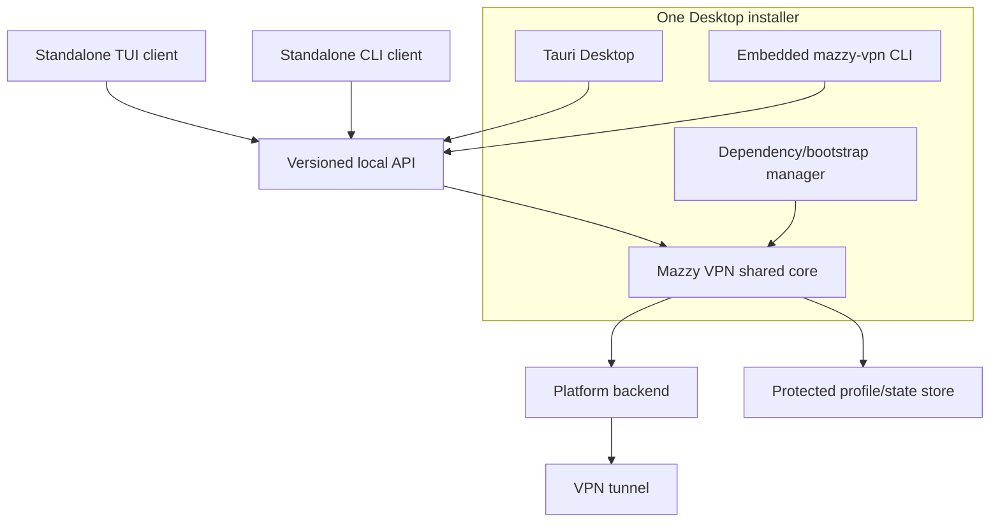
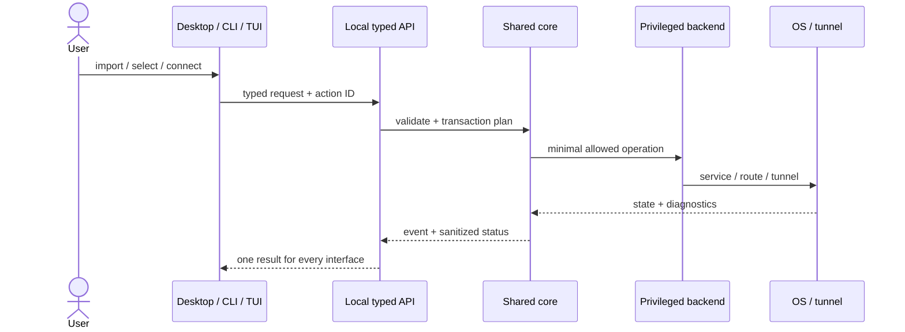
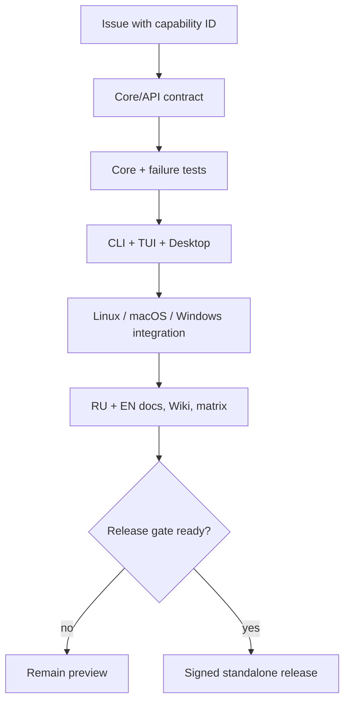

# Mazzy VPN Desktop 1.0: standalone application plan

Copyright © 2026 [Nik m (@mazurovn)](https://github.com/mazurovn).

[Русский](DESKTOP_ROADMAP.ru.md) ·
[Capability matrix](FEATURE_PARITY.md) ·
[Current Desktop preview](DESKTOP.en.md)

## Decision

Desktop must not require the user to install the CLI first. Its installer must
provide everything required by the selected OS: the shared engine, protected
system service, protocol backends, recovery monitor, GUI and an embedded CLI
for diagnostics and automation.

CLI, TUI and Desktop must not contain three separate VPN implementations. They
use one versioned core API and one state model.

Desktop works without a separate CLI installation because it bundles a
compatible client/core. CLI and TUI remain independently installable and can
control the same core while the GUI is closed.

## Missing from Desktop 0.1

- single-file, multi-file, folder and drag-and-drop import;
- AWG, WireGuard, OpenVPN and L2TP/IPsec detection before installation;
- profile library with search, grouping, location and default profile;
- normal, test, emergency and fallback mode selection;
- transactional tests, rollback and probe results in the GUI;
- complete doctor with explicitly approved safe fixes;
- engine service, autostart, health-monitor and recovery controls;
- self-contained dependency bootstrap and existing-install migration;
- a shared versioned API instead of direct individual CLI invocation;
- native macOS/Windows backends, signing/notarization and system installers;
- parity tests that block releases when a CLI/TUI capability was forgotten.

Desktop packages remain **preview** until these items are complete.

## Target components

| Component | Responsibility |
|---|---|
| `mazzy-vpn-core` | profile model, validation, state machine, transactions, recovery |
| `mazzy-vpnd` | minimal privileged service and versioned local API |
| platform backend | Linux systemd/netlink; macOS Network Extension; Windows service/Wintun |
| CLI client | scripting, SSH, automation and GUI-independent rescue |
| TUI client | complete interactive terminal workflow |
| Desktop client | complete workflow, library, dashboard, tray, notifications |
| bootstrap | OS/dependency detection, install, upgrade, migrate and rollback |

The core must not depend on Tauri, HTML or a package manager. A frontend must
not read private keys or execute arbitrary shell strings.

## Local API contract

The first stable API must cover:

- `GetStatus`, `WatchEvents`, `ListCapabilities`;
- `ListProfiles`, `InspectImport`, `ImportProfiles`, `RemoveProfile`;
- `SelectDefault`, `Connect`, `Reconnect`, `Disconnect`;
- `Validate`, `Probe`, `Test`, `TestAll`, `Emergency`;
- `GetServices`, `SetAutostart`, `StartMonitor`, `StopMonitor`;
- `Doctor`, `ApplyApprovedFix`;
- `GetSettings`, `SetLanguage`, `SetFallbackPolicy`.

Every mutating request uses a typed schema, action ID and audit event. A file
path, profile label or UI string is never converted into a shell command.

## Standalone installation

```mermaid
flowchart LR
    Start["Start installer"] --> Detect["OS, arch, privileges, existing version"]
    Detect --> Plan["Show verifiable install plan"]
    Plan --> Verify["Verify signature and SHA-256"]
    Verify --> Deps["Install missing dependencies"]
    Deps --> Core["Install core + service + recovery"]
    Core --> UI["Install Desktop + embedded CLI"]
    UI --> Migrate["Import/migrate existing state"]
    Migrate --> SelfTest["Offline self-test + optional live test"]
    SelfTest --> Ready["Ready or complete rollback"]
```

The installer must not silently replace an active VPN. A live test saves the
current state, arms a timeout guard and restores the previous connection after
failure.

### Linux

- DEB/RPM declare system dependencies and install the service/core;
- AppImage carries the GUI and a signed bootstrap helper that installs the
  core only after explicit approval;
- existing `/etc/vpnctl` and `/var/lib/vpnctl` state migrates without copying
  keys into a user directory;
- uninstall does not delete user profiles unless separately requested.

### macOS

- signed/notarized app and privileged helper;
- Network Extension backend and launchd recovery agent;
- Keychain/protected profile storage;
- explicit entitlement and system VPN-permission checks.

### Windows

- signed installer and Windows service;
- Wintun/WireGuard/OpenVPN backend;
- DPAPI/ACL protected store;
- standard repair and uninstall workflow.

## Complete Desktop interface

1. **Dashboard** — tunnel, internet, IP privacy, handshake, health, recovery.
2. **Locations** — protocol, country/city/provider, latency, search, favorites.
3. **Profiles** — import/inspect/validate, default, label rename, remove.
4. **Connect** — quick, selected, reconnect and disconnect.
5. **Modes** — normal, transactional test, emergency and fallback policy.
6. **Services** — engine, autostart, monitor, recovery and recent events.
7. **Diagnostics** — doctor, probes, redacted logs and approved fixes.
8. **Settings** — language, startup, notifications, update channel, privacy.

An error explains what failed, whether state changed, whether rollback
completed and which safe next action is available.

## Keeping CLI, TUI and Desktop synchronized

[`capabilities.json`](capabilities.json) is the single parity registry. CI
validates references, statuses and release gates. Every pull request names a
capability ID and completes the cross-surface checklist.

Definition of Done:

- behavior exists in the shared core/API;
- every applicable CLI/TUI/Desktop surface is updated;
- success, failure, timeout and rollback are tested;
- permissions, secrets and migration are reviewed;
- `capabilities.json`, RU/EN docs and Wiki are synchronized;
- CI computes the release gate instead of trusting an unsupported claim.

## Phases

1. **Foundation:** schema/API, capability registry, event model, migration spec.
2. **Linux core:** extract the shared core/daemon without regressing Bash CLI/TUI.
3. **Linux Desktop 1.0:** embedded core/bootstrap and complete feature parity.
4. **Windows backend:** service, Wintun/OpenVPN, installer, recovery, signing.
5. **macOS backend:** Network Extension, helper/launchd, notarization.
6. **Hardening:** upgrade rollback, accessibility, soak/fault tests and strictly
   opt-in telemetry without VPN data.

The proven CLI/TUI is not replaced in one risky rewrite. New APIs first run
beside the current engine, then adapters migrate one at a time behind contract
tests.
