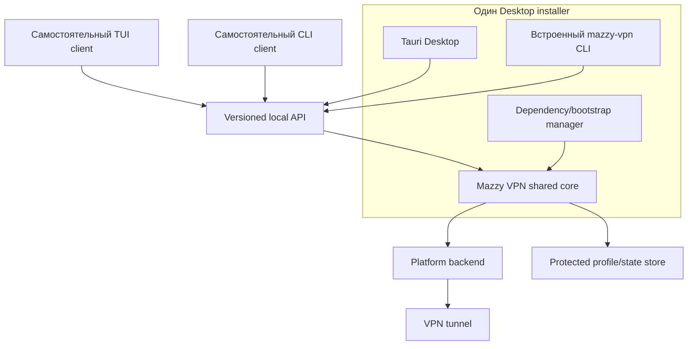
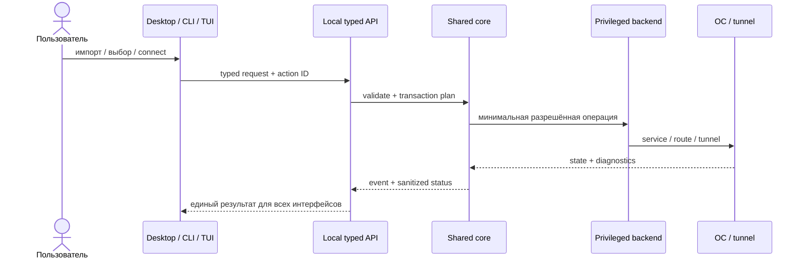
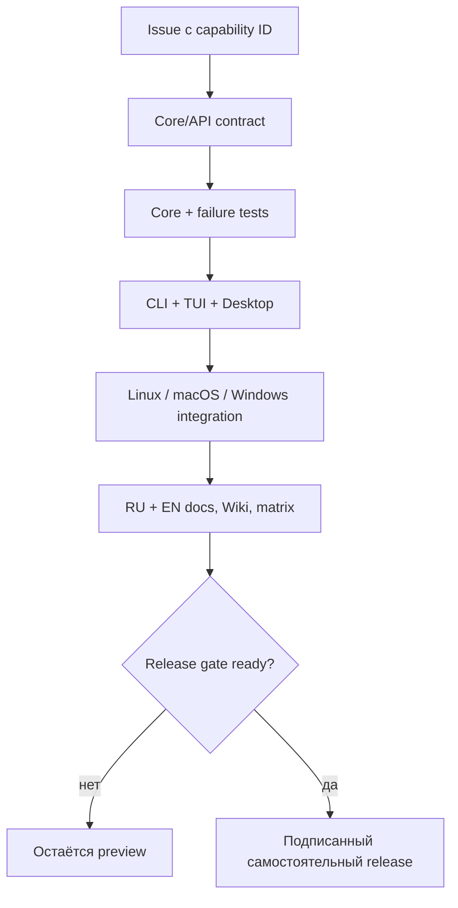

# Mazzy VPN Desktop 1.0: план самостоятельного приложения

Copyright © 2026 [Nik m (@mazurovn)](https://github.com/mazurovn).

[English](DESKTOP_ROADMAP.en.md) ·
[Матрица функций](FEATURE_PARITY.md) ·
[Текущий Desktop preview](DESKTOP.ru.md)

## Решение

Desktop не должен зависеть от заранее установленного пользователем CLI. Его
инсталлятор обязан установить всё необходимое для выбранной ОС: общий движок,
защищённую системную службу, protocol backends, recovery monitor, GUI и
внутренний CLI для диагностики/автоматизации.

При этом CLI, TUI и Desktop не получают три отдельных реализации VPN-логики.
Они обращаются к одному versioned core API и работают с одним состоянием.

Desktop работает без отдельной установки CLI, потому что включает совместимый
client/core. CLI и TUI остаются доступными отдельно и могут управлять тем же
core, даже когда GUI закрыт.

## Что готово в Desktop 0.2 Linux preview

- встроенный installer engine с проверкой версий и готовности зависимостей;
- безопасный импорт одного/нескольких файлов и папки с определением протокола;
- очищенный cache библиотеки профилей с поиском, локацией и выбором;
- connect, validate, probe, transactional test, test-all и emergency;
- полный сохраняемый вывод Doctor, approved fix, self-test и bounded logs;
- управление autostart engine и независимым health monitor;
- типизированные Rust-операции с фиксированными аргументами без shell-строк;
- проверки capability registry и ссылки на regression-тесты всех поверхностей.

## Что остаётся до Desktop 1.0

- предварительный просмотр импорта и drag-and-drop workflow;
- полные настройки normal/test/emergency и fallback policy;
- общий привилегированный versioned service API вместо отдельного CLI-процесса
  на каждое действие (adapter 0.2 типизирован, но вызывает встроенный engine);
- полный перевод новых экранов центра управления на все шесть языков;
- подписанные обновления, миграция и transactional rollback installer;
- native macOS/Windows backends, signing/notarization и системные installers;
- security, accessibility, failure-injection и длительные soak gates.

До закрытия применимых release gates пакеты Desktop имеют статус **preview**.

## Целевые компоненты

| Компонент | Ответственность |
|---|---|
| `mazzy-vpn-core` | модель профилей, проверка, state machine, транзакции, recovery |
| `mazzy-vpnd` | минимальная привилегированная служба и локальный versioned API |
| platform backend | Linux systemd/netlink; macOS Network Extension; Windows service/Wintun |
| CLI client | скрипты, SSH, automation и rescue без GUI |
| TUI client | полный интерактивный терминальный интерфейс |
| Desktop client | полный workflow, library, dashboard, tray, notifications |
| bootstrap | обнаружение ОС/зависимостей, установка, upgrade, migrate, rollback |

Core не должен зависеть от Tauri, HTML или конкретного package manager.
Frontend не должен читать приватные ключи или выполнять произвольный shell.

## Контракт локального API

Первый стабильный API должен покрывать:

- `GetStatus`, `WatchEvents`, `ListCapabilities`;
- `ListProfiles`, `InspectImport`, `ImportProfiles`, `RemoveProfile`;
- `SelectDefault`, `Connect`, `Reconnect`, `Disconnect`;
- `Validate`, `Probe`, `Test`, `TestAll`, `Emergency`;
- `GetServices`, `SetAutostart`, `StartMonitor`, `StopMonitor`;
- `Doctor`, `ApplyApprovedFix`;
- `GetSettings`, `SetLanguage`, `SetFallbackPolicy`.

Все mutating-запросы используют typed schema, action ID и audit event. Путь
файла, label профиля или текст из UI не превращается в shell-команду.

## Самостоятельная установка

### Общий flow

```mermaid
flowchart LR
    Start["Запуск installer"] --> Detect["ОС, arch, права, существующая версия"]
    Detect --> Plan["Показать проверяемый install plan"]
    Plan --> Verify["Проверить подпись и SHA-256"]
    Verify --> Deps["Установить отсутствующие зависимости"]
    Deps --> Core["Установить core + service + recovery"]
    Core --> UI["Установить Desktop + embedded CLI"]
    UI --> Migrate["Импортировать/мигрировать существующее состояние"]
    Migrate --> SelfTest["Offline self-test + optional live test"]
    SelfTest --> Ready["Готово или полный rollback"]
```

Инсталлятор не должен молча менять активный VPN. Перед live test он сохраняет
состояние, использует timeout guard и возвращает предыдущее соединение при
ошибке.

### Linux

- DEB/RPM объявляют системные зависимости и устанавливают service/core;
- AppImage содержит GUI и signed bootstrap helper, который устанавливает core
  только после явного подтверждения;
- существующие `/etc/vpnctl` и `/var/lib/vpnctl` мигрируются без копирования
  ключей в пользовательский каталог;
- package uninstall не удаляет пользовательские профили без отдельного флага.

### macOS

- signed/notarized app и privileged helper;
- Network Extension backend, launchd recovery agent;
- Keychain/защищённое хранилище;
- отдельная проверка entitlement и системного разрешения VPN.

### Windows

- signed installer и Windows service;
- Wintun/WireGuard/OpenVPN backend;
- DPAPI/ACL protected store;
- repair/uninstall через стандартный Windows workflow.

## Полный интерфейс Desktop

1. **Dashboard** — tunnel, internet, IP privacy, handshake, health, recovery.
2. **Locations** — протокол, страна/город/provider, latency, поиск, избранное.
3. **Profiles** — import/inspect/validate, default, rename label, remove.
4. **Connect** — quick, selected, reconnect, disconnect.
5. **Modes** — normal, transactional test, emergency, fallback policy.
6. **Services** — engine, autostart, health monitor, recovery, last events.
7. **Diagnostics** — doctor, probes, logs с redaction, approved fixes.
8. **Settings** — язык, startup, notifications, update channel, privacy.

Ошибки должны объяснять: что не сработало, изменилось ли состояние, выполнен ли
rollback и какое безопасное действие возможно дальше.

## Синхронизация CLI/TUI/Desktop

[`capabilities.json`](capabilities.json) — единственный реестр паритета. CI
проверяет ссылки, статусы и release gates. Pull request обязан назвать
capability ID и пройти общий checklist.

Definition of Done:

- поведение реализовано в shared core/API;
- применимые CLI/TUI/Desktop surfaces обновлены;
- успех, отказ, timeout и rollback протестированы;
- права/секреты/миграция проверены;
- `capabilities.json`, RU/EN docs и Wiki синхронизированы;
- release gate вычисляется CI, а не объявляется вручную без доказательств.

## Этапы

1. **Foundation:** schema/API, capability registry, event model, migration spec.
2. **Linux core:** выделить shared core/daemon без регрессии Bash CLI/TUI.
3. **Linux Desktop 1.0:** встроенный core/bootstrap и полный feature parity.
4. **Windows backend:** service, Wintun/OpenVPN, installer, recovery, signing.
5. **macOS backend:** Network Extension, helper/launchd, notarization.
6. **Hardening:** upgrades/rollback, accessibility, soak/fault tests, telemetry
   только opt-in и без VPN-данных.

Текущий CLI/TUI не переписывается одним рискованным шагом. Новые API сначала
работают рядом с проверенным engine, затем адаптеры переносятся по одному с
контрактными тестами.
