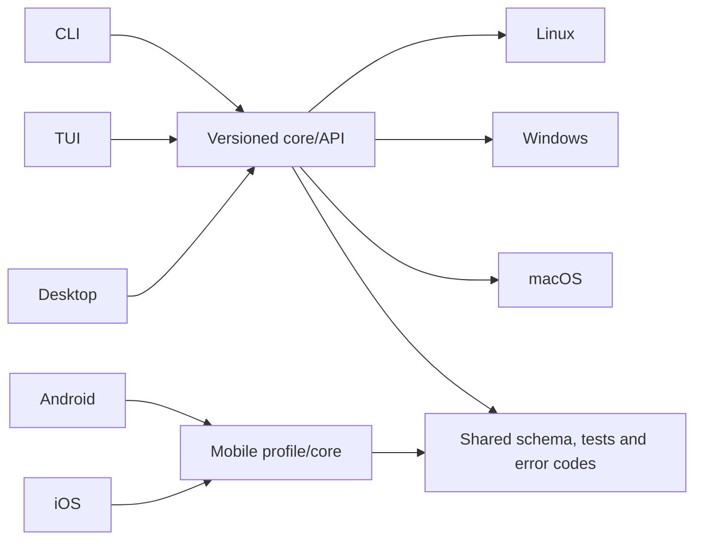

# Mazzy VPN: CLI, TUI, Desktop and Mobile plan

Copyright © 2026 [Nik m (@mazurovn)](https://github.com/mazurovn).

This document describes direction, not promised dates. Automated gates in
[`capabilities.json`](capabilities.json) determine platform readiness. A package
must not be called a complete client until its gate computes as `ready`.

## Shared foundation

Every interface must use one profile model, the same error codes, connection
states and transactional rules. The partially implemented versioned local API
already separates CLI/TUI/Desktop lifecycle operations from the system Linux
VPN backend. Private keys and complete
configurations never enter the status cache, telemetry or public logs.

## AI-ready reliability contract

“AI-ready” means that the client is designed to keep long-running human and
agent sessions stable and to expose evidence instead of only a selected
profile label. Every functional platform must eventually provide:

- actual default/interface egress, DNS and IPv6 leak signals;
- structured location-provider agreement tied to the observed egress IP;
- endpoint latency plus active-tunnel latency, loss and jitter measurements;
- network-change, sleep/wake, captive-portal and tunnel-stall detection;
- bounded reconnect/failover with state reconciliation and visible reasons;
- opt-in application-level reachability probes suitable for AI and video
  workflows without storing tokens, cookies or prompts.

These checks cannot promise that a specific provider accepts an account or
session. Provider policy, organization policy, account region, WebRTC and
device/browser state remain external. The UI must distinguish network evidence
from an application-access claim.

Dependencies belong in platform-native signed packages. Linux DEB/RPM declare
system packages; Windows installers include the signed service/driver; macOS
ships the approved Network Extension; Android/iOS embed native libraries in the
signed app. No production client should download and execute an arbitrary
backend during first run.

## CLI and TUI improvements

1. Freeze versioned JSON schemas for status, doctor, profiles, tests and
   service operations, with stable exit/error codes.
2. Complete TUI service parity: start/stop/restart, autostart, health monitor,
   recovery, recent transitions and a readable Doctor result.
3. Add import preview and name-conflict handling, destructive-action
   confirmation, progress and cancellation for long `test-all` runs.
4. Separate `doctor` from `doctor --fix`: diagnosis stays unprivileged and each
   repair is explained and explicitly authorized.
5. Improve discoverability with contextual help, examples, a man page, shell
   completion and suggestions for the next safe action.
6. Add a redacted support bundle and automation event stream without endpoints,
   keys, private paths or credentials.

## Desktop improvements

- replace the interim typed `pkexec` adapter with a versioned local service API;
- expose normal/test/emergency/fallback policy settings;
- show progress, deadlines, rollback and the outcome of every mutation;
- add drag-and-drop/import preview, rename, groups, favorites and latency;
- expose service start/stop/restart and recent state transitions;
- export only redacted logs and support bundles;
- complete six-language coverage, keyboard navigation, screen-reader labels,
  contrast/reduced-motion behavior and scaling;
- provide signed updates with checksum/signature verification and rollback;
- keep a dedicated About screen for versions, author, license, privacy and safe
  operation rules.

## Linux

Desktop 0.3 is a published functional preview with engine/bootstrap, profiles,
tests, Doctor, logs and system settings. Issue #31 is closed with a
provenance-verified upstream `glib` backport and clean release checks. Linux
Desktop 1.0 still requires the versioned service API,
complete policy/localization/accessibility parity, signed updates, clean-device
package lifecycle/rollback coverage and fault/soak tests. DEB/RPM now own the
engine/service payload and preserve user state; AppImage still uses an explicit
host bootstrap.

Release formats are AppImage, DEB and RPM. A local SHA-256 can detect accidental
corruption, but production requires signed provenance/attestation and the
`desktop-linux-1.0` gate.

## Windows

The Windows preview is not a VPN backend. Desktop 1.0 requires:

- a Windows Service with a least-privilege local API and protected ACL;
- WireGuard/Wintun as the first native backend, followed by audited OpenVPN;
- Credential Manager/DPAPI for secrets and safe temporary-file removal;
- signed MSI/NSIS, uninstall/upgrade/rollback and SmartScreen validation;
- route, DNS, sleep/resume, network-change and crash-recovery tests.

Protocol support is advertised per platform only after a real integration test.
Gate: `desktop-windows-1.0`.

## macOS

The macOS preview renders the UI but does not yet establish a tunnel. Version
1.0 requires:

- a system application and Network Extension/Packet Tunnel backend;
- Keychain, App Groups and tightly scoped IPC;
- correct sleep/wake and network-change lifecycle behavior;
- Developer ID signing, hardened runtime, notarization and stapling;
- Network Extension permission and upgrade/rollback tests.

WireGuard, OpenVPN and any other protocol are advertised only after their
specific backend passes integration tests. Gate: `desktop-macos-1.0`.

## Android

Android is planned as a native client, not a wrapped Desktop UI:

- `VpnService` with foreground lifecycle, notification and safe reconnect;
- WireGuard first, with OpenVPN after the bundled runtime is audited;
- Android Keystore, Storage Access Framework and share-sheet import;
- always-on VPN/kill switch, network changes, Doze and reboot recovery;
- signed AAB/APK, reproducible metadata, Data safety and privacy disclosure;
- instrumented tests across supported Android versions.

Gate: `mobile-android-1.0`.

## iOS

iOS is planned as a Network Extension client:

- a Packet Tunnel provider and shared versioned profile contract;
- Keychain, App Groups, document picker and safe imports;
- on-demand rules, network changes, background lifecycle and recovery;
- WireGuard first; extra backends only after size, licensing, stability and App
  Store policy checks;
- signed archives, TestFlight, privacy manifest and App Store review;
- real-device tests because a simulator cannot validate the VPN lifecycle.

Gate: `mobile-ios-1.0`. Building and publishing requires Apple Developer
entitlements, certificates and a macOS runner; a Linux build cannot replace
those requirements.

## Release promotion order

1. Confirm the resolved #31 RustSec gate on `main` and publish Linux Desktop 0.3.
2. Complete the shared API and Linux Desktop 1.0.
3. Ship Windows and macOS previews independently; promote each platform only
   when its own gate passes.
4. Build Android/iOS proofs of concept on the common profile contract.
5. Promote mobile alpha → beta → production independently per platform.

A version number, signature or polished UI never substitutes for a passing
gate. Unimplemented platforms always remain explicitly `preview` or `planned`.
