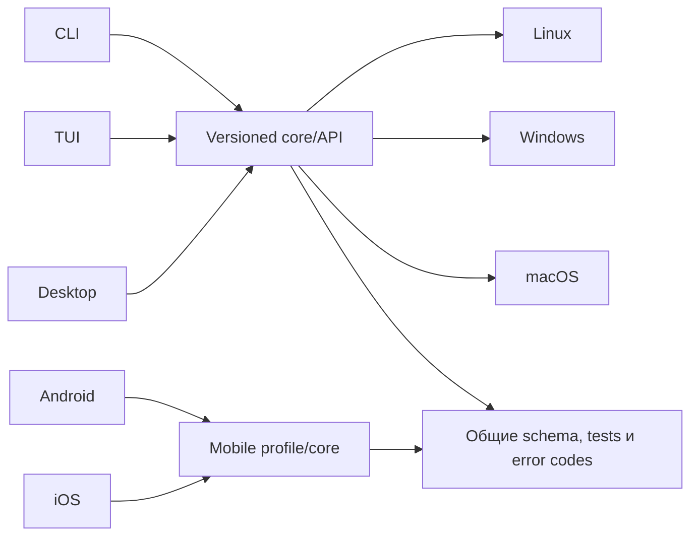

# Mazzy VPN: план CLI, TUI, Desktop и Mobile

Copyright © 2026 [Nik m (@mazurovn)](https://github.com/mazurovn).

Этот документ описывает направление разработки, а не обещание дат. Готовность
каждой платформы определяется автоматическими gate из
[`capabilities.json`](capabilities.json). Пакет нельзя называть полноценным
клиентом, пока его gate не вычисляется как `ready`.

## Общая основа

Все интерфейсы должны использовать одну модель профиля, одинаковые коды ошибок,
состояния подключения и транзакционные правила. Частично реализованный
versioned local API уже отделяет lifecycle CLI/TUI/Desktop от системного Linux
VPN backend. Приватные ключи и
полные конфигурации не попадают в status cache, телеметрию или публичные логи.

## Контракт AI-ready надёжности

«AI-ready» означает, что клиент рассчитан на долгие сессии людей и AI-агентов и
показывает evidence, а не только label выбранного профиля. Каждая функциональная
платформа в итоге должна реализовать:

- фактические default/interface egress, DNS и IPv6 leak signals;
- структурированное согласие geo providers, привязанное к наблюдаемому egress
  IP;
- endpoint latency и измерения latency/loss/jitter активного туннеля;
- обнаружение смены сети, sleep/wake, captive portal и stalled tunnel;
- bounded reconnect/failover со сверкой состояния и видимой причиной;
- opt-in application-level reachability probes для AI/video workflows без
  хранения tokens, cookies или prompts.

Эти проверки не обещают, что конкретный provider примет аккаунт или сессию.
Provider policy, политика организации, регион аккаунта, WebRTC и состояние
устройства/браузера остаются внешними факторами. UI обязан отличать network
evidence от заявления о доступности приложения.

Зависимости должны входить в platform-native signed packages. Linux DEB/RPM
объявляют системные packages; Windows installer содержит подписанные
service/driver; macOS поставляет разрешённый Network Extension; Android/iOS
встраивают native libraries в signed app. Production-клиент не должен
скачивать и исполнять произвольный backend при первом запуске.

Общий versioned registry сейчас описывает 13 протоколов и transport families,
но наличие в каталоге не означает поддержку подключения. В Linux подключение
реализовано только для AmneziaWG, WireGuard, OpenVPN и L2TP/IPsec. VLESS,
Hysteria 2, Mieru, NaiveProxy, TUIC v5, Shadowsocks 2022, Trojan, AnyTLS и
ShadowTLS v3 остаются работой над адаптерами с отдельными platform gates.
Большинство из них являются proxy protocols и требуют проверенного TUN adapter,
прежде чем их можно показывать как device-wide VPN.

## Что улучшить в CLI и TUI

1. Зафиксировать versioned JSON schema для status, doctor, profiles, tests и
   service operations; добавить стабильные exit/error codes.
2. Довести TUI до полного service parity: start/stop/restart, autostart,
   health monitor, recovery, последние переходы и понятный результат Doctor.
3. Добавить import preview с конфликтами имён, подтверждение опасных операций,
   прогресс и отмену длительных `test-all`.
4. Разделить `doctor` и `doctor --fix`: обычная диагностика не требует root,
   каждое исправление объясняется и отдельно подтверждается.
5. Улучшить discoverability: `help` по контексту, примеры, man page,
   shell-completion, подсказки следующего безопасного действия.
6. Добавить redacted support bundle и поток событий для автоматизации без
   публикации endpoint, ключей, путей и credential.

## Что улучшить в Desktop

- перейти с временного typed `pkexec` adapter на versioned local service API;
- добавить явную настройку normal/test/emergency/fallback policy;
- показывать прогресс, deadline, rollback и итог каждого изменения;
- добавить drag-and-drop/import preview, rename, groups, favorites и latency;
- показать start/stop/restart сервиса и историю переходов состояния;
- экспортировать только очищенный журнал/support bundle;
- завершить шесть языков, keyboard navigation, screen-reader labels,
  contrast/reduced motion и масштабирование;
- реализовать подписанное обновление с проверкой checksum/signature и rollback;
- сохранить отдельный экран «О программе» с версиями, автором, лицензией,
  приватностью и правилами безопасной работы.

## Linux

Desktop 0.3 опубликован как функциональный preview: он включает
engine/bootstrap, профили, тесты, Doctor, журнал и системные настройки. Issue
#31 закрыт provenance-verified upstream backport `glib`, release checks чистые.
До Linux Desktop 1.0 остаются versioned service API, полный
policy/localization/accessibility parity, подписанные обновления, clean-device
package lifecycle/rollback coverage и fault/soak tests. DEB/RPM теперь владеют
engine/service payload и сохраняют user state; AppImage всё ещё использует явный
host bootstrap.

Релизные форматы: AppImage, DEB и RPM. Локальный SHA-256 обнаруживает случайное
повреждение, но production требует подписанных provenance/attestation и gate
`desktop-linux-1.0`.

## Windows

Windows preview не является VPN backend. Для Desktop 1.0 нужны:

- Windows Service с минимальным локальным API и защищённым ACL;
- WireGuard/Wintun как первый нативный backend, затем проверенный OpenVPN;
- подписанные и зафиксированные sing-box-compatible и Cronet/Naive adapters до
  объявления censorship-resistant протоколов доступными;
- Credential Manager/DPAPI для секретов и безопасное удаление временных файлов;
- signed MSI/NSIS, uninstall/upgrade/rollback и проверка SmartScreen;
- тесты маршрутов, DNS, sleep/resume, смены сети и восстановления после crash.

Поддержка протокола объявляется отдельно для платформы и только после реального
integration test. Gate: `desktop-windows-1.0`.

## macOS

macOS preview показывает интерфейс, но ещё не поднимает туннель. Для 1.0 нужны:

- системное приложение и Network Extension/Packet Tunnel backend;
- Keychain, App Groups и строго ограниченный IPC;
- корректный lifecycle при sleep/wake и смене сети;
- Developer ID signing, hardened runtime, notarization и stapling;
- тесты upgrade/rollback и разрешений Network Extension.

Поддержка WireGuard/OpenVPN и других протоколов объявляется только после
проверки конкретного backend. Gate: `desktop-macos-1.0`.

## Android

Планируется отдельный нативный клиент, а не упаковка Desktop UI:

- `VpnService` с foreground lifecycle, уведомлением и безопасным reconnect;
- WireGuard первым, OpenVPN после аудита bundled runtime;
- встроенные reproducible protocol libraries и integration tests с
  `VpnService` до объявления device-wide routing для proxy protocols;
- Android Keystore, Storage Access Framework и импорт через share sheet;
- always-on VPN/kill switch, смена сети, Doze и reboot recovery;
- signed AAB/APK, reproducible metadata, Data safety и privacy disclosure;
- instrumented tests на поддерживаемых версиях Android.

Gate: `mobile-android-1.0`.

## iOS

Планируется отдельный клиент на Network Extension:

- Packet Tunnel provider и общий versioned профильный контракт;
- Keychain, App Groups, document picker и безопасный импорт;
- on-demand rules, смена сети, background lifecycle и восстановление;
- WireGuard первым; дополнительные backends — только после проверки размера,
  лицензии, стабильности и правил App Store;
- signed archive, TestFlight, privacy manifest и App Store review;
- реальные device tests, потому что симулятор не подтверждает VPN lifecycle.

Gate: `mobile-ios-1.0`. Для сборки и публикации потребуются Apple Developer
entitlements, сертификаты и macOS runner; их нельзя заменить Linux-сборкой.

## Порядок продвижения релизов

1. Поддерживать опубликованную Linux Desktop 0.3 исправлениями и regression tests.
2. Завершить общий API, protocol adapters и Linux Desktop 1.0.
3. Выпускать Windows и macOS preview независимо; production только по своему
   gate, без ожидания другой платформы.
4. Создать Android/iOS proof-of-concept на общем профильном контракте.
5. Продвигать mobile alpha → beta → production отдельно для каждой платформы.

Номер версии, подпись и красивый интерфейс не заменяют gate. Не реализованные
платформы всегда маркируются `preview` или `planned`.
