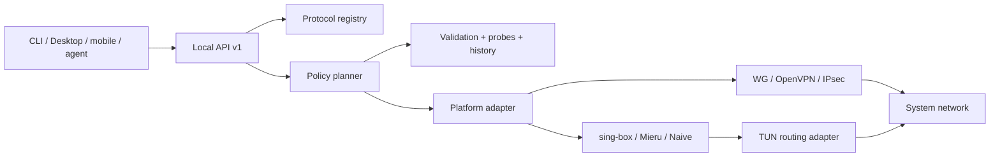

# Protocols, censorship resistance and AI orchestration

Copyright © 2026 [Nik m (@mazurovn)](https://github.com/mazurovn).

Current as of 2026-08-01. The machine-readable source of truth is
[`protocols/v1/registry.json`](../protocols/v1/registry.json). `implemented`
means a functionally tested connection backend on that platform. Recognizing a
URI or listing a protocol does not mean that a tunnel can be established.

## Thirteen-protocol catalog

| Protocol | Class and role | Linux connect | Detection |
|---|---|---:|---:|
| AmneziaWG | obfuscated WireGuard-like VPN | implemented | implemented |
| WireGuard | standard VPN | implemented | implemented |
| OpenVPN | TCP/UDP and enterprise VPN | implemented | implemented |
| L2TP/IPsec | legacy/enterprise VPN | implemented | implemented |
| VLESS / REALITY | proxy + TUN, TLS/REALITY | planned | URI implemented |
| Hysteria 2 | QUIC proxy + TUN, lossy links and HTTP/3 camouflage | planned | URI implemented |
| Mieru | proxy + TUN, padding and probe resistance | planned | URI implemented |
| NaiveProxy | Chromium HTTP/2/3 proxy + TUN | planned | planned |
| TUIC v5 | QUIC proxy + TUN | planned | URI implemented |
| Shadowsocks 2022 | AEAD 2022 proxy + TUN | planned | URI implemented |
| Trojan | TLS proxy + TUN | planned | URI implemented |
| AnyTLS | multiplexed TLS proxy + TUN | planned | URI implemented |
| ShadowTLS v3 | TLS camouflage transport | planned | planned |

VLESS, Hysteria 2, TUIC, Shadowsocks, Trojan, AnyTLS and Naive are documented
sing-box outbounds. VLESS must not reach a public server without outer
transport security. NaiveProxy requires a compatible Chromium/Cronet runtime
and a normal certificate; self-signed TLS changes its traffic behavior.
ShadowTLS v3 is a TCP transport, not a standalone L3 VPN.

Primary references:

- [Xray VLESS](https://xtls.github.io/en/config/outbounds/vless.html)
- [Hysteria 2 protocol](https://v2.hysteria.network/docs/developers/Protocol/)
- [Mieru client and share URIs](https://github.com/enfein/mieru/blob/main/docs/client-install.md)
- [NaiveProxy architecture](https://github.com/klzgrad/naiveproxy)
- [sing-box outbound catalog](https://sing-box.sagernet.org/configuration/outbound/)
- [Shadowsocks 2022](https://sing-box.sagernet.org/manual/proxy-protocol/shadowsocks/)
- [ShadowTLS v3](https://github.com/ihciah/shadow-tls/blob/master/docs/protocol-v3-en.md)

## Implementation layers



A proxy backend is not implemented until strict parsing, root-only secret
storage, TUN/routing/DNS, stop/rollback, health checks, package supply chain and
integration tests pass. Arbitrary user-supplied sing-box JSON must not run as
root: it may declare unexpected listeners, paths or remote rule sets. Runtime
configuration must be synthesized from an allowlist schema.

## Detection and custom servers

The current detector accepts a share URI only through stdin and returns
redacted metadata:

```bash
printf '%s\n' "$SHARE_URI" | mazzy-vpn protocols detect --stdin --json
mazzy-vpn protocols list --json
mazzy-vpn protocols diagnose --json
```

It never returns the host, user info, UUID, password, query or fragment. Full
custom-server import is the next backend slice:

1. The UI passes a file/URI to a write-only import operation and never reads a
   key itself.
2. The system parser validates a protocol-specific allowlist schema.
3. Credentials use mode `600` storage or a platform keystore; only an opaque
   `profile_id` and safe display name leave the backend.
4. `inspect-import` causes no network mutation; installation needs
   authorization and an `action_id`.
5. Runtime configuration is synthesized, checked by the backend and removed
   after shutdown.

## Selection and diagnostics

The planner first enforces hard constraints: platform backend ready, valid
profile, backend-only secret access, rollback available and supported platform.
An LLM cannot override these constraints.

Eligible candidates receive a deterministic 100-point score:

- 30: recent tunnel/egress success, with repeated-failure penalties;
- 25: fit for observed blocking and TCP/UDP/TLS/QUIC availability;
- 20: DNS/ICMP/TCP/QUIC reachability without treating ping as a VPN test;
- 15: latency, loss and jitter with bounded result freshness;
- 10: workload fit for LLM streams, short API calls, video or split routing.

A switch is always transactional: snapshot, bounded start, actual
egress/DNS/IPv6 verification, then commit or rollback.

## AI agent boundary

- agents read `protocols.list`, `profiles.list`, `status.get` and diagnostics
  through schemas;
- agents receive opaque IDs and evidence, never endpoints or credentials;
- plans default to dry-run;
- mutations require authorized action IDs, deadlines, audit and rollback;
- LLM text never becomes a shell command or backend configuration;
- retrying the same mutation action ID is idempotent.

Until the policy planner is implemented, automation may select only platform
backends marked `implemented`; `planned` is excluded by a hard constraint.

## Tracked implementation slices

- [#36 typed custom-server import and secret storage](https://github.com/mazurovn/mazzy-vpn/issues/36)
- [#37 sing-box-family Linux TUN adapters](https://github.com/mazurovn/mazzy-vpn/issues/37)
- [#38 Mieru and NaiveProxy/Cronet adapters](https://github.com/mazurovn/mazzy-vpn/issues/38)
- [#39 deterministic agent-safe planner](https://github.com/mazurovn/mazzy-vpn/issues/39)
