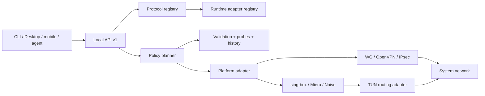

# Protocols, censorship resistance and AI orchestration

Copyright © 2026 [Nik m (@mazurovn)](https://github.com/mazurovn).

Current as of 2026-08-02. The machine-readable source of truth is
[`protocols/v1/registry.json`](../protocols/v1/registry.json). `implemented`
means a functionally tested connection backend on that platform. Recognizing a
URI or listing a protocol does not mean that a tunnel can be established.

## Thirteen-protocol catalog

| Protocol | Class and role | Managed import | Linux connect | Detection |
|---|---|---:|---:|---:|
| AmneziaWG | obfuscated WireGuard-like VPN | implemented | implemented | implemented |
| WireGuard | standard VPN | implemented | implemented | implemented |
| OpenVPN | TCP/UDP and enterprise VPN | implemented | implemented | implemented |
| L2TP/IPsec | legacy/enterprise VPN | implemented | implemented | implemented |
| VLESS / REALITY | proxy + TUN, TLS/REALITY | partial | planned | URI/JSON implemented |
| Hysteria 2 | QUIC proxy + TUN, lossy links and HTTP/3 camouflage | partial | planned | URI/JSON implemented |
| Mieru | proxy + TUN, padding and probe resistance | partial | planned | URI/JSON implemented |
| NaiveProxy | Chromium HTTP/2/3 proxy + TUN | partial | planned | JSON implemented |
| TUIC v5 | QUIC proxy + TUN | partial | planned | URI/JSON implemented |
| Shadowsocks 2022 | AEAD 2022 proxy + TUN | partial | planned | URI/JSON implemented |
| Trojan | TLS proxy + TUN | partial | planned | URI/JSON implemented |
| AnyTLS | multiplexed TLS proxy + TUN | partial | planned | URI/JSON implemented |
| ShadowTLS v3 | TLS camouflage transport | partial | planned | JSON implemented |

VLESS, Hysteria 2, TUIC, Shadowsocks 2022, Trojan and AnyTLS use the pinned
sing-box adapter target. Mieru 3.32.0 and NaiveProxy 148.0.7778.96-5 require
separate loopback SOCKS sidecars plus a TUN-to-SOCKS process. VLESS must not
reach a public server without outer transport security. NaiveProxy requires a
compatible Chromium runtime and a normal certificate; self-signed TLS changes
its traffic behavior. ShadowTLS v3 is a TCP transport requiring a typed inner
proxy chain, not a standalone L3 VPN.

Primary references:

- [Xray VLESS](https://xtls.github.io/en/config/outbounds/vless.html)
- [Hysteria 2 protocol](https://v2.hysteria.network/docs/developers/Protocol/)
- [Mieru client and share URIs](https://github.com/enfein/mieru/blob/main/docs/client-install.md)
- [NaiveProxy architecture](https://github.com/klzgrad/naiveproxy)
- [sing-box outbound catalog](https://sing-box.sagernet.org/configuration/outbound/)
- [Shadowsocks 2022](https://sing-box.sagernet.org/manual/proxy-protocol/shadowsocks/)
- [ShadowTLS v3](https://github.com/ihciah/shadow-tls/blob/master/docs/protocol-v3-en.md)

IETF MASQUE (`CONNECT-UDP` and `CONNECT-IP`,
[RFC 9298](https://www.rfc-editor.org/rfc/rfc9298.html) and
[RFC 9484](https://www.rfc-editor.org/rfc/rfc9484.html)) was also evaluated. It
is a promising HTTP/2/3 L3 transport, but is not in the primary catalog yet:
there is no selected runtime, server contract or demonstrated censorship
resistance for this product. Tor pluggable transports are useful for reaching
Tor, but are not counted as separate general-purpose Mazzy VPN L3 protocols.

## Implementation layers



A proxy backend is not implemented until strict parsing, root-only secret
storage, TUN/routing/DNS, stop/rollback, health checks, package supply chain and
integration tests pass. Arbitrary user-supplied sing-box JSON must not run as
root: it may declare unexpected listeners, paths or remote rule sets. Runtime
configuration must be synthesized from an allowlist schema.

[`runtime/v1/adapter-registry.json`](../runtime/v1/adapter-registry.json)
records the four execution graphs and pinned candidate versions. It explicitly
keeps lifecycle and integration tests `planned`; packaging the adapter script
does not bundle or authorize an engine.

## Detection and custom servers

The current detector accepts a share URI or one JSON object only through stdin
and returns redacted metadata:

```bash
printf '%s\n' "$SHARE_URI" | mazzy-vpn protocols detect --stdin --json
mazzy-vpn protocols list --json
mazzy-vpn protocols diagnose --json
mazzy-vpn protocols adapters --json
```

For URIs, the detector accepts one terminal `LF` or `CRLF`, rejects embedded
line terminators and requires a non-empty scheme payload. JSON accepts normal
space, `TAB`, `LF` and `CR`; duplicate keys, multiple documents, ambiguous
multi-protocol configurations and payloads larger than 64 KiB are rejected.
It recognizes sing-box/Xray outbounds, the official Mieru shape and NaiveProxy
`listen`/`proxy`. This classifies a format; it is not full validation.

It never returns the host, user info, UUID, password, query or fragment. A
closed Mazzy-managed custom-server profile can now be validated and stored:

```bash
mazzy-vpn protocols managed-validate --stdin --json < profile.json
mazzy-vpn protocols managed-import profile.json --dry-run --json
sudo mazzy-vpn protocols managed-import profile.json --json
```

The v1 schema covers all nine modern entries. It accepts typed endpoint,
credentials, TLS, DNS and full-tunnel policy fields only; listeners, file
paths, arbitrary route rules, dial marks and insecure TLS are impossible in
the input shape. Import rejects symlink sources and duplicate keys, writes an
atomic protocol/profile-ID file under `/etc/vpnctl/profiles`, uses directory
mode `700` and file mode `600`, and never reflects a credential or endpoint.
This is why registry import status is `partial`, not `implemented`: vendor
share URI conversion and platform keystores remain.

The packaged `mazzy-sing-box-adapter` can synthesize a fixed, closed TUN/DNS/
route graph for VLESS, Hysteria 2, TUIC, Shadowsocks 2022, Trojan and AnyTLS.
Its v1 renderer requires literal IPv4 proxy and DoH bootstrap addresses and
verified TLS. It cannot yet enter the normal service lifecycle. Mieru and
NaiveProxy need an atomic two-process sidecar supervisor; ShadowTLS needs a
typed inner-proxy reference. All three therefore return
`render_supported:false`.

The remaining production flow is:

1. Convert audited vendor share formats into the neutral managed schema without
   exposing credentials to UI or agents.
2. Move credentials from mode `600` Linux files to platform keystores where
   available; only an opaque `profile_id` and safe display name leave the
   backend.
3. Supply checksum-pinned engines with SBOM/provenance and verify their native
   config parsers before activation.
4. Add authorized lifecycle, process supervision, egress verification and
   transactional rollback.
5. Pass network-namespace DNS/IPv4/IPv6/leak/crash tests on every platform.

## Selection and diagnostics

The implemented read-only `planner.evaluate` query first enforces hard
constraints from local backend state: platform backend ready, valid profile,
backend-only secret access, protected rollback storage ready and supported
platform. The storage gate is a prerequisite for journaling future execution,
not proof of a candidate-specific rollback. An LLM cannot override these
constraints. Input is one strict JSON object of at most 64 KiB with a workload
and 1–128 unique opaque profile IDs.

Eligible candidates receive a deterministic 100-point score:

- 30: recent tunnel/egress success, with repeated-failure penalties;
- 25: censorship resistance derived from the versioned protocol catalog;
- 20: supplied reachability without treating it as a VPN test;
- 15: supplied latency and loss with bounded result freshness;
- 10: workload fit derived from workload, protocol class and transports.

Observed health evidence (recent outcome, reachability and latency/loss) older
than 900 seconds scores zero. Equal scores are ordered by opaque profile ID,
making the decision stable for the same local snapshot and evidence;
`evaluated_at` intentionally changes. The result contains only gates, factor
points and reason codes and is always `dry_run: true`:

```bash
jq -n --arg profile_id "$PROFILE_ID" '{
  workload: "api-calls",
  candidates: [{
    profile_id: $profile_id,
    evidence: {
      recent_outcome: "unknown", consecutive_failures: 0,
      reachability: "reachable", latency_ms: 150, loss_percent: 1,
      evidence_age_seconds: 30
    }
  }]
}' | mazzy-vpn planner evaluate --stdin --json
```

The caller supplies only bounded health evidence: recent outcome, consecutive
failures, reachability, latency/loss and measurement age. The backend derives
`censorship-fit` and `workload-fit` from the versioned catalog and workload, so
an LLM cannot self-assign them. A caller can still distort health scoring, but
cannot make a planned backend, invalid profile or unsafe secret file eligible.
Future switching must be transactional: snapshot,
bounded start, actual egress/DNS/IPv6 verification, then commit or rollback.
The evaluator passes its absolute monotonic deadline into candidate validation,
including the external OpenVPN parser, and returns `deadline-exceeded` when the
budget is exhausted.

## AI agent boundary

- agents read `protocols.list`, `profiles.list`, `status.get`,
  `planner.evaluate` and diagnostics through schemas;
- agents receive opaque IDs and evidence, never endpoints or credentials;
- plans default to dry-run;
- mutations require authorized action IDs, deadlines, audit and rollback;
- LLM text never becomes a shell command or backend configuration;
- retrying the same mutation action ID is idempotent.

The evaluator can rank only platform backends marked `implemented`; `planned`
is excluded by a hard constraint. It performs no mutation. History storage,
authorized connect/failover execution and Desktop/mobile agent integration are
still tracked by issue #39.

## Tracked implementation slices

- [#36 typed custom-server import and secret storage](https://github.com/mazurovn/mazzy-vpn/issues/36)
- [#37 sing-box-family Linux TUN adapters](https://github.com/mazurovn/mazzy-vpn/issues/37)
- [#38 Mieru and NaiveProxy/Cronet adapters](https://github.com/mazurovn/mazzy-vpn/issues/38)
- [#39 planner history, execution/failover and cross-surface integration](https://github.com/mazurovn/mazzy-vpn/issues/39)
