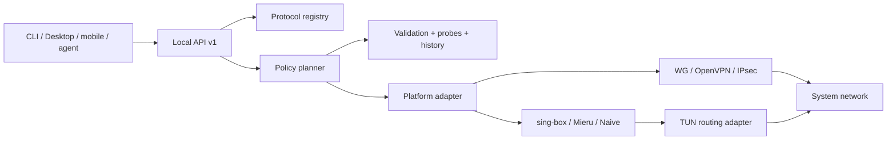

# Протоколы, обход блокировок и AI-оркестрация

Copyright © 2026 [Nik m (@mazurovn)](https://github.com/mazurovn).

Актуально на 2026-08-01. Машиночитаемый источник истины:
[`protocols/v1/registry.json`](../protocols/v1/registry.json). Статус
`implemented` означает проверенный функциональный backend именно на указанной
платформе. Распознавание URI или запись в каталоге не означают, что туннель уже
можно подключить.

## Матрица из 13 протоколов

| Протокол | Класс и назначение | Linux connect | Detection |
|---|---|---:|---:|
| AmneziaWG | обфусцированный WireGuard-like VPN | готово | готово |
| WireGuard | стандартный VPN | готово | готово |
| OpenVPN | TCP/UDP и enterprise VPN | готово | готово |
| L2TP/IPsec | legacy/enterprise VPN | готово | готово |
| VLESS / REALITY | proxy + TUN, TLS/REALITY | план | URI готово |
| Hysteria 2 | QUIC proxy + TUN, потери и HTTP/3 camouflage | план | URI готово |
| Mieru | proxy + TUN, padding и probe resistance | план | URI готово |
| NaiveProxy | Chromium HTTP/2/3 proxy + TUN | план | план |
| TUIC v5 | QUIC proxy + TUN | план | URI готово |
| Shadowsocks 2022 | AEAD 2022 proxy + TUN | план | URI готово |
| Trojan | TLS proxy + TUN | план | URI готово |
| AnyTLS | multiplexed TLS proxy + TUN | план | URI готово |
| ShadowTLS v3 | TLS camouflage transport | план | план |

VLESS, Hysteria 2, TUIC, Shadowsocks, Trojan, AnyTLS и Naive доступны как
outbound в документации sing-box. VLESS без внешней transport security нельзя
применять к публичному серверу. NaiveProxy требует совместимый Chromium/Cronet
runtime и нормальный сертификат: self-signed TLS меняет профиль трафика.
ShadowTLS v3 является TCP transport, а не самостоятельным L3 VPN.

Первичные источники:

- [Xray VLESS](https://xtls.github.io/en/config/outbounds/vless.html)
- [Hysteria 2 protocol](https://v2.hysteria.network/docs/developers/Protocol/)
- [Mieru client и share URI](https://github.com/enfein/mieru/blob/main/docs/client-install.md)
- [NaiveProxy architecture](https://github.com/klzgrad/naiveproxy)
- [sing-box outbound catalog](https://sing-box.sagernet.org/configuration/outbound/)
- [Shadowsocks 2022](https://sing-box.sagernet.org/manual/proxy-protocol/shadowsocks/)
- [ShadowTLS v3](https://github.com/ihciah/shadow-tls/blob/master/docs/protocol-v3-en.md)

## Слои реализации



Proxy backend не считается готовым, пока не реализованы строгий parser,
root-only secret storage, TUN/routing/DNS, stop/rollback, health-check, package
supply chain и integration tests. Полный пользовательский sing-box JSON нельзя
запускать от root: он может содержать неожиданные listeners, пути и удалённые
rule sets. Runtime-конфигурация должна синтезироваться из allowlist schema.

## Распознавание и свои серверы

Текущий detector принимает share URI только через stdin и возвращает очищенные
метаданные:

```bash
printf '%s\n' "$SHARE_URI" | mazzy-vpn protocols detect --stdin --json
mazzy-vpn protocols list --json
mazzy-vpn protocols diagnose --json
```

Детектор принимает один завершающий `LF` или `CRLF` от обычного pipeline. Он
отклоняет встроенные и повторные переводы строк, остальные control bytes и
payload больше 64 КиБ после удаления конечного разделителя.

Он не возвращает host, user info, UUID, password, query или fragment. Полный
импорт своих серверов является следующим backend-срезом:

1. UI передаёт файл/URI в write-only import operation и не читает ключ.
2. Системный parser проверяет allowlist schema конкретного протокола.
3. Credential хранится с mode `600` или в platform keystore; наружу выходит
   только opaque `profile_id` и безопасное display name.
4. `inspect-import` не меняет сеть; установка требует authorization и
   `action_id`.
5. Runtime-конфиг синтезируется, проверяется backend и удаляется после stop.

## Умный выбор и диагностика

Реализованный read-only query `planner.evaluate` сначала вычисляет hard
constraints из локального состояния backend: backend готов на платформе,
профиль валиден, секрет виден только backend, защищённый rollback storage готов
и платформа поддерживается. Storage gate нужен для journal будущего execution,
но не доказывает rollback конкретного кандидата. LLM не может обойти эти
условия. Входом является один strict JSON object до 64 КиБ с workload и 1–128
уникальными opaque profile IDs.

Оставшиеся кандидаты получают детерминированные 100 баллов:

- 30: недавний успешный tunnel/egress и штраф за повторные failures;
- 25: переданное caller соответствие блокировке и доступности transport;
- 20: переданная reachability без подмены VPN test обычным ping;
- 15: переданные latency и loss с ограниченным сроком жизни результатов;
- 10: workload fit для LLM stream, коротких API calls, video или split routing.

Наблюдаемое health evidence (recent outcome, reachability и latency/loss)
старше 900 секунд даёт ноль баллов. При равном score кандидаты стабильно
сортируются по opaque profile ID: решение повторяемо для одинакового локального
snapshot и evidence, а `evaluated_at` намеренно меняется. Result содержит только
gates, баллы факторов и reason codes и всегда имеет `dry_run: true`:

```bash
jq -n --arg profile_id "$PROFILE_ID" '{
  workload: "api-calls",
  candidates: [{
    profile_id: $profile_id,
    evidence: {
      recent_outcome: "unknown", consecutive_failures: 0,
      censorship_fit: "medium", reachability: "reachable",
      latency_ms: 150, loss_percent: 1, workload_fit: "high",
      evidence_age_seconds: 30
    }
  }]
}' | mazzy-vpn planner evaluate --stdin --json
```

В этом срезе fit и health evidence передаёт caller. Он может изменить dry-run
score, но не сделать eligible запланированный backend, невалидный профиль или
небезопасный файл с секретом. Будущая смена протокола должна быть
транзакционной: snapshot, bounded start, фактическая egress/DNS/IPv6 проверка,
затем commit или rollback.
Evaluator передаёт абсолютный monotonic deadline внутрь candidate validation,
включая внешний OpenVPN parser, и возвращает `deadline-exceeded` при исчерпании
бюджета.

## Контракт AI-агентов

- агент читает `protocols.list`, `profiles.list`, `status.get`,
  `planner.evaluate` и diagnostics только через schema;
- агент видит opaque ID и evidence, но не endpoint или credential;
- план по умолчанию dry-run;
- mutation требует authorized `action_id`, deadline, audit и rollback;
- LLM text никогда не становится shell command или backend config;
- повтор mutation с тем же `action_id` идемпотентен.

Evaluator ранжирует только platform backends со статусом `implemented`:
`planned` запрещён hard constraint. Mutation не выполняется. History storage,
authorized connect/failover и Desktop/mobile agent integration остаются в
issue #39.

## Задачи реализации

- [#36 typed import своих серверов и secret storage](https://github.com/mazurovn/mazzy-vpn/issues/36)
- [#37 sing-box-family Linux TUN adapters](https://github.com/mazurovn/mazzy-vpn/issues/37)
- [#38 Mieru и NaiveProxy/Cronet adapters](https://github.com/mazurovn/mazzy-vpn/issues/38)
- [#39 history, execution/failover и cross-surface integration planner](https://github.com/mazurovn/mazzy-vpn/issues/39)
