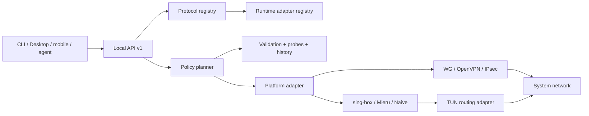

# Протоколы, обход блокировок и AI-оркестрация

Copyright © 2026 [Nik m (@mazurovn)](https://github.com/mazurovn).

Актуально на 2026-08-02. Машиночитаемый источник истины:
[`protocols/v1/registry.json`](../protocols/v1/registry.json). Статус
`implemented` означает проверенный функциональный backend именно на указанной
платформе. Распознавание URI или запись в каталоге не означают, что туннель уже
можно подключить.

## Матрица из 13 протоколов

| Протокол | Класс и назначение | Managed import | Linux connect | Detection |
|---|---|---:|---:|---:|
| AmneziaWG | обфусцированный WireGuard-like VPN | готово | готово | готово |
| WireGuard | стандартный VPN | готово | готово | готово |
| OpenVPN | TCP/UDP и enterprise VPN | готово | готово | готово |
| L2TP/IPsec | legacy/enterprise VPN | готово | готово | готово |
| VLESS / REALITY | proxy + TUN, TLS/REALITY | частично | план | URI/JSON готово |
| Hysteria 2 | QUIC proxy + TUN, потери и HTTP/3 camouflage | частично | план | URI/JSON готово |
| Mieru | proxy + TUN, padding и probe resistance | частично | план | URI/JSON готово |
| NaiveProxy | Chromium HTTP/2/3 proxy + TUN | частично | план | JSON готово |
| TUIC v5 | QUIC proxy + TUN | частично | план | URI/JSON готово |
| Shadowsocks 2022 | AEAD 2022 proxy + TUN | частично | план | URI/JSON готово |
| Trojan | TLS proxy + TUN | частично | план | URI/JSON готово |
| AnyTLS | multiplexed TLS proxy + TUN | частично | план | URI/JSON готово |
| ShadowTLS v3 | TLS camouflage transport | частично | план | JSON готово |

VLESS, Hysteria 2, TUIC, Shadowsocks 2022, Trojan и AnyTLS используют целевой
адаптер sing-box. Mieru 3.32.0 и NaiveProxy 148.0.7778.96-5 требуют отдельных
loopback SOCKS sidecar и второго TUN-to-SOCKS процесса. VLESS без внешней
transport security нельзя применять к публичному серверу. NaiveProxy требует
совместимый Chromium runtime и нормальный сертификат: self-signed TLS меняет
профиль трафика. ShadowTLS v3 требует typed inner proxy chain и не является
самостоятельным L3 VPN.

Первичные источники:

- [Xray VLESS](https://xtls.github.io/en/config/outbounds/vless.html)
- [Hysteria 2 protocol](https://v2.hysteria.network/docs/developers/Protocol/)
- [Mieru client и share URI](https://github.com/enfein/mieru/blob/main/docs/client-install.md)
- [NaiveProxy architecture](https://github.com/klzgrad/naiveproxy)
- [sing-box outbound catalog](https://sing-box.sagernet.org/configuration/outbound/)
- [Shadowsocks 2022](https://sing-box.sagernet.org/manual/proxy-protocol/shadowsocks/)
- [ShadowTLS v3](https://github.com/ihciah/shadow-tls/blob/master/docs/protocol-v3-en.md)

Также рассмотрен стандартизованный IETF MASQUE (`CONNECT-UDP` и `CONNECT-IP`,
[RFC 9298](https://www.rfc-editor.org/rfc/rfc9298.html) и
[RFC 9484](https://www.rfc-editor.org/rfc/rfc9484.html)). Он перспективен как
HTTP/2/3 L3 transport, но пока не включён в основной каталог: выбранный runtime,
server contract и доказанная устойчивость к блокировкам отсутствуют. Tor
pluggable transports полезны для доступа к Tor, но не считаются отдельными
универсальными L3 VPN-протоколами Mazzy VPN.

## Слои реализации



Proxy backend не считается готовым, пока не реализованы строгий parser,
root-only secret storage, TUN/routing/DNS, stop/rollback, health-check, package
supply chain и integration tests. Полный пользовательский sing-box JSON нельзя
запускать от root: он может содержать неожиданные listeners, пути и удалённые
rule sets. Runtime-конфигурация должна синтезироваться из allowlist schema.

[`runtime/v1/adapter-registry.json`](../runtime/v1/adapter-registry.json)
фиксирует четыре execution graph и версии движков-кандидатов. Lifecycle и
integration tests в нём намеренно остаются `planned`: наличие adapter script в
пакете не означает поставку или разрешение engine.

## Распознавание и свои серверы

Текущий detector принимает share URI или один JSON object только через stdin и
возвращает очищенные метаданные:

```bash
printf '%s\n' "$SHARE_URI" | mazzy-vpn protocols detect --stdin --json
mazzy-vpn protocols list --json
mazzy-vpn protocols diagnose --json
mazzy-vpn protocols adapters --json
```

Для URI detector принимает один завершающий `LF` или `CRLF`, отклоняет
встроенные переводы строк и пустую часть после scheme. Для JSON разрешены
обычные пробелы, `TAB`, `LF` и `CR`; повторные ключи, несколько документов,
неоднозначные multi-protocol configs и payload больше 64 КиБ отклоняются.
Распознаются sing-box/Xray outbound, официальная структура Mieru и
NaiveProxy `listen`/`proxy`. Это классификация формата, а не полная валидация.

Он не возвращает host, user info, UUID, password, query или fragment. Закрытый
Mazzy managed-профиль своего сервера теперь можно проверить и сохранить:

```bash
mazzy-vpn protocols managed-validate --stdin --json < profile.json
mazzy-vpn protocols managed-import profile.json --dry-run --json
sudo mazzy-vpn protocols managed-import profile.json --json
```

Schema v1 покрывает все девять современных записей. Вход содержит только typed
endpoint, credentials, TLS, DNS и full-tunnel policy; listeners, пути к файлам,
произвольные route rules, dial marks и insecure TLS структурно запрещены.
Import отклоняет symlink и duplicate keys, атомарно пишет файл
`protocol/profile_id.json` в `/etc/vpnctl/profiles`, задаёт каталогам `700`,
файлам `600` и не отражает endpoint или credential. Поэтому import имеет статус
`partial`: conversion vendor share URI и platform keystore ещё не готовы.

Пакетный `mazzy-sing-box-adapter` синтезирует фиксированный TUN/DNS/route graph
для VLESS, Hysteria 2, TUIC, Shadowsocks 2022, Trojan и AnyTLS. Renderer v1
требует literal IPv4 для proxy и DoH bootstrap и проверяемый TLS, но пока не
включён в обычный service lifecycle. Mieru и NaiveProxy требуют атомарный
двухпроцессный sidecar supervisor, ShadowTLS — typed inner-proxy reference;
поэтому у всех трёх `render_supported:false`.

Оставшийся production flow:

1. Конвертировать проверенные vendor share formats в нейтральную schema без
   выдачи credential UI или агенту.
2. Перенести credential из Linux mode `600` в platform keystore, где он есть;
   наружу оставлять только opaque `profile_id` и безопасное display name.
3. Поставлять checksum-pinned engines с SBOM/provenance и запускать их native
   parser до активации.
4. Добавить authorized lifecycle, supervision, egress verification и rollback.
5. Пройти network-namespace DNS/IPv4/IPv6/leak/crash tests на каждой платформе.

## Умный выбор и диагностика

Реализованный read-only query `planner.evaluate` сначала вычисляет hard
constraints из локального состояния backend: backend готов на платформе,
профиль валиден, секрет виден только backend, защищённый rollback storage готов
и платформа поддерживается. Storage gate нужен для journal будущего execution,
но не доказывает rollback конкретного кандидата. LLM не может обойти эти
условия. Входом является один strict JSON object до 64 КиБ с workload и 1–128
уникальными opaque profile IDs.

Оставшиеся кандидаты получают детерминированные 100 баллов:

- 30: недавний успешный tunnel/egress и штраф за повторные failures;
- 25: устойчивость к блокировкам из versioned protocol catalog;
- 20: переданная reachability без подмены VPN test обычным ping;
- 15: переданные latency и loss с ограниченным сроком жизни результатов;
- 10: workload fit, вычисленный из workload, класса протокола и transport.

Наблюдаемое health evidence (recent outcome, reachability и latency/loss)
старше 900 секунд даёт ноль баллов. При равном score кандидаты стабильно
сортируются по opaque profile ID: решение повторяемо для одинакового локального
snapshot и evidence, а `evaluated_at` намеренно меняется. Result содержит только
gates, баллы факторов и reason codes и всегда имеет `dry_run: true`:

```bash
jq -n --arg profile_id "$PROFILE_ID" '{
  workload: "api-calls",
  candidates: [{
    profile_id: $profile_id,
    evidence: {
      recent_outcome: "unknown", consecutive_failures: 0,
      reachability: "reachable", latency_ms: 150, loss_percent: 1,
      evidence_age_seconds: 30
    }
  }]
}' | mazzy-vpn planner evaluate --stdin --json
```

Caller передаёт только ограниченное health evidence: recent outcome,
consecutive failures, reachability, latency/loss и возраст измерения.
`censorship-fit` и `workload-fit` backend выводит из versioned catalog и
workload, поэтому LLM не может назначить их себе. Caller всё ещё может исказить
health score, но не сделать eligible запланированный backend, невалидный
профиль или небезопасный файл с секретом. Будущая смена протокола должна быть
транзакционной: snapshot, bounded start, фактическая egress/DNS/IPv6 проверка,
затем commit или rollback.
Evaluator передаёт абсолютный monotonic deadline внутрь candidate validation,
включая внешний OpenVPN parser, и возвращает `deadline-exceeded` при исчерпании
бюджета.

## Контракт AI-агентов

- агент читает `protocols.list`, `profiles.list`, `status.get`,
  `planner.evaluate` и diagnostics только через schema;
- агент видит opaque ID и evidence, но не endpoint или credential;
- план по умолчанию dry-run;
- mutation требует authorized `action_id`, deadline, audit и rollback;
- LLM text никогда не становится shell command или backend config;
- повтор mutation с тем же `action_id` идемпотентен.

Evaluator ранжирует только platform backends со статусом `implemented`:
`planned` запрещён hard constraint. Mutation не выполняется. History storage,
authorized connect/failover и Desktop/mobile agent integration остаются в
issue #39.

## Задачи реализации

- [#36 typed import своих серверов и secret storage](https://github.com/mazurovn/mazzy-vpn/issues/36)
- [#37 sing-box-family Linux TUN adapters](https://github.com/mazurovn/mazzy-vpn/issues/37)
- [#38 Mieru и NaiveProxy/Cronet adapters](https://github.com/mazurovn/mazzy-vpn/issues/38)
- [#39 history, execution/failover и cross-surface integration planner](https://github.com/mazurovn/mazzy-vpn/issues/39)
