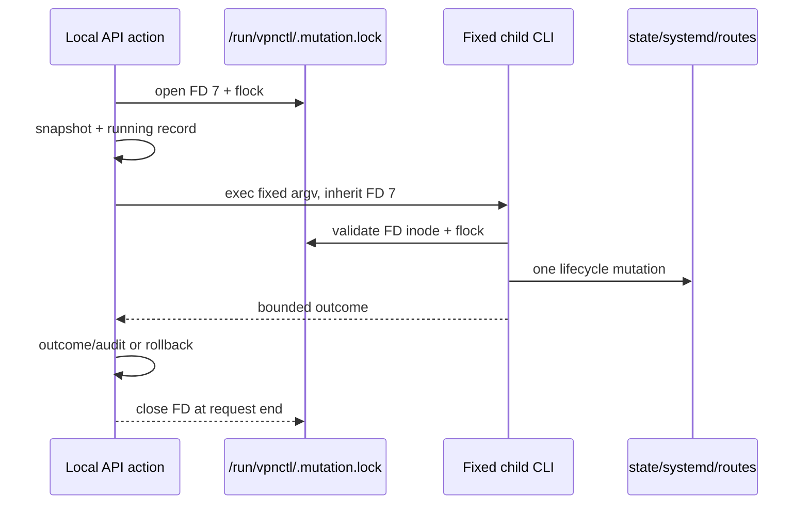

# R0a: единая блокировка системных мутаций

Copyright © 2026 [Nik m (@mazurovn)](https://github.com/mazurovn).

Статус: **реализовано в текущей непубликованной ветке; переходная архитектура**.

Нормативная цель остаётся в
[целевой архитектуре](TARGET_ARCHITECTURE_2026-08-02.ru.md): единственным
владельцем egress state должен стать `mazzy-vpnd`. Этот документ описывает
первый R0a safety slice существующего Bash/systemd control plane и не расширяет
release claims опубликованного `v1.3.2`.

## Проблема

До R0a API lifecycle, прямой CLI и health recovery использовали разные lock
files. API мог создать snapshot и journal record, после чего другой path менял
service/state/routes вне этой транзакции. Rollback тогда применял устаревший
intent.

## Решение R0a

Все поддержанные entrypoints используют один inode:

```text
$VPNCTL_RUN_DIR/.mutation.lock
default: /run/vpnctl/.mutation.lock
```

| Mutation path | Поведение R0a |
|---|---|
| API `lifecycle.connect/reconnect/disconnect` | non-blocking lock, ответ `busy` при конфликте |
| Direct `connect/reconnect/disconnect/test/emergency` | тот же non-blocking lock |
| Timeout, test boot recovery и API action boot recovery | тот же lock с ограниченным ожиданием; API oneshot выполняется до test recovery/tunnel/health/socket, а test recovery требует его успеха и ограничен 60 секундами |
| Health remediation | `.health.lock` сериализует ticks; start/restart проверяет API recovery marker под общим lock и держит lock до terminal результата systemd |
| Ordinary и managed profile import/remove | общий lock плюс существующая локальная atomic/per-directory защита |
| `doctor --fix`, `autostart`, `monitor` | fail-closed до вызова system tools |
| Internal quick-policy cleanup | общий lock до изменения policy rules |
| API recovery acknowledgement | общий lock до удаления recovery marker |

Read-only status, probe, verify и dry-run import общий mutation lock не берут.
Длительный `vpnctl.service` не удерживает lock весь срок жизни tunnel: lock
защищает управляющую транзакцию, а systemd остаётся process supervisor.

## Унаследованный lock API

API удерживает file descriptor `7` во время snapshot, дочерней фиксированной
CLI-команды, outcome и rollback. Дочерняя команда не открывает второй lock,
который заблокировал бы её саму. Вместо этого она получает
`VPNCTL_MUTATION_LOCK_FD=7` и проверяет:

1. значение является числом и FD открыт;
2. inode `/proc/$$/fd/<fd>` совпадает с inode текущего `.mutation.lock`;
3. `flock -n <fd>` подтверждает владение или атомарно получает lock;
4. ошибка любой проверки завершает операцию до `systemctl`, записи профиля или
   изменения policy.

Fallback subprocesses являются отдельной trust boundary: при их запуске CLI
явно закрывает FD `7`, `8` и `9`. Поэтому daemonized provider fallback не может
удержать API/direct lock после завершения action.

Прямой CLI после успешного получения FD `8` экспортирует тот же marker для
доверенных вложенных вызовов, например `import-files -> import`. Проверка inode
повторяется; одно только значение environment variable не является
полномочием.



## Fail-closed и recovery

- Конкурентная API mutation получает стабильную retryable ошибку `busy`.
- Direct CLI завершает действие сообщением о другой активной операции.
- Invalid inherited FD не приводит к fallback на незаблокированную мутацию.
- Failed API rollback сохраняет root-only recovery marker и блокирует следующие
  API actions, новый managed-service start и health remediation до ручной
  проверки.
- Hardened `mazzy-vpn-api-recovery.service` запускает
  `_api-recover-interrupted-actions` от root при загрузке, до
  test recovery, `vpnctl.service`, `vpnctl-health.service` и API socket. Boot path
  восстанавливает durable intent, не ожидая рекурсивно уже упорядоченный
  `vpnctl.service` job; systemd применяет восстановленный intent после выхода
  oneshot. Ошибки подготовки каталогов, permissions или получения lock
  также долговечно сохраняют fail-closed marker.
- Health remediation больше не использует `systemctl --no-block`: общий lock
  освобождается только после terminal результата start/restart.
- Снятие marker выполняется только командой
  `sudo mazzy-vpn _api-clear-recovery --acknowledge-current-state` под тем же
  lock. Операторская процедура описана в Wiki Diagnostics and Recovery.

## Автоматические доказательства

`tests/run.sh` проверяет:

- API/CLI lifecycle и idempotent action journal не self-deadlock на inherited
  FD;
- daemonized fallback не удерживает ни direct FD `8`, ни API FD `7`;
- конкурентная mutation получает `busy`;
- timeout/boot recovery ждёт тот же lock;
- health remediation не обходит active mutation;
- service-policy и profile-import paths не вызывают system mutation при
  занятом lock;
- фиктивный `VPNCTL_MUTATION_LOCK_FD` отклоняется до `systemctl`;
- rollback failure сохраняет recovery-only state.
- boot API recovery success/failure, включая реально занятый общий
  lock, systemd ordering, health marker gate и отсутствие async systemd overlap.

`shellcheck mazzy-vpn tests/run.sh`, `bash -n`, public-secret audit и полный
regression suite являются обязательными merge gates этого среза.

## Что R0a не решает

1. Нет отдельного privileged `mazzy-vpnd` и typed IPC owner.
2. Direct root CLI остаётся compatibility authority.
3. API journal/action ID не охватывает каждую direct root/config mutation.
4. Rollback проверяет intent/service, но не доказывает routes, DNS, firewall,
   interface generation и leak freedom.
5. systemd auto-restart является отдельным process supervisor, а не desired vs
   observed reconciler с revision fencing.
6. `install.sh` имеет отдельный package transaction; его нужно перенести под
   daemon maintenance mode.
7. `mazzy-sing-box-adapter` пока не подключён к lifecycle. До интеграции он не
   является поддержанным product entrypoint; будущий запуск должен идти только
   через `mazzy-vpnd` transaction/lease.

## Переход к `mazzy-vpnd`

| Этап | Критерий завершения |
|---|---|
| V10.1 | system daemon и protected typed local IPC существуют |
| V10.2 | CLI/Desktop/health публикуют intent/evidence, но не вызывают system tools напрямую |
| V10.3 | каждая mutation имеет action ID, revision, journal и terminal outcome |
| V10.4 | desired/observed/resource snapshots используют generation fencing |
| V10.5 | rollback verifier доказывает service, interface, routes, DNS, firewall и leak policy |
| V10.6 | crash/reboot/kill/power-loss tests подтверждают reconciliation |
| V10.7 | direct root compatibility paths удалены; R0a file-lock больше не authority |

R0a считается полностью заменённым только после V10.1-V10.7. До этого
документация должна использовать формулировку «shared transitional mutation
lock», а не «единый daemon owner».
