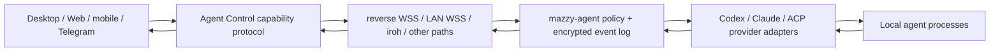

# Исследование удалённого управления AI-агентами

Copyright © 2026 [Nik m (@mazurovn)](https://github.com/mazurovn).

Дата проверки: 2026-08-02.

[Архитектура Agent Control](AGENT_CONTROL_ARCHITECTURE.ru.md) ·
[нормативная целевая архитектура](TARGET_ARCHITECTURE_2026-08-02.ru.md) ·
[реестр transport adapters](../agent-control/v1/registry.json) ·
[Desktop](DESKTOP.ru.md)

Этот документ фиксирует research evidence и сравнение аналогов. При
расхождении решений нормативным источником является целевая архитектура.

## Цель

Mazzy должен поддерживать два независимых направления:

1. egress VPN к провайдеру или корпоративной сети;
2. обратное подключение пользователя к локальным AI-агентам с Desktop, Web,
   mobile или Telegram.

Второй слой даёт удалённый доступ к коду и инструментам пользователя, поэтому
его корректная модель угроз ближе к remote administration, чем к чату. Один
сетевой tunnel не решает identity, pairing, authorization, approvals, durable
delivery, idempotency и revocation.

## Проверенные источники

Репозитории исследованы по исходному коду, а не только по README:

| Проект | Зафиксированная ревизия | Что проверено |
|---|---|---|
| [Happy](https://github.com/slopus/happy) | `971d608923f175d3d63af7c204e8c036206b3e99` | CLI wrappers, encrypted sync, Socket.IO events, session/machine scopes, RPC/ACK |
| [Claude Bridge](https://github.com/HelpFreedom/claude-bridge) | `89ebf2953bbfe7b4f989a7ba5207d6588245ecf3` | LAN WSS, TLS pinning, QR pairing, discovery, PTY keepers, iroh sidecar |
| [Paseo](https://github.com/getpaseo/paseo) | `26bdb1d1713e8f884950e560bdf067980f175213` | local daemon, provider adapters, WebSocket API, mobile/Desktop/Web/CLI, E2EE relay |
| [Yep Anywhere](https://github.com/kzahel/yepanywhere) | `d882f8d0c14f0cc95abaab8118243060f6e77184` | self-hosted session owner, browser client, auth/encrypted relay, multi-host sources |

Также проверены официальные интерфейсы:

- [Codex app-server](https://developers.openai.com/codex/app-server): JSON-RPC
  rich-client protocol, stdio/Unix socket и экспериментальный WebSocket;
- локальный Codex CLI `0.146.0`: experimental `app-server` и experimental
  `remote-control start|pair|stop`;
- [Claude Remote Control](https://code.claude.com/docs/en/remote-control):
  продолжение локальной сессии через claude.ai/mobile;
- [Claude Channels](https://code.claude.com/docs/en/channels): MCP channel
  plugins для Telegram, Discord, iMessage и собственных event sources;
- локальный Claude Code `2.1.197`: поддержка `--remote-control`;
- [Agent Client Protocol](https://agentclientprotocol.com/get-started/architecture):
  typed client-agent boundary поверх JSON-RPC.

`OpenACP` не включён в выводы: указанный ранее repository URL при повторной
проверке не существовал. Архитектура не должна опираться на неподтверждённый
проект.

## Сравнение моделей

| Модель | Сессией владеет | Remote path | Сильная сторона | Критический риск |
|---|---|---|---|---|
| Happy | wrapper/agent на host | encrypted durable sync server | reconnect, multi-device state, ordered events, Codex + Claude | центральный routing service и wrapper становятся большой trust surface |
| Claude Bridge | Linux host + PTY keeper | pinned LAN WSS или iroh direct/relay | быстрый local-first путь, QR pairing, переживает disconnect клиента | PTY-specific protocol смешивает terminal state и control semantics |
| Paseo | непривилегированный local daemon | direct WebSocket или E2EE relay | единая multi-provider модель и много first-party clients | daemon имеет полномочия пользователя; публичный bind равен remote execution surface |
| Yep Anywhere | self-hosted server | browser/direct or relay | простой Web ingress и server-owned persistent sessions | browser path требует отдельной защиты localhost, origin, auth и relay metadata |
| Codex native | Codex local app-server/daemon | official Remote Control или protected WS/Unix | typed approvals/events без разбора терминала | vendor relay/account dependency; raw app-server нельзя публиковать без TLS/auth |
| Claude native | Claude local CLI | official Remote Control/Channels | готовые Web/mobile и Telegram events | provider cloud/channel policy; chat может внести prompt injection |

## Что необходимо перенять

- Из Happy: durable encrypted event log, monotonic sequence,
  optimistic-version check, ACK и machine/session scopes.
- Из Claude Bridge: QR pairing, peer pinning, LAN-first probing и iroh как
  direct/relay optimization.
- Из Paseo: local unprivileged daemon как единственный владелец agent process,
  provider abstraction и одинаковый API для Desktop/mobile/Web/CLI.
- Из Yep Anywhere: browser как полноценный клиент, а не удалённый терминал, и
  явное разделение host/session sources.
- Из официальных provider APIs: typed lifecycle, streamed events и approvals.
- Из ACP: capability negotiation вместо предположений о конкретном CLI.

Не следует переносить raw terminal stream в core protocol. Terminal output
может содержать escape sequences, secrets и неподтверждённый model text; PTY
не задаёт надёжных границ команды, результата и approval.

## Принятое решение Mazzy

Ключевые свойства:

- `mazzy-agentd` работает без root рядом с agent CLI и не входит в
  привилегированный VPN backend;
- ingress, transport и provider являются тремя отдельными plugin boundaries;
- command schema закрыт: arbitrary `shell.exec` отсутствует;
- каждый side effect имеет `message_id`, sequence, TTL, risk, confirmation и
  application ACK;
- broker видит routing metadata, но хранит только E2EE ciphertext;
- повторная доставка возвращает сохранённый результат и не повторяет действие;
- LAN/iroh/reverse-WSS можно менять без downgrade encryption или authorization;
- VPN routing mode задаёт backend policy, а не LLM;
- provider credentials остаются в локальном Codex/Claude, gateway их не
  импортирует и не синхронизирует.

## Почему гибрид, а не один protocol

`iroh` удобен для native QUIC direct/relay, но браузер и UDP-blocked enterprise
network требуют других paths. Reverse WSS через outbound TCP 443 нужен как
универсальный durable baseline. LAN WSS уменьшает latency и зависимость от
relay. WebRTC/WebTransport нужны first-party browser client. Mesh integration
может быть enterprise option, но не скрытой обязательной зависимостью.

Оркестратор сначала применяет hard gates, затем выбирает path по health,
privacy, censorship fit, latency и battery cost. Он не выполняет одну команду
по нескольким путям: параллельно разрешено только probe, а delivery имеет один
authoritative path и idempotent retry после ACK cursor.

## Реализованный containment slice

Desktop теперь содержит unreleased first-party экран «AI-агенты» и Rust boundary:

- обнаруживает кандидаты `codex` и `claude`, не запуская их;
- показывает candidate/runtime readiness для всех семи transport adapters;
- не регистрирует `run_agent_operation` в Tauri invoke и не показывает
  renderer controls для start/pair/stop;
- не хранит pairing state и не возвращает pairing material в WebView;
- включает unit, UI-contract и package payload regressions.

Этот slice сознательно не даёт vendor-native lifecycle path. Native approval,
trusted executable resolution и process-tree containment должны быть
реализованы и проверены до возврата authority. Собственный Mazzy transport,
Web client, Telegram bot и provider lifecycle не реализованы.

## Следующие задачи

1. Создать отдельный `mazzy-agent-control` monorepo и unprivileged
   `mazzy-agentd` с
   Unix-socket API, device identity, protected local keys и typed audit log.
2. Реализовать read-only Codex app-server/Claude/ACP adapters:
   `providers.list`, `sessions.list`, `session.status`, `events.subscribe`.
3. Добавить pairing/revocation/key rotation и E2EE reverse-WSS broker с
   durable queue, deduplication, resume cursor и broker-metadata policy.
4. Встроить в Desktop first-party session list, event stream, prompt и approval
   UI. Prompt/approval включать только после E2EE и risk-policy tests.
5. Добавить LAN WSS, затем iroh direct/relay за единым transport contract.
6. Реализовать Web/PWA и Telegram Mini App как paired first-party clients.
7. Добавить Telegram Bot только для `status/list/pause/cancel` и notifications;
   prompt, artifacts, credentials и approvals через обычный Bot API запретить.
8. После Linux E2E перенести daemon/adapters на Windows/macOS, затем Android.

## Release blockers

- нет `mazzy-agentd` runtime и first-party `mazzy-agent-control` repository;
- нет persistent device identity, pairing revocation и key rotation;
- E2EE envelope пока schema, а не audited runtime с test vectors;
- нет reverse-WSS broker, offline queue, ACK/resume и reconnect tests;
- нет first-party Web/mobile clients и Telegram privilege tests;
- Claude lifecycle adapter только обнаруживается;
- Windows npm command shims могут требовать нативный executable adapter;
- существующий Linux Tauri/GTK3 dependency graph не имеет известной
  vulnerability по `cargo audit`, но выдаёт 16 `unmaintained` warnings и
  остаётся общим Desktop maintenance blocker;
- не пройдены NAT/relay, packet-loss, duplicate/replay/flood, incident recovery
  и независимый security review.

Поэтому этот код должен выпускаться как Desktop provider-integration preview,
а не как готовый Mazzy client-to-client agent gateway.
