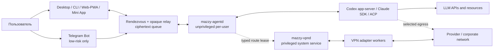

# Целевая архитектура Mazzy VPN и Agent Control

Copyright © 2026 [Nik m (@mazurovn)](https://github.com/mazurovn).

Дата ревью: 2026-08-02. Статус: **нормативный план, не описание готовой
реализации**.

[Текущая архитектура VPN](ARCHITECTURE.ru.md) ·
[текущая архитектура Agent Control](AGENT_CONTROL_ARCHITECTURE.ru.md) ·
[исследование аналогов](RESEARCH_AGENT_REMOTE_CONTROL_2026-08-02.ru.md) ·
[реестр Agent Control v1](../agent-control/v1/registry.json)

## 1. Резюме решения

Главное архитектурное решение проекта верно: Mazzy должен иметь две
независимые плоскости.

1. **Egress VPN plane** подключает приложения и устройство к VPN-провайдеру
   или корпоративной сети. Она владеет TUN, routes, DNS, firewall и требует
   системных привилегий.
2. **Reverse Agent Control plane** доставляет команды от paired-клиента к уже
   запущенному AI-агенту. Она владеет device identity, sessions, approvals,
   encrypted event log и provider adapters, но не должна получать root.

Связывать эти плоскости общим процессом, общей базой или общей привилегией
нельзя. Единственная допустимая связь между ними: узкий типизированный
`route-lease` API, в котором Agent Control запрашивает один из заранее
разрешённых режимов маршрутизации, а только VPN daemon решает, можно ли создать
endpoint-scoped route/DNS exception.

Текущий код реализует только ограниченный срез этой целевой модели:

- egress работает на Linux; release 1.4 R0a свёл Bash/API/direct CLI и
  health remediation на общий lock, но единого daemon owner/journal ещё нет;
- Desktop Agent Control остаётся diagnostics-only обнаружением Codex/Claude;
  отдельно реализован непривилегированный Linux `mazzy-agentd` для локального
  LAN-WSS egress API без agent-provider sessions;
- `agent-control/v1` содержит исполнимый локальный egress command/receipt/result/
  error/pairing slice. HPKE envelope, broker protocol, PAKE и общий remote-agent
  wire protocol остаются draft;
- Windows/macOS остаются UI previews без VPN backend, Android/iOS приложений
  нет;
- современные proxy protocols имеют registry/import/render foundation, но не
  полный connect/TUN/DNS/routing/rollback/leak-test lifecycle.

Поэтому ближайшая цель не состоит в одновременной реализации семи Agent
Control transports и девяти VPN protocols. Сначала нужно доказать два
минимальных end-to-end контура с одним владельцем состояния:

- `Desktop/CLI -> mazzy-vpnd -> один существующий Linux VPN adapter`;
- `Desktop/Web -> reverse HTTPS/WSS -> mazzy-agentd -> Codex app-server`.

## 2. Метод ревью и уровень уверенности

Архитектура сформирована после пяти независимых read-only ревью:

| Роль | Проверенная область |
|---|---|
| Principal distributed-systems architect | state ownership, consistency, failure recovery, deployment boundaries |
| Security architect | STRIDE, confused deputy, key lifecycle, broker trust, privilege separation |
| Network/transport researcher | WSS/HTTPS, LAN, iroh, WebRTC, WebTransport, libp2p, mesh, MASQUE, Tor |
| AI integration architect | Happy, Claude Bridge, Paseo, Yep Anywhere, Codex, Claude, ACP и MCP |
| Staff implementation/test architect | cross-platform delivery, migrations, SLO, CI, release DAG и rollback |

Выводы дополнительно сверены с текущим кодом и первичными источниками. Факт о
существующей реализации отделён от рекомендации. Числа SLO и budgets ниже
являются стартовыми engineering targets; их необходимо подтвердить telemetry и
soak tests до GA.

## 3. Критические выводы текущего аудита

**Статус раздела: текущая реализация и уже подтверждённые findings.**

### 3.1 P0 finding: split-lock устранён в R0a, единый owner ещё не реализован

Исходный аудит обнаружил три независимые блокировки: API lifecycle использовал
`$API_ACTION_DIR/.mutation.lock`, обычные `connect`/`reconnect`/`disconnect` —
`$RUN_DIR/.action.lock`, а health controller имел `$RUN_DIR/.health.lock` и сам
запускал или перезапускал service. API snapshot/journal поэтому не исключал
параллельную прямую CLI-операцию.

В release 1.4 реализован первый срез **R0a**:

- API, прямой CLI lifecycle, обычный/managed profile import/remove,
  timeout/boot recovery, health remediation, internal policy cleanup,
  `doctor --fix`, `autostart` и `monitor` используют один
  `$RUN_DIR/.mutation.lock`;
- API удерживает lock на всём lifecycle action, а дочерняя фиксированная CLI
  операция принимает только проверенный inherited FD того же inode;
- неверный или подменённый inherited FD приводит к fail-closed до `systemctl`;
- `$RUN_DIR/.health.lock` остался только singleton lock самой health-проверки;
  любое исправляющее действие дополнительно получает общий mutation lock;
- regression tests проверяют API-vs-CLI busy, recovery serialization,
  inherited-lock validation и service-policy blocking.

Это закрывает подтверждённую split-lock гонку текущего Bash control plane, но
**не закрывает ADR-002**: отдельного `mazzy-vpnd` ещё нет, direct root paths
остаются возможны, а API action journal пока не охватывает каждую такую
операцию. Общий file lock является переходным safety boundary, не целевой
моделью владения.

Точный scope, inherited-FD trust boundary, тесты и migration criteria записаны
в [технической спецификации R0a](R0_MUTATION_SINGLE_FLIGHT.ru.md).

### 3.2 P0: rollback восстанавливает intent, но не доказывает ресурсы

API snapshot сейчас сохраняет в основном файл `active`, затем start/stop
service. Это полезная защита, но недостаточная транзакция. Успешный rollback
должен доказать восстановление:

- process/resource generation;
- TUN/interface identity;
- routes и policy rules;
- DNS state;
- firewall/nftables state;
- внешний fallback VPN, если он был изменён;
- фактический egress или явно `evidence-unavailable`.

Если доказать восстановление нельзя, состояние должно стать
`RECOVERY_REQUIRED`, а новые mutations блокируются.

**Текущий containment slice:** hardened root oneshot теперь согласует
прерванные API actions при загрузке под общим mutation lock и запускается до
tunnel, health remediation и API socket. Неудачный rollback сохраняет
root-only marker; health проверяет его под тем же lock и ждёт terminal
`systemctl` result вместо `--no-block`. Полная resource/leak verification по
этому finding всё ещё не реализована.

### 3.3 P0: Agent Control schema не является полным protocol

Сейчас отсутствуют отдельные контракты для:

- hello/version negotiation;
- device record и pairing transcript;
- session snapshot и revision;
- result, event, ACK, error и stream resume;
- key rotation/revocation;
- approval proof;
- transport framing и path migration.

`arguments` остаётся произвольным object; `risk` и `source_channel` передаёт
caller. Это нельзя использовать как authorization input. Риск, channel binding
и допустимые arguments обязан повторно вывести `mazzy-agentd` из
аутентифицированного контекста и capability-specific schema.

### 3.4 P0: renderer-supplied confirmation не является trusted presence

Desktop вызывает `window.confirm()`, затем передаёт Rust параметр
`confirmed: true`. Любой код, способный вызвать Tauri IPC, может пропустить
диалог. Это не доказывает присутствие человека.

**Требование:** privileged/native boundary сам создаёт confirmation ceremony и
выдаёт одноразовое доказательство, привязанное к точному digest команды,
actor/device, target, policy version, expiry и nonce. Свободный boolean или
непривязанный `confirmation_id` запрещены.

**Текущий containment slice:** `run_agent_operation` удалён из Tauri invoke и
renderer, кнопки start/pair/stop и pairing state удалены. Agent Control остаётся
read-only diagnostics до реализации этого требования.

### 3.5 P0: subprocess deadline не закрывает descendants

`agent_control.rs::run_limited` убивает только direct child, после чего без
deadline ждёт reader threads. Descendant, унаследовавший stdout/stderr, может
удержать pipe и повесить операцию после номинальных 12 секунд.

**Требование:** запускать adapter в отдельной process group/job object или
cgroup, завершать всю группу, закрывать pipes с общим deadline и проверять это
fixture, которая оставляет inherited pipe открытым.

**Текущий containment slice:** Desktop diagnostics больше не запускают
обнаруженный agent executable. Lifecycle authority может вернуться только
вместе с trusted executable resolution и проверенным process-tree containment.

### 3.6 P1: readiness и registry переоценивают доказательства

- До containment `ProviderState.adapter_status: "implemented"` в
  `desktop/src-tauri/src/agent_control.rs` означал только три vendor-native
  Codex lifecycle operation, а не first-party gateway. В
  registry Desktop ingress имеет `diagnostics: "implemented"` и platform
  status `partial`, тогда как все transport platform runtimes остаются
  `planned`.
- executable existence и substring в `--help` не доказывают compatibility,
  health или release readiness.
- `browser_client: true` не доказывает, что browser может безопасно подключиться
  к LAN WSS: нужны Local Network Access permission и Web PKI constraints.
- семь строк transports не являются семью равноценными production paths.

Нужны отдельные состояния:

```text
discovered -> compatible -> locally_operational -> e2e_verified -> release_ready
```

Текущий Desktop теперь сообщает только `discovery-only`, не выставляет
`embedded_client_ready`, возвращает пустой список actions и имеет low-risk
ceiling в registry.

### 3.7 Исправлено в ходе аудита: opaque pairing secret fallback

`parse_pairing` предпочитал `manualPairingCode`, но при его отсутствии мог
вернуть raw `pairingCode` в WebView. Это противоречило заявленной границе.
Fallback удалён: Desktop принимает только безопасный manual code и fail-closed
отклоняет opaque-only response. Regression test фиксирует инвариант.

## 4. Цели, ограничения и non-goals

**Статус раздела: целевые требования.**

### 4.1 Цели

- один authoritative mutation owner в каждой плоскости;
- offline-capable E2EE reverse control без provider credentials на broker;
- typed multi-provider session API для Codex, Claude и ACP;
- deterministic path selection с безопасной работой в UDP-blocked networks;
- одинаковые command semantics для Desktop, CLI, Web/PWA и Mini App;
- явная low-trust модель обычного Telegram Bot;
- Linux-first реализация, переносимая на Windows/macOS/Android;
- machine-readable contracts, conformance kit и anti-overclaiming release gate;
- self-hosted и managed deployment profiles без скрытой смены trust model.

### 4.2 Non-goals первой production версии

- arbitrary `shell.exec`;
- raw PTY как wire, auth или approval protocol;
- автоматические approvals от LLM;
- маршруты или firewall rules, построенные из LLM output;
- синхронизация provider API keys;
- prompt, artifacts, approvals или credentials через Telegram Bot API;
- одновременная отправка side-effecting command по нескольким transports;
- multi-region Kubernetes до доказанного single-region restore;
- libp2p, WebRTC, WebTransport и mesh как блокеры первого релиза;
- hosting desktop provider agents на мобильном устройстве.

## 5. Quality attributes и инварианты

**Статус раздела: целевые инварианты и стартовые SLO.**

Инварианты важнее средних SLO:

1. Один `command_id` создаёт не более одного внешнего side effect в пределах
   опубликованного idempotency horizon.
2. Revoked device не может выполнить новую command, даже если relay доставил
   старый ciphertext.
3. Broker, его storage и logs не содержат plaintext command, prompt, output,
   artifact или provider credential.
4. Transport switch не ослабляет identity, E2EE, policy или approval.
5. Agent Control failure не меняет VPN state.
6. VPN failure меняет только судьбу явно выданного route lease.
7. LLM никогда не является authorization, secret или route authority.
8. `completed` означает persisted provider outcome, а не TCP/QUIC delivery.
9. Неизвестный side effect после crash становится `IN_DOUBT`, а не повторяется.
10. Runtime support нельзя повысить только на основании наличия executable.
11. Компрометация только HPKE recipient key позволяет читать адресованный
    ciphertext, но не позволяет создать envelope, приписанный устройству:
    авторство требует отдельный Ed25519 signing key.

Стартовые SLO после появления production runtime:

| Показатель | Target |
|---|---|
| local `mazzy-agentd` availability | 99.5% weekly, пока host awake |
| broker enqueue + durable ACK API | 99.9% monthly |
| online read-only command to app ACK | p95 < 3 s, p99 < 10 s |
| reconnect/resume | p95 < 30 s |
| accepted-envelope RPO | 0 |
| broker restore RTO | < 30 min |
| revocation propagation | p99 < 60 s |

Duplicate side effects, accepted revoked commands, plaintext at broker и
unauthorized dispatch имеют zero tolerance и не являются error-budget SLO.

## 6. System context

**Статус раздела: целевая модель.**



## 7. Trust boundaries

**Статус раздела: целевые обязательные границы.**

| Boundary | Что доверено | Что запрещено |
|---|---|---|
| Desktop/WebView -> native core | typed UI intent | self-asserted approval, risk или executable path |
| client -> relay | authenticated mailbox access, quotas | plaintext policy decision и command parsing |
| relay -> agentd | opaque delivery | authorization и key custody |
| agentd -> provider | capability-specific typed request | arbitrary shell/PTY injection |
| agentd -> vpnd | enum route mode + approved endpoint identity | raw routes, DNS text, marks, scripts |
| vpnd -> adapter | immutable generated config + generation token | product policy и durable desired state |
| Telegram -> Mazzy | verified update identity for low-risk ingress | first-party E2EE or high-risk presence claim |

Provider CLI является доверенным third-party binary в контексте пользователя,
но не частью TCB Mazzy. Его output парсится fail-closed, version/capabilities
negotiated, а credential остаётся в provider-owned storage.

## 8. Deployment topology

**Статус раздела: целевая platform topology.**

### 8.1 Linux host

```text
system scope
  mazzy-vpnd                 root/minimal capabilities, sole network writer
  vpn adapter worker        fenced process/cgroup, generated config

user scope
  mazzy-agentd              systemd --user, no root, one per login user
  provider adapter process  same UID, separate process group/cgroup
  optional iroh sidecar     same UID, no access to VPN secrets
  Mazzy Desktop / CLI       clients of two separate local APIs
```

- `mazzy-vpnd` socket authenticates OS peer and applies host policy.
- `mazzy-agentd` socket имеет `0600` и расположен в user runtime directory.
- Между daemon нет shared database, shared secret directory или inherited
  privilege.
- Secrets хранятся через libsecret/kernel keyring или в encrypted store с key,
  wrapped защищённым platform storage.
- Provider binaries выбираются по canonical absolute path, с проверкой owner,
  permissions и provenance. PATH не перечитывается каждые 15 секунд.

### 8.2 Windows

- `mazzy-vpnd`: signed Windows Service + Wintun/platform backend.
- `mazzy-agentd`: per-user background process/service без SYSTEM privilege.
- Identity keys: DPAPI/Windows credential protection.
- Adapter descendants: Windows Job Object с kill-on-close.
- npm `.cmd` shim не запускается через generic shell; locator находит реальный
  executable или просит пользователя выбрать подписанный path.

### 8.3 macOS

- `mazzy-vpnd`: signed helper/Network Extension согласно platform API.
- `mazzy-agentd`: per-user LaunchAgent.
- Keys: Keychain; distribution: signing + notarization.
- GUI PATH не считается источником истины для provider discovery.

### 8.4 Android и iOS

- Mobile app прежде всего paired control client.
- Android VPN egress реализуется отдельно через `VpnService`.
- iOS Network Extension и Agent Control platform status должны быть явно
  добавлены в versioned registry v2 либо объявлены unsupported.
- Background sockets/probes не считаются постоянно доступными. Wake делается
  opaque push notification, затем клиент создаёт новый `network_epoch` и
  resumes с durable cursor.

## 9. Egress target: `mazzy-vpnd`

**Статус раздела: целевая реализация; daemon ещё не существует в этом виде.**

### 9.1 Ответственность

`mazzy-vpnd` является единственным владельцем:

- desired VPN profile/mode и `state_revision`;
- host network mutation lease;
- adapter generation/fencing;
- routes, DNS, firewall и TUN resources;
- transaction journal и recovery quarantine;
- sanitized action audit;
- control-plane route leases.

Desktop, CLI, TUI, health observer и planner не изменяют систему напрямую.

### 9.2 Mutation state machine

```text
ACCEPTED
  -> PREPARED
  -> APPLYING
  -> VERIFYING
  -> COMMITTED

APPLYING|VERIFYING
  -> ROLLING_BACK
  -> ROLLED_BACK
  -> RECOVERY_REQUIRED
```

Каждый необратимый шаг предваряется fsync-backed journal record. Action несёт:

- `action_id` и request fingerprint;
- `expected_state_revision`;
- actor/OS peer identity;
- deadline;
- target generation;
- полный список управляемых ресурсов и их previous generation.

Mutation delivery остаётся at-least-once. Effectively-once достигается durable
unique `action_id`, fingerprint и reconciliation. Термин `exactly once` не
используется.

### 9.3 Desired и observed state

- Desired state локально strongly consistent и имеет одного writer.
- Observed state eventual, timestamped и содержит `desired_revision`,
  `adapter_generation`, `observation_revision`, `freshness` и evidence source.
- UI получает profile catalog и status из одной snapshot revision.
- Stale observer не может перезаписать более новую projection.
- Public reachability probes не могут сами отключить здоровый tunnel.

### 9.4 Adapter worker contract

Adapter получает только:

- protocol adapter ID и pinned runtime version;
- immutable validated config/reference to secret;
- generation/fencing token;
- bounded lifecycle deadline;
- output/event sink с лимитами.

Adapter не определяет product policy и не хранит desired state. Process group,
namespace/cgroup и capabilities ограничиваются платформой. После timeout
убивается вся resource group.

### 9.5 Transactional rollback

Rollback считается успешным только после reconciliation с OS. В journal
сохраняется не копия единственного файла, а typed resource snapshot и
generation map. Для ресурсов, которые невозможно безопасно snapshot/restore,
adapter обязан иметь reconcile/cleanup operation и проверяемое terminal state.

## 10. Agent Control target: `mazzy-agentd`

**Статус раздела: ограниченный egress LAN-WSS slice реализован; полная
first-party remote-agent модель остаётся целевой.**

### 10.1 Ответственность

`mazzy-agentd` является единственным per-user владельцем:

- host/device identity и key epochs;
- paired devices, scopes, revocation и channel binding;
- provider registry и session ownership;
- per-session actor/state machine;
- command inbox, dedupe journal и durable result;
- append-only session events и resume cursors;
- endpoint authorization и risk derivation;
- command-bound approvals;
- transport selection и encrypted outbox.

Relay не может выполнять эти функции, потому что не видит plaintext.

### 10.2 Internal layers

```text
Ingress client SDK
  -> capability API
  -> identity + policy engine
  -> command/session actor
  -> provider adapter SPI
  -> Codex / Claude / ACP

Encrypted outbox/inbox
  -> transport orchestrator
  -> reverse HTTPS/WSS | LAN WSS | iroh | optional paths
```

Ingress, transport и provider являются ортогональными plugin boundaries.
Добавление нового provider не требует нового transport, и наоборот.

### 10.3 Session state machine

```text
INITIALIZING -> IDLE -> RUNNING -> IDLE
                    -> AWAITING_APPROVAL -> RUNNING
IDLE|RUNNING -> PAUSED -> IDLE|RUNNING
ANY -> ERROR|CLOSED
```

Один actor сериализует команды каждой session. Mutating command содержит
`expected_session_revision`; conflict возвращает typed `session_conflict`, а
не silently last-write-wins.

## 11. Repository and ownership model

**Статус раздела: принятое целевое именование.** Имена
`mazzy-agent-gateway`, `mazzy-agent` и `mazzy-gateway` из ранних draft
документов заменяются на repository `mazzy-agent-control`, per-user daemon
`mazzy-agentd` и server component `relay`.

Рекомендуемая структура:

```text
mazzy-vpn                           current repository
  egress engine and adapters
  mazzy-vpnd migration
  Desktop shell and VPN UI
  pinned Agent Control client SDK
  route-lease client/server contract

mazzy-agent-control                new repository, one monorepo initially
  crates/protocol                  CDDL/schema/generated models/test vectors
  crates/client-core               pairing, keys, encryption, resume
  crates/agentd                    local daemon and policy/session state
  crates/provider-codex
  crates/provider-claude
  crates/provider-acp
  crates/transport-reverse-http
  crates/transport-lan-wss
  services/relay                   opaque queue/rendezvous
  apps/web                         PWA and Telegram Mini App shell
  apps/telegram-bot                low-risk gateway
  testkit                          fake provider, relay chaos, vectors
```

Почему отдельный repository нужен:

- другой privilege и threat model;
- независимый server release lifecycle;
- gateway/PWA/Android не должны зависеть от privileged VPN packaging;
- можно выпускать client SDK и protocol packages отдельно.

Почему пока нужен один agent-control monorepo, а не repo-per-component:

- protocol, daemon, relay и PWA должны проходить N/N-1 contract tests вместе;
- преждевременное деление увеличит version skew и CI complexity;
- deployables всё равно остаются отдельными binaries/images и trust zones.

## 12. Domain model и data ownership

| Data | Authoritative owner | Plaintext visibility |
|---|---|---|
| VPN desired state | `mazzy-vpnd` | privileged local service |
| observed OS network state | OS + `mazzy-vpnd` observer | local system |
| provider credentials | provider CLI/SDK storage | provider process only |
| host/device private keys | each device secure storage | local device only |
| paired-device scopes/revocation | `mazzy-agentd` | local host and paired encrypted clients as needed |
| session transcript | `mazzy-agentd` + authorized paired clients | E2EE endpoints |
| artifacts | content-addressed local encrypted store | explicitly authorized endpoints |
| command result/dedupe | `mazzy-agentd` | encrypted endpoints |
| relay queue | relay | ciphertext + bounded routing metadata |
| Telegram bot message | Telegram + low-risk ingress | Telegram-visible by definition |
| UI cache | Desktop/Web | projection, never truth |

Provider-native session ID хранится как opaque reference. Mazzy выдаёт свой
stable `session_id`; клиент не должен зависеть от vendor ID shape.

## 13. Provider-neutral capability model

### 13.1 Capability families

Первая версия должна быть закрытой и минимальной:

```text
providers.list
sessions.list
session.status
events.subscribe
session.prompt
session.pause
session.cancel
permission.respond
session.close
```

`artifact.list/get` откладываются до отдельного transfer protocol. У каждой
capability есть собственные:

- argument/result schema;
- target kind;
- maximum sizes и TTL range;
- endpoint-derived risk floor;
- allowed ingress/channel scopes;
- idempotency и crash reconciliation policy;
- audit redaction policy.

Свободный `Record<string, unknown>` в production command запрещён.

### 13.2 Provider adapter SPI

```text
ProviderAdapter
  id() -> ProviderId
  probe() -> Availability + Version + CapabilityManifest
  list_sessions(cursor) -> Page<SessionSnapshot>
  get_session(id) -> SessionSnapshot
  create_or_resume(spec) -> SessionHandle
  send_prompt(id, PromptCommand) -> AcceptedOperation
  respond_permission(id, PermissionDecision) -> AcceptedOperation
  pause/cancel/close(id) -> AcceptedOperation
  subscribe(id, event_cursor) -> EventStream
  reconcile(operation_id) -> OperationOutcome
```

Приоритет implementation:

1. Codex app-server по local stdio/Unix socket и typed JSON-RPC.
2. Claude official SDK/typed integration, если его stable contract достаточен.
3. Generic ACP adapter с `initialize` capability negotiation.
4. Isolated legacy adapter только для provider без structured protocol.

Codex app-server нельзя публиковать напрямую в internet. Официальная
документация требует authentication и TLS для non-local endpoint, а WebSocket
transport остаётся experimental/unsupported. Mazzy подключается к нему локально
и публикует только собственный capability boundary.

### 13.3 ACP и MCP не взаимозаменяемы

- **ACP** управляет lifecycle/session/prompt/events/permissions агента.
- **MCP** предоставляет агенту tools/resources/prompts.

Mazzy может позже быть MCP server для разрешённых VPN/diagnostic tools, но MCP
не заменяет Agent Control protocol и human approval state machine.

### 13.4 PTY policy

Raw PTY не является transcript, authorization или approval. Если legacy
provider не имеет structured interface:

- adapter запускается изолированно;
- PTY bytes не пересылаются как core protocol;
- client видит явный `raw_terminal_passthrough` experimental capability;
- approvals не эмулируются keystrokes;
- scrollback bounded и помечен lossy.

## 14. Protocol suite

**Статус раздела: целевой draft до crypto ADR, test vectors и независимого
review.**

### 14.1 Необходимые message types

```text
hello / hello_ack
pairing_offer / pairing_accept / pairing_complete
command
receipt
authorization_result
operation_started
result
event
stream_ack / resume
error
key_rotate / device_revoke
```

Transport ACK и application outcome разделены.

### 14.2 Version axes

Версии независимы:

1. envelope/wire major/minor;
2. command/event vocabulary и capability flags;
3. transport framing/resume version;
4. provider adapter capability manifest;
5. policy version, по которой выдан approval.

Handshake согласует min/max и intersection capabilities. Unknown major или
required critical field вызывает `unsupported_protocol_version`, а не silent
downgrade.

### 14.3 Canonical encoding и crypto

Текущий JSON schema полезен как human-readable projection, но production wire
не должен подписывать неоднозначный JSON. Предлагаемый ADR:

- deterministic CBOR/CDDL для canonical bytes;
- COSE protected headers/signature structure;
- HPKE Base mode с X25519/HKDF-SHA256/ChaCha20-Poly1305;
- Ed25519 device signature;
- отдельные test vectors для Rust, TypeScript/WASM и Kotlin.

Protected header и HPKE AAD должны включать как минимум:

```text
protocol/version, message_type, message_id,
sender_device_id, sender_key_epoch,
recipient_device_id, recipient_key_epoch,
stream_id, sequence, issued_at, expires_at,
content_type, compression/padding policy
```

Предлагаемая композиция: сначала HPKE seal, затем outer Ed25519 signature над
domain-separated canonical tuple
`(protected_header, hpke_encapsulated_key, ciphertext)`. Recipient сначала
проверяет signature и identity/key epoch, затем выполняет HPKE open. HPKE Base,
а не Auth mode, выбран потому, что sender authentication выполняет отдельная
подпись; recipient key и signing key имеют разные роли, rotation и compromise
semantics. Protected header обязательно связывает recipient ID/key epoch, чтобы
envelope нельзя было перенести другому recipient или re-attribute без новой
валидной подписи.

Изменение любого routing, expiry, sequence, key, HPKE encapsulated key или
content field должно ломать verification. Нельзя просто написать «HPKE +
Ed25519» без exact bytes, processing order, domain separation, base64/CBOR rules
и vectors. Финальный crypto ADR должен проверить KCI, multi-recipient
substitution, replay и key-compromise recovery для выбранных libraries.

Crypto primitives не реализуются вручную. Перед фиксацией suite нужен review
конкретных maintained libraries на всех целевых платформах.

### 14.4 Identity и key lifecycle

Каждое устройство имеет:

- stable random `device_id`;
- Ed25519 signing key + epoch;
- X25519/HPKE recipient key + epoch;
- human-readable name, platform и granted scopes;
- revocation counter/status.

Private keys создаются на устройстве и не покидают secure storage. Rotation
создаёт новый epoch; endpoint принимает old epoch только в bounded grace window
для уже подтверждённых receipts. Revocation немедленно запрещает execution и
удаляет адресуемые queued messages. Потеря нового client key не восстанавливается
из vendor Remote Control: устройство pairing выполняется заново.

### 14.5 Pairing ceremony

Pairing не должен опираться на Telegram identity, relay account или короткий
bearer code без защиты.

1. Host создаёт one-time offer с TTL, nonce и requested scopes.
2. QR несёт high-entropy bootstrap material и rendezvous address; manual short
   code проходит только через стандартный PAKE.
3. Оба устройства обмениваются ephemeral keys и показывают одинаковый SAS.
4. Пользователь подтверждает SAS на trusted local/native UI.
5. Host подписывает device grant со scopes, channel, key epochs и policy
   version.
6. Offer становится single-use; failures rate-limited per offer/source/device.

Для short-code path кандидат стандарта: SPAKE2+ RFC 9383. Выбор конкретного
PAKE/library является отдельным security ADR; custom PAKE и plain hash code
запрещены.

### 14.6 Approval proof

Approval object содержит:

```text
approval_id
command_digest
actor_id + approving_device_id
target_device_id + session_id
capability + derived_risk
policy_version
method
issued_at + expires_at
single_use_nonce
signature
```

`mazzy-agentd` проверяет его после decrypt и перед provider invocation. Proof
нельзя применить к другой command, session или target.

## 15. Delivery, ordering и consistency

### 15.1 Delivery semantics

- Transport: at-least-once.
- Side effect: effectively-once в documented dedupe horizon.
- Per-session execution: serialized single writer.
- Events: append-only, monotonic `session_revision/event_id`.
- Device directory/metrics: eventual, кроме revocation/policy at execution.

Dedup key:

```text
target_device_id + sender_device_id + sender_key_epoch + command_id
```

### 15.2 ACK phases

```text
TRANSPORTED
DURABLY_RECEIVED
AUTHORIZED | REJECTED
STARTED
COMPLETED | FAILED | IN_DOUBT
```

Только `COMPLETED` является успехом операции. Relay удаляет queued ciphertext
после durable recipient receipt, а не после показа в UI.

### 15.3 Sequence scopes

Один глобальный `sequence` недостаточен. Нужны:

- per sender/recipient/key-epoch anti-replay sequence;
- per session authoritative revision/event cursor;
- per connection `connection_epoch`;
- per network/path `network_epoch/path_epoch`.

Resume указывает stream ID и last durably processed event. Если cursor старше
retention window, endpoint возвращает `replay_exhausted` и полный snapshot,
никогда не скрывает gap.

### 15.4 Provider crash

Перед invocation journal фиксирует `STARTED`. После crash adapter вызывает
capability-specific `reconcile`:

- read-only operation можно безопасно повторить;
- idempotent provider operation повторяется с native idempotency key;
- неизвестный mutating outcome становится `IN_DOUBT`;
- prompt/approval не повторяется вслепую.

## 16. Ingress and channel policy

| Channel | Trust | Допустимый baseline |
|---|---|---|
| Desktop first-party | paired/native | full according to policy |
| CLI first-party | paired/local or remote | full according to policy |
| Web/PWA first-party | paired E2EE | full with WebAuthn/native confirmation |
| Telegram Mini App | paired E2EE Web client | full only after Mazzy pairing |
| Telegram Bot API | third-party gateway-visible | status/list/notify, tightly scoped cancel if policy permits |

`source_channel` берётся из authenticated connection/grant, не из command
payload. Endpoint применяет versioned allowlist. Telegram Bot не получает
prompt, transcript, tool arguments, artifacts, credentials и approval details.

Telegram `initData` проверяется server-side с freshness window и constant-time
verification, но это только bootstrap Telegram identity. Оно не заменяет Mazzy
device key. Mini App может использовать platform secure storage, но key
enrollment всё равно проходит first-party pairing.

## 17. Relay and server architecture

Минимальные server deployables:

1. **Device/rendezvous service**: short-lived offers, public key directory,
   revocation epochs и abuse limits.
2. **Opaque relay/queue**: recipient mailbox, ciphertext, TTL, size, receipt
   cursor, quota.
3. **Web/PWA origin**: static shell и client protocol; не имеет provider keys.
4. **Telegram ingress**: отдельная service identity с low-risk allowlist.

Relay хранит PostgreSQL authoritative queue. Redis может обслуживать ephemeral
rate limits, но не является queue truth. ACK enqueue возвращается только после
durable commit.

Broker-visible metadata:

- source/destination mailbox or key IDs;
- IP/region, time, direction, size и queue activity;
- account/tenant quota context.

Эта утечка metadata является accepted risk, а не скрывается фразой «E2EE».
Нужны retention policy, size buckets/padding profile для sensitive payload,
regional/self-hosted mode и запрет plaintext logs.

## 18. Transport architecture

**Статус раздела: целевая policy; реализован только direct Linux LAN-WSS egress
slice, остальные production paths ещё не реализованы.**

### 18.1 Production order

| Порядок | Path | Решение |
|---|---|---|
| 1 | reverse HTTPS/WSS | mandatory durable baseline; оба peers делают outbound TLS |
| 1a | HTTPS/2 POST + SSE/long-poll | fallback, если proxy блокирует WebSocket Upgrade |
| 2 | LAN WSS | native foreground accelerator после pairing/pinning |
| 3 | iroh | native direct/relay accelerator после общей conformance suite |
| optional | configured Tailscale/Headscale | explicit enterprise substrate, не auto-enrollment |
| later | WebRTC | browser P2P accelerator при доказанной необходимости |
| later | WebTransport | client-server optimization, не P2P/NAT traversal |
| defer | libp2p | только при конкретной interoperability need |
| experimental | MASQUE/Tor | отдельные threat-model profiles, не общий weighted score |

Почему reverse HTTPS/WSS первый: NAT/CGNAT не требуют inbound mapping, TCP 443
проходит там, где UDP/QUIC заблокированы, и broker может держать durable offline
queue. E2EE остаётся application-level, потому что TLS заканчивается на broker.

Iroh даёт authenticated QUIC endpoint, relay-first rendezvous, hole punching и
relay fallback. Он полезен, но не является доказательством censorship
resistance: UDP, relay domain, ALPN и traffic shape могут блокироваться.

WebTransport по W3C является browser-to-server API. Он не direct P2P и не
заменяет broker semantics. WebRTC требует signaling и реальный TURN fallback;
TURN path является relay, несмотря на название P2P stack.

### 18.2 Path instance, не transport row

Оркестратор выбирает конкретный `path_instance`:

```text
transport_id, config_id, relay_operator,
platform/browser version, network_epoch, interface,
path_class, endpoint_set_version
```

Iroh direct и relay, WebRTC host/srflx/TURN, Tailscale direct/peer-relay/DERP
являются разными path classes. Нельзя присвоить один privacy/latency score всей
строке transport.

### 18.3 State machine

```text
DISABLED -> DORMANT -> PROBING -> READY -> CONNECTING -> ACTIVE
                         |                    |          |
                         +-> COOLDOWN <-------+-> DEGRADED
ANY <-> SUSPENDED
```

- Security/config failure переводит path в `DISABLED` до изменения input.
- Reachability failure использует bounded cooldown.
- Mobile background переводит обычные sockets в `SUSPENDED`.
- `ACTIVE` наступает только после encrypted Mazzy challenge и `RESUME_OK`, а не
  после TLS/QUIC/ICE handshake.
- 0-RTT разрешён только для replay-safe hello/probe/resume, не side effects.

### 18.4 Deterministic selection

Текущий weighted score недостаточно определён: нет units, evidence age,
normalization, hysteresis и missing-value rules. Privacy/censorship нельзя
сводить к context-free float.

После hard gates candidates сортируются integer tuple:

```text
profile_tier,
active_stickiness,
evidence_freshness,
health_class,
validated_directness,
relay_ownership,
p95_connect_bucket,
energy_class,
monetary_cost,
stable_path_id
```

Одинаковый snapshot + `selection_epoch` должен дать byte-identical order и
reason codes. Healthy active path сохраняется, пока challenger не улучшает
policy class или устойчиво не лучше по latency заданный период.

### 18.5 Probe budget

Стартовый foreground budget на peer/network epoch:

- один LAN discovery burst + один authenticated LAN handshake, deadline 750 ms;
- максимум два internet candidates одновременно, stagger 250 ms;
- 3 s до первого READY path;
- до 64 KiB probe bytes Desktop, 32 KiB mobile foreground;
- до 6 новых dials за 10 минут;
- после двух независимых UDP timeouts: `udp_blocked` cache 10 минут;
- backoff: 30 s, 2 min, 10 min, 30 min + stable jitter;
- network change очищает reachability failure, но не auth/cert failure.

Эти значения должны стать конфигурируемыми policy defaults и подтверждаться
telemetry; diagnostic mode может превышать budget только по явному действию.

## 19. Cross-plane route lease

**Статус раздела: целевой contract; текущего route-lease API нет.**

Agent Control выбирает enum:

- `through-egress`: control endpoint идёт через активный VPN;
- `independent-underlay`: только approved control endpoints получают bypass;
- `strict-coupled`: control запрещён без VPN.

Request не содержит произвольный IP route. Он содержит:

```text
lease_id, mode, endpoint_identity, resolved_endpoint_set_version,
requested_ttl, reason_code, agentd_peer_identity
```

`mazzy-vpnd` проверяет admin/user policy, сам резолвит approved endpoint set,
устанавливает scoped rules и включает lease в network transaction snapshot.
LLM, relay payload и dynamic arbitrary hostname не могут создать исключение.

Во время VPN switch:

1. текущий control path получает drain/hold state;
2. underlay lease остаётся pinned либо through-egress ждёт verify новой
   generation;
3. alternate path может probe, но side-effect delivery остаётся на одной
   authoritative `connection_epoch`;
4. после `RESUME_OK` новый path атомарно становится authoritative.

## 20. Storage and migrations

**Статус раздела: целевая data model; host/broker stores ещё не созданы.**

### 20.1 Host store

Рекомендуемый SQLite schema domain:

- `schema_meta`, migration journal;
- device identities/key epochs;
- paired peers/scopes/revocations;
- providers/sessions/opaque native refs;
- inbox/outbox/ACK cursors;
- command outcomes/idempotency;
- append-only session events;
- sanitized audit;
- transport evidence и policy settings.

Raw workspace path, prompt/output и provider credential не попадают в
sanitized audit. Sensitive rows encrypted at rest; database key wrapped by
platform secure storage.

Migration transactional, имеет protected backup, N-1 fixtures и отказывается
от unknown future major. Corruption не создаёт silently новую identity.

### 20.2 Broker store

PostgreSQL migration: expand -> dual write/backfill -> dual read -> contract
минимум через две совместимые releases. Revocation/deletion использует
tombstone, чтобы offline replay не воскресил peer. Queue имеет per-message,
per-device и retention quota.

## 21. Error taxonomy

Минимальные stable errors:

```text
provider_unavailable
provider_auth_required
unsupported_protocol_version
unsupported_capability
session_not_found
session_conflict
permission_denied
permission_timeout
approval_invalid
rate_limited
transport_closed
replay_rejected
replay_exhausted
revoked_device
policy_denied
in_doubt
provider_internal_error
```

Error содержит safe display key, retryability и optional retry-after. Raw
provider stack/error не показывается low-trust channel.

## 22. Observability and privacy

Разрешённые metrics:

- daemon/provider latency и sanitized failure reason;
- queue depth/oldest age, enqueue/ACK/dedupe/replay reject;
- reconnect/path switch/direct upgrade;
- confirmation/revocation latency и key age;
- migration/restore outcome;
- probe bytes/budget denied, UDP negative cache;
- mobile wake/reconnect/background attempts.

Запрещённые labels/log data:

- prompt, output, artifact content;
- file/workspace path;
- IP/domain/EndpointId/peer ID/message ID;
- keys, pairing secrets, Telegram content;
- stable global user/session label.

Correlation использует short-lived salted identifiers. Synthetic canaries
работают только с fake provider и synthetic sessions.

## 23. Failure and incident recovery

| Failure | Required behavior |
|---|---|
| `mazzy-vpnd` crash | replay journal, inspect OS resources, commit/rollback or quarantine |
| adapter crash/hang | kill resource group, reconcile generation, bounded backoff |
| lost API response | query same action ID; no blind new mutation |
| rollback failure | freeze mutations, preserve evidence, `RECOVERY_REQUIRED` |
| relay outage | local/direct continue; ciphertext stays in sender outbox |
| duplicate/reordered relay | endpoint dedupe/replay reject; no weaker fallback |
| `mazzy-agentd` crash | load journals before accepting commands |
| provider crash | reconcile or `IN_DOUBT`; no blind repeated prompt |
| key compromise | rotate epoch, revoke old, purge addressable queue, security event |
| clock skew | bounded wall-clock leeway plus counters/revisions, not TTL alone |
| broker compromise | availability/metadata damage only; no content/integrity loss |
| bad release | per-capability/transport kill switch, signed rollback, preserve keys/audit |

## 24. Test architecture

### 24.1 Contract and property tests

- common valid/invalid corpus для Rust, TypeScript/WASM и Kotlin;
- canonical signing/HPKE vectors;
- mutate-every-field signature tests;
- duplicate/reorder/loss/partition/clock-skew model tests;
- property: one `command_id` -> at most one effect;
- property: ACK/revision monotonic;
- property: revocation never reverses;
- N/N-1 compatibility;
- parser/frame/handshake fuzzing.

### 24.2 Provider and process tests

- fake Codex/Claude/ACP executables and server simulators;
- inherited-pipe descendant timeout on Unix and Windows;
- concurrent start/pair/stop single-flight;
- malformed/oversized provider JSON corpus;
- strict golden fixtures for supported versions/capabilities;
- real provider canaries only in isolated empty workspaces, never PR/user repo.

### 24.3 Network matrix

Mandatory scenarios:

- LAN IPv4/IPv6, guest isolation, VLAN, mDNS blocked;
- public IP, restricted/symmetric NAT, double NAT, CGNAT, IPv6-only, NAT64;
- all UDP blocked, QUIC/STUN/WireGuard block;
- TCP 443 only, authenticated HTTP CONNECT, TLS interception;
- WebSocket Upgrade stripped, H2 fallback;
- DNS poison, SNI/domain block, captive portal;
- 1/5/20% loss, reorder, duplicate, latency/jitter, MTU 1200/PMTU black hole;
- Wi-Fi/cellular handoff, NAT rebinding, sleep/wake;
- relay restart/region loss/disk full/queue restore/quota;
- revoke/rotate during session and duplicate on two transports.

Assertions включают packet/socket evidence path class, no E2EE downgrade,
bounded retry, one authoritative connection и no duplicate side effect.

### 24.4 Platform gates

- Linux package clean install/upgrade/remove and user-service permissions;
- Windows signed service/job object/DPAPI/clean VM;
- macOS signing/notarization/LaunchAgent/Keychain/clean VM;
- Android emulator + real device, Doze/background/network handoff;
- Chromium/Firefox/WebKit PWA, Local Network Access grant/deny;
- Telegram staging with invalid/stale `initData` and privilege-negative tests.

## 25. CI and release gates

Every PR:

- generated-contract no-diff;
- fmt/clippy/lint/typecheck;
- unit/contract/vector/fuzz smoke;
- migrations from supported N-1 fixtures;
- secret/SAST/license/vulnerability scan;
- Linux/Windows/macOS native tests;
- PWA browser smoke и Android unit/lint;
- package payload + forbidden-secret audit;
- SBOM/provenance with pinned actions/toolchains.

Release candidate:

- signed/notarized artifacts;
- clean install/upgrade/downgrade/uninstall;
- key/database preservation;
- restore and kill-switch rehearsal;
- 24h preview, 7d beta, 30d GA soak evidence;
- independent security review for crypto/high-risk capabilities;
- staged rollout and capability/transport-specific promotion.

Transport/platform status может стать `implemented` только если registry
ссылается на conformance evidence ID, package version, test matrix result и
review date. Наличие кода без этих evidence означает `partial`.

## 26. Delivery DAG and release slices

**Статус раздела: целевой dependency graph.**

Оценки `S/M/L/XL` относительные; календарные даты нельзя обещать до измерения
team throughput.

### R0: harden current preview

| ID | Task | Status | Size/Risk | Depends |
|---|---|---|---|---|
| R0-1 | process-group/job-object bounded provider runner | open | M/High | - |
| R0-2 | native command-bound confirmation; убрать renderer boolean | open | M/Critical | - |
| R0-3 | cross-platform executable locator/provenance fixtures | open | M/High | R0-1 |
| R0-4 | mutation single-flight, audit ID, strict provider fixtures | partial: shared R0a lock implemented; daemon owner/audit convergence open | M/High | R0-1 |
| R0-5 | relabel readiness: vendor preview vs first-party gateway | partial | S/Medium | - |

### R1: contracts and local daemon

| ID | Task | Size/Risk | Depends |
|---|---|---|---|
| A10 | finish command/result/event/ACK/pairing/revocation schemas | L/Critical | ADR crypto/pairing |
| A11 | generated Rust/TS/Kotlin models and vectors | L/Critical | A10 |
| B10 | provider SPI + simulator | L/High | A11 |
| C10 | host store/keys/migrations | L/Critical | A11 |
| C11 | policy/risk/approval engine | L/Critical | A10 |
| D10 | Linux `mazzy-agentd` + protected local IPC | L/High | B10,C10,C11 |
| D11 | Desktop read-only sessions/events | M/High | D10 |

R1 release: local read-only provider/session control, без remote network.

### R2: first remote read-only path

| ID | Task | Size/Risk | Depends |
|---|---|---|---|
| E10 | pair/revoke/rotate | L/Critical | A11,C10,C11 |
| E11 | E2EE/replay/dedupe | L/Critical | E10 |
| F10 | relay + PostgreSQL durable queue/ACK | XL/Critical | E11 |
| F11 | reverse WSS + H2/SSE fallback | L/Critical | F10,D10 |
| G10 | paired PWA read-only | L/Critical | F11 |
| G11 | cross-browser read-only E2E | M/Critical | G10 |

### R3: interactive sessions

| ID | Task | Size/Risk | Depends |
|---|---|---|---|
| H10 | typed Codex prompt/cancel/approval adapter | L/Critical | D10,C11,A11 |
| H11 | endpoint-derived policy + command-bound approval integration | M/Critical | H10,C11,R0-2 |
| H12 | Desktop/PWA interactive UX | L/Critical | H10,H11,G11 |
| H13 | provider crash reconciliation and `IN_DOUBT` flows | M/High | H10,B10,C10 |
| H14 | independent security review and remediation | M/Critical | E11,F11,G11,H11,H13 |

### Parallel egress migration

| ID | Task | Size/Risk | Depends |
|---|---|---|---|
| V10 | `mazzy-vpnd` single mutation owner + typed local API | XL/Critical | - |
| V11 | route direct CLI and health decisions through the owner | L/Critical | V10 |
| V12 | resource-generation journal + OS-verified rollback | XL/Critical | V10 |
| V13 | typed route-lease API and loop/leak tests | L/Critical | V11,V12,D10 |
| V14 | fenced Linux adapter workers and reconciliation | L/High | V10,V12 |

Agent Control R1-R3 не должен ждать завершения всего egress track, но общий GA
требует V10-V14.

### R4: native desktop platforms

| ID | Task | Size/Risk | Depends |
|---|---|---|---|
| I10 | Windows per-user `mazzy-agentd` | L/High | D10,H14 |
| I11 | Windows signed egress service/Wintun backend | XL/Critical | V10,V12,V14 |
| I12 | Windows signed clean-host E2E/recovery gate | L/Critical | I10,I11,V13 |
| I20 | macOS per-user LaunchAgent | L/High | D10,H14 |
| I21 | macOS signed egress helper/Network Extension | XL/Critical | V10,V12,V14 |
| I22 | macOS notarized clean-host E2E/recovery gate | L/Critical | I20,I21,V13 |

### R5: mobile and Telegram

| ID | Task | Size/Risk | Depends |
|---|---|---|---|
| J10 | Android paired read-only client | L/High | E11,G11 |
| J11 | Telegram Bot low-risk notifications/status | M/High | C11,F10,H14 |
| J12 | Telegram Mini App paired PWA shell | M/High | E11,G11 |
| J13 | interactive Android/Mini App capability UX | L/Critical | H12,H14,J10,J12 |
| J14 | explicit iOS platform ADR and scoped backlog | S/Medium | G11 |

### R6: path accelerators

| ID | Task | Size/Risk | Depends |
|---|---|---|---|
| K10 | native LAN WSS adapter + conformance matrix | L/High | E11,F11,G11 |
| K11 | iroh experiment + direct/relay evidence | L/High | E11,F11,G11 |
| K12 | comparative soak, telemetry and promotion decision | M/High | K10,K11 |

### R7: optional transports

| ID | Task | Size/Risk | Depends |
|---|---|---|---|
| L10 | WebTransport gap/compatibility ADR and experiment | M/High | G11,K12 |
| L11 | WebRTC/TURN threat model and experiment | L/High | G11,K12 |
| L12 | explicit Tailscale/Headscale substrate adapter | L/High | F11,K12,V13 |
| L13 | MASQUE/Tor profile-specific threat models | L/Critical | F11,K12,V13 |
| L14 | libp2p interoperability decision | M/High | K12,approved external requirement |

R7 выполняется только по измеренному gap и не блокирует R1-R5.

## 27. Architecture decisions

### Accepted

- **ADR-001:** две плоскости, один узкий route-lease boundary.
- **ADR-002:** один mutation owner: `mazzy-vpnd` и per-user `mazzy-agentd`.
- **ADR-003:** authorization на endpoint, opaque relay только доставляет.
- **ADR-004:** at-least-once delivery + durable idempotent effects.
- **ADR-005:** revisioned desired/observed/session state.
- **ADR-006:** approval подписан и привязан к command digest.
- **ADR-007:** deterministic binary encoding + exact crypto vectors.
- **ADR-008:** capability-specific arguments/results и risk floors.
- **ADR-009:** reverse HTTPS/WSS baseline; LAN и iroh accelerators.
- **ADR-010:** official typed provider APIs/ACP first, PTY last.
- **ADR-011:** materialized UI/cache/registry не являются runtime truth.
- **ADR-012:** route exception является privileged capability, не строкой.
- **ADR-013:** managed/self-hosted relay и Tailscale/Headscale имеют разные trust profiles.
- **ADR-014:** отдельный agent-control monorepo, shared generated protocol package.

### Rejected or deferred

- Один privileged process для VPN и agent gateway: excessive blast radius.
- Relay как plaintext policy engine: разрушает E2EE trust model.
- Telegram Bot как полный remote terminal: third-party plaintext/RCE surface.
- Raw terminal protocol: нет typed boundaries, approvals и reliable transcript.
- Семь transports одновременно: больше attack/ops surface до доказанного core.
- Один weighted score: nondeterministic и смешивает policy с noisy evidence.
- Silent fallback на weaker auth/path: fail-open downgrade.
- Exactly-once claim: недостижим без provider transaction support.

## 28. Необходимые изменения текущих contracts

До публикации Agent Control v1 как stable нужно сделать breaking draft changes:

1. Удалить caller-authoritative `risk` и `source_channel` из authorization
   semantics; оставить их только как derived/attested fields.
2. Заменить generic `arguments` capability-specific union/schema.
3. Добавить typed result/event/receipt/ACK/error/hello/pairing/revocation.
4. Определить stream/session/device/key epochs и replay windows.
5. Определить exact protected headers, AAD/signature input и vectors.
6. Привязать approval proof к command digest и policy version.
7. Добавить session expected revision и `session_conflict`.
8. Добавить `replay_exhausted` + full snapshot recovery.
9. Разделить transport catalog, path instances, deployment configs и evidence.
10. Заменить static weighted score deterministic policy profiles/state machine.
11. Добавить iOS field либо explicit unsupported decision в registry v2.
12. Требовать conformance evidence перед `implemented`.

До этих изменений корректнее называть существующий `agent-control/v1`
**draft catalog contract**, несмотря на implemented schema validation.

## 29. Immediate next actions

1. Зафиксировать ADR-001..014 и выбрать crypto/pairing libraries.
2. Закрыть R0 subprocess, confirmation и readiness blockers в текущем repo.
3. Создать `mazzy-agent-control` monorepo и protocol/testkit skeleton.
4. Сначала реализовать local read-only Codex adapter + fake provider.
5. Параллельно свести egress mutation paths к одному owner, не смешивая это с
   Agent Control daemon.
6. Только после local state/policy/journal реализовать pairing и relay.
7. Не начинать Telegram/Web interactive и новые transports до E2EE,
   replay/dedupe и command-bound approval tests.

## 30. Primary sources

- [Codex app-server](https://developers.openai.com/codex/app-server)
- [Claude Remote Control](https://code.claude.com/docs/en/remote-control)
- [Claude Channels](https://code.claude.com/docs/en/channels)
- [Agent Client Protocol architecture](https://agentclientprotocol.com/get-started/architecture)
- [MCP authorization](https://modelcontextprotocol.io/specification/2025-06-18/basic/authorization)
- [iroh NAT traversal](https://docs.iroh.computer/concepts/nat-traversal)
- [iroh endpoints](https://docs.iroh.computer/concepts/endpoints)
- [W3C WebTransport](https://www.w3.org/TR/webtransport/)
- [W3C WebRTC](https://www.w3.org/TR/webrtc/)
- [RFC 9298 CONNECT-UDP](https://www.rfc-editor.org/rfc/rfc9298)
- [RFC 9052 COSE](https://www.rfc-editor.org/rfc/rfc9052)
- [RFC 9180 HPKE](https://www.rfc-editor.org/rfc/rfc9180)
- [RFC 9383 SPAKE2+](https://www.rfc-editor.org/rfc/rfc9383)
- [Tailscale architecture](https://tailscale.com/blog/how-tailscale-works)
- [Tailscale DERP](https://tailscale.com/docs/reference/derp-servers)
- [Telegram Mini Apps](https://core.telegram.org/bots/webapps)
- [Happy](https://github.com/slopus/happy), source review at commit
  `971d608923f175d3d63af7c204e8c036206b3e99`
- [Claude Bridge](https://github.com/HelpFreedom/claude-bridge), source review
  at commit `89ebf2953bbfe7b4f989a7ba5207d6588245ecf3`
- [Paseo](https://github.com/getpaseo/paseo), source review at commit
  `26bdb1d1713e8f884950e560bdf067980f175213`
- [Yep Anywhere](https://github.com/kzahel/yepanywhere), source review at commit
  `d882f8d0c14f0cc95abaab8118243060f6e77184`

## 31. Definition of architecture complete

Этот документ считается реализованным, а не просто написанным, только когда:

- обе плоскости имеют по одному tested mutation owner;
- wire protocol имеет generated models, vectors и N/N-1 negotiation;
- clean device может pair, rotate и revoke;
- одна command переживает loss/reconnect без повторного side effect;
- event stream resumes монотонно или явно сообщает gap;
- endpoint, а не caller/relay, принудительно применяет channel/risk/approval;
- broker opacity подтверждена black-box test;
- VPN switch проходит route-lease integration test без loop/leak;
- promoted platform/transport имеет package, chaos, security и rollback evidence.
