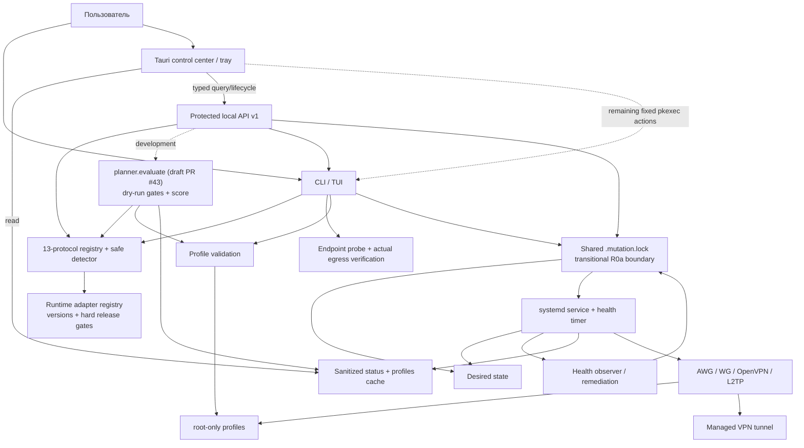
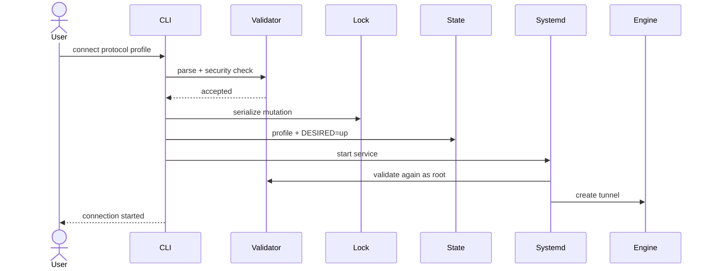
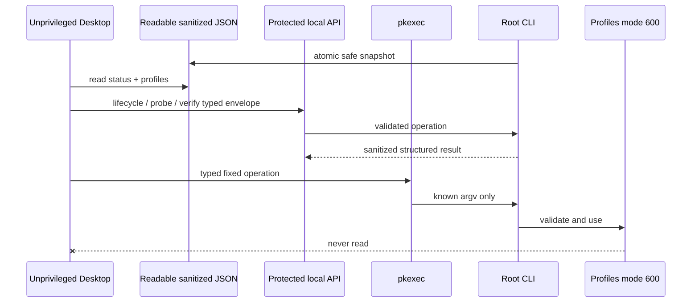

# Архитектура

Полная версия: [docs/ARCHITECTURE.ru.md](https://github.com/mazurovn/mazzy-vpn/blob/main/docs/ARCHITECTURE.ru.md).

Эта страница описывает действующую архитектуру CLI/TUI и Desktop 0.3.
Целевая архитектура самостоятельного Desktop 1.0, общий core/API и правила
синхронизации интерфейсов описаны на странице
[[Desktop Full Application Plan]].

Текущая непубликованная ветка сводит API, direct CLI, timeout/boot recovery,
health remediation и service-policy команды на один runtime lock. Отдельный
`.health.lock` только исключает параллельные health ticks. Это закрывает
split-lock гонку, но не заменяет целевой `mazzy-vpnd`: прямые root paths ещё
существуют, а общий action journal и доказательство rollback ресурсов не
реализованы.
Точный переходный контракт: [R0a mutation single-flight](https://github.com/mazurovn/mazzy-vpn/blob/main/docs/R0_MUTATION_SINGLE_FLIGHT.ru.md).

## Подключение

## Desktop boundary

## Граница planner и релиза

Опубликованный stable `v1.3.2` ещё не содержит `planner.evaluate`: операция
остаётся в draft [PR #43](https://github.com/mazurovn/mazzy-vpn/pull/43).
Реализованный срез только читает локальное состояние и возвращает
`dry_run: true`. Eligibility вычисляет backend из runtime, profile validation,
прав secret storage, platform support и готовности защищённого rollback storage.
Последний gate не доказывает rollback конкретного backend. Caller evidence
влияет только на score; данные health старше 900 секунд обнуляются. Абсолютный
monotonic deadline передаётся внутрь OpenVPN parser.

## Обратное управление агентами — текущая ветка и target

Отдельный `agent-control/v1` сейчас является draft catalog/schema contract, а
не работающим E2EE protocol. Непубликованный Desktop только обнаруживает
кандидаты Codex/Claude и показывает catalog diagnostics; renderer/Tauri IPC не
предоставляет lifecycle authority и не запускает найденные binaries.
Reverse WSS/H2 является целевым durable baseline, LAN и iroh — accelerators.
`mazzy-agentd`, relay, E2EE runtime, Web и Telegram не реализованы. Подробности:
[[Agent Control Gateway]] и [целевая архитектура](https://github.com/mazurovn/mazzy-vpn/blob/main/docs/TARGET_ARCHITECTURE_2026-08-02.ru.md).

---

# Architecture

Full document: [docs/ARCHITECTURE.en.md](https://github.com/mazurovn/mazzy-vpn/blob/main/docs/ARCHITECTURE.en.md).

The CLI/TUI is the current validated control plane. systemd owns tunnel
lifetime and an independent health timer. Desktop reads sanitized caches and
uses the protected local API for lifecycle, whole-list probes and actual egress
verification. Remaining typed operations map to fixed CLI argument arrays
through `pkexec`. The bundle contains compatible installer/engine resources.
Operational profiles remain root-only and never cross the Desktop boundary.
The unreleased R0a slice serializes API, direct CLI, recovery, health
remediation and service-policy mutations through one runtime lock. It is a
transitional safety boundary, not the target `mazzy-vpnd` owner or proof of
route/DNS/firewall rollback.
The shared 13-entry registry and redacted detector are described in
[[Protocol Orchestration]]. Catalog presence never bypasses platform/backend,
profile-validation or rollback gates. LLM clients receive opaque IDs and
evidence only; credentials and generated shell commands are outside the API.

Stable `v1.3.2` does not yet ship `planner.evaluate`; the read-only operation is
still draft [PR #43](https://github.com/mazurovn/mazzy-vpn/pull/43). Backend-owned
eligibility gates cannot be overridden by caller evidence. The rollback gate
proves protected journal/snapshot storage only, stale observed health scores
zero, and candidate parsing shares one absolute monotonic deadline. History,
authorized execution/failover and Desktop/mobile integration remain in issue
#39.
Censorship/workload fit is backend-derived from the versioned catalog and
workload; agents supply only bounded observed health evidence.

Reverse control of remote agents is a separate plane with a draft registry,
future E2EE-envelope declarations and channel policy. See [[Agent Control Gateway]] and the detailed
[target architecture](https://github.com/mazurovn/mazzy-vpn/blob/main/docs/TARGET_ARCHITECTURE_2026-08-02.ru.md). iroh, libp2p,
WebRTC and reverse WSS are agent transports rather than VPN protocols. The
unreleased Desktop branch has diagnostics-only Codex/Claude discovery and no
provider lifecycle/pairing authority. No Mazzy transport is therefore marked
ready; the target keeps Desktop/Web/Telegram ingress,
transport and Codex app-server/Claude/ACP provider adapters as separate trust
boundaries.
