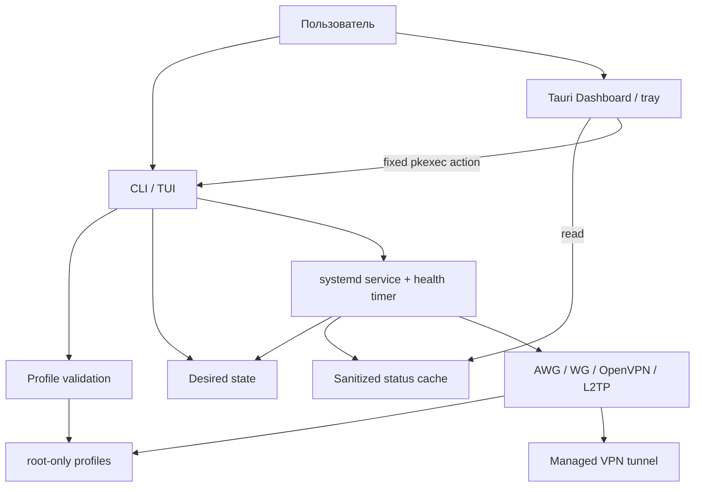
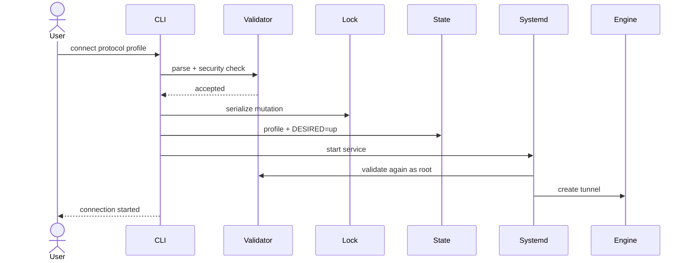
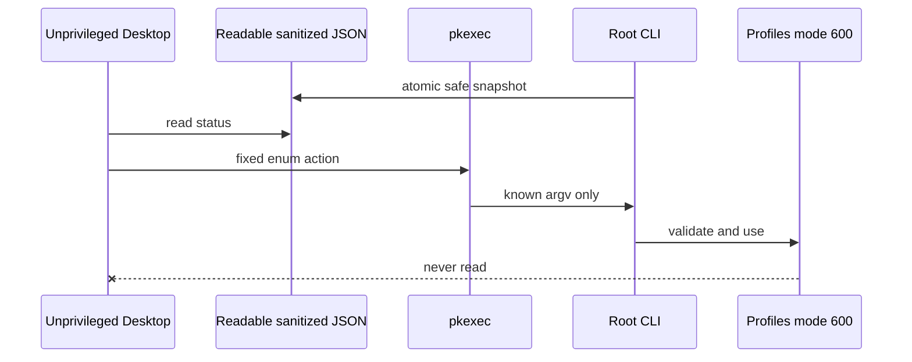

# Архитектура

Полная версия: [docs/ARCHITECTURE.ru.md](https://github.com/mazurovn/mazzy-vpn/blob/main/docs/ARCHITECTURE.ru.md).

## Подключение

## Desktop boundary

---

# Architecture

Full document: [docs/ARCHITECTURE.en.md](https://github.com/mazurovn/mazzy-vpn/blob/main/docs/ARCHITECTURE.en.md).

The CLI/TUI is the validated control plane. systemd owns tunnel lifetime and an
independent health timer. Desktop reads a sanitized cache and maps enum actions
to fixed CLI argument arrays through `pkexec`. Operational profiles remain
root-only and never cross the Desktop boundary.
