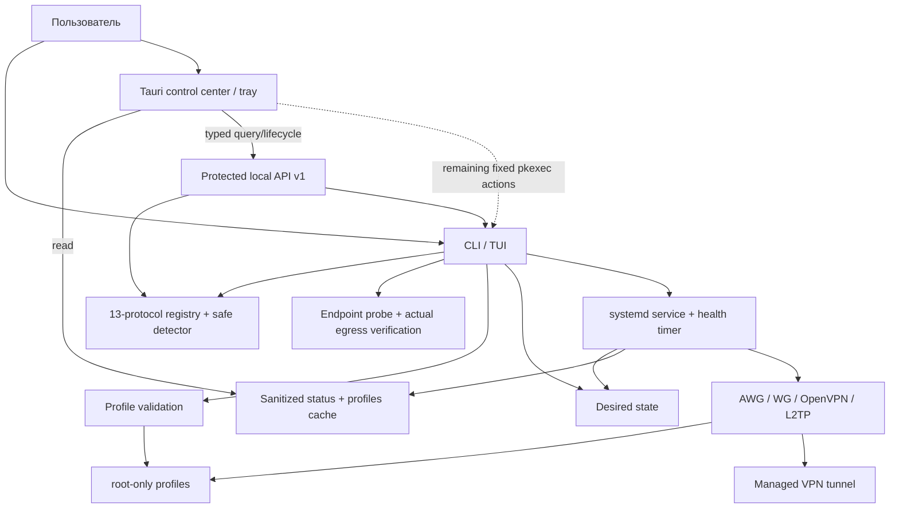
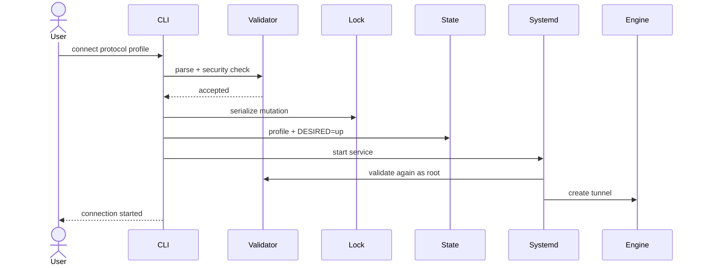
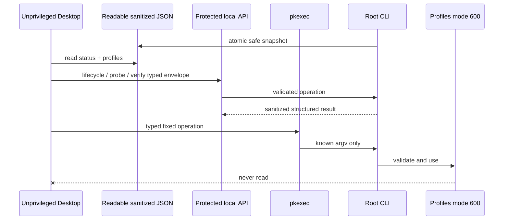

# Архитектура

Полная версия: [docs/ARCHITECTURE.ru.md](https://github.com/mazurovn/mazzy-vpn/blob/main/docs/ARCHITECTURE.ru.md).

Эта страница описывает действующую архитектуру CLI/TUI и Desktop 0.3.
Целевая архитектура самостоятельного Desktop 1.0, общий core/API и правила
синхронизации интерфейсов описаны на странице
[[Desktop Full Application Plan]].

## Подключение

## Desktop boundary

---

# Architecture

Full document: [docs/ARCHITECTURE.en.md](https://github.com/mazurovn/mazzy-vpn/blob/main/docs/ARCHITECTURE.en.md).

The CLI/TUI is the current validated control plane. systemd owns tunnel
lifetime and an independent health timer. Desktop reads sanitized caches and
uses the protected local API for lifecycle, whole-list probes and actual egress
verification. Remaining typed operations map to fixed CLI argument arrays
through `pkexec`. The bundle contains compatible installer/engine resources.
Operational profiles remain root-only and never cross the Desktop boundary.
The shared 13-entry registry and redacted detector are described in
[[Protocol Orchestration]]. Catalog presence never bypasses platform/backend,
profile-validation or rollback gates. LLM clients receive opaque IDs and
evidence only; credentials and generated shell commands are outside the API.
