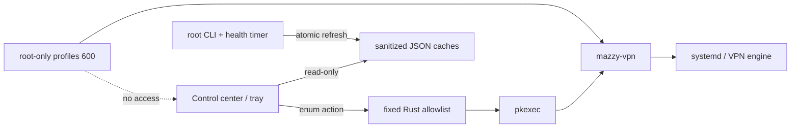

# Desktop control center и tray

[Русский Dashboard](https://raw.githubusercontent.com/mazurovn/mazzy-vpn/main/docs/images/dashboard-ru.png) ·
[Deutsch](https://raw.githubusercontent.com/mazurovn/mazzy-vpn/main/docs/images/dashboard-de.png) ·
[中文](https://raw.githubusercontent.com/mazurovn/mazzy-vpn/main/docs/images/dashboard-zh.png) ·
[日本語](https://raw.githubusercontent.com/mazurovn/mazzy-vpn/main/docs/images/dashboard-ja.png) ·
[한국어](https://raw.githubusercontent.com/mazurovn/mazzy-vpn/main/docs/images/dashboard-ko.png)

> Desktop 0.4 — Linux control center preview со встроенным installer engine.
> Он сам проверяет зависимости и может установить/восстановить engine после
> явного разрешения. Versioned service API и остальные release gates описаны в
> [плане Desktop 1.0](Desktop-Full-Application-Plan). Preview 0.4 является текущим release source;
> issue #31 закрыт проверенным `glib` backport и чистыми release checks.

Интерфейс объединяет:

- состояние сервиса, туннеля и интернета;
- выбранную локацию/default-профиль;
- протокол, интерфейс и возраст handshake;
- публичный VPN IP с локальной кнопкой скрытия;
- autostart, health monitor и fallback;
- количество профилей по протоколам;
- фактические egress/location, DNS и IPv6 signals с optional speed sample;
- массовый ping локаций, сортировку по latency/status/name и connect fastest;
- импорт файлов/папок, поиск и действия с профилями;
- validate, probe, transactional test, test-all и emergency;
- полный вывод Doctor, self-test и bounded logs;
- состояние зависимостей, установка/repair engine и настройки services;
- автоматическая проверка подписанных обновлений с обязательным диалогом;
- кликабельные события текущего UI-сеанса с полным detail и возраст данных.

Dashboard и общие элементы поддерживают `ru`, `en`, `de`, `zh`, `ja`, `ko`;
новые экраны полностью переведены на русский и английский, остальные языки
временно используют английский fallback. Выбор остаётся в WebView storage.

## Обновления Desktop

Автопроверка при запуске включена по умолчанию и отключается в Settings. Она
обращается только к фиксированному `desktop-updater` feed в GitHub Releases.
Найденная версия всегда показывается в modal dialog; фоновой установки нет.
AppImage после отдельного подтверждения загружает и проверяет Tauri-подписанный
artifact. DEB/RPM открывает versioned release и не заменяет package-managed
binary. Windows/macOS используют тот же updater trust key, но остаются
UI-preview без native VPN backend, Authenticode и Apple notarization.
Технический trust boundary и rollback limits описаны в
[`docs/DESKTOP_UPDATES.md`](https://github.com/mazurovn/mazzy-vpn/blob/main/docs/DESKTOP_UPDATES.md).

## Tray menu

- **Open Dashboard / Profiles / Diagnostics / Settings / About**
- **Quick Connect**
- **Reconnect**
- **Disconnect**
- **Verify VPN Egress**
- **Ping All Locations**
- **Refresh Status**
- **Self-diagnostics**
- **Enable / Disable Auto-connect**
- **Enable / Disable Health Monitor**
- **Quit Mazzy VPN**

Закрытие окна скрывает его в tray. На Linux контекстное меню надёжнее открывать
правой кнопкой: событие обычного клика зависит от desktop environment.
Повторный запуск приложения фокусирует уже работающий single instance и не
создаёт дополнительный WebView или tray.

## Журнал Desktop

Собственный ограниченный журнал находится на Linux в
`~/.local/share/com.mazurovn.mazzy-vpn/logs/Mazzy VPN Desktop.log`. На macOS
используется `~/Library/Logs/com.mazurovn.mazzy-vpn/`, на Windows —
`%LOCALAPPDATA%\com.mazurovn.mazzy-vpn\logs\`. Ротация `KeepOne` ограничивает
файл одним мегабайтом. Записываются только lifecycle, вид операции, успех/ошибка
и агрегаты проверок; профили, endpoint, credentials, конфигурации и IP не
попадают в этот журнал.

## Модель привилегий

UI читает только очищенные `/run/mazzy-vpn/status.json` и `profiles.json`.
Rust принимает оба cache только после строгой типовой и cross-field проверки.
Активный профиль сопоставляется по opaque `profile_id` или точному basename;
одинаковые display names не создают ложную активную строку.
Lifecycle-операции и read-only `tests.probe`/`tests.verify-egress` используют
защищённый local API, когда он доступен. Остальные изменяющие состояние
действия Rust backend передаёт `pkexec` как типизированные фиксированные
аргументы. Compatibility processes имеют bounded output/deadline, но timeout
мутации всё ещё может дать indeterminate state — это gate до native service.
Произвольной команды, shell interpolation или поля для ввода команды нет.

---

# Desktop control center and tray

> Desktop 0.4 is a Linux control-center preview with a bundled engine installer.
> It checks dependencies and can install or repair the engine after explicit
> authorization. The versioned service API and remaining gates are tracked in the
> [Desktop 1.0 plan](Desktop-Full-Application-Plan#english). Issue #31 is
> closed with a verified `glib` backport and clean release checks; preview 0.4
> is the current release source and is published only with its tag and Release page.

The control center combines:

- service, tunnel and Internet state;
- selected location/default profile;
- protocol, interface and handshake age;
- public VPN IP with a local privacy toggle;
- autostart, health monitor and fallback;
- per-protocol profile counts;
- actual egress/location, DNS and IPv6 signals with an optional speed sample;
- whole-list ping, latency/status/name sorting and connect-fastest;
- file/folder import, profile search and actions;
- validate, probe, transactional test, test-all and emergency;
- retained Doctor, self-test and bounded log output;
- dependency readiness, engine install/repair and service settings;
- automatic signed-update checks with a mandatory consent dialog;
- clickable current-session events with retained detail and data age.

The dashboard and shared elements support `ru`, `en`, `de`, `zh`, `ja` and
`ko`. New screens are complete in Russian and English and temporarily use an
English fallback for the other languages.

Startup update checks are enabled by default and can be disabled in Settings.
They contact only the fixed `desktop-updater` GitHub Releases feed. A discovered
version is always shown in a modal and is never installed in the background.
AppImage verifies the Tauri updater signature after separate consent; DEB/RPM
opens the versioned release rather than bypassing package ownership.

The tray opens Dashboard, Profiles, Diagnostics, Settings or About and provides
Quick Connect, Reconnect, Disconnect, Verify VPN Egress, Ping All Locations,
Refresh, Self-diagnostics, explicit Auto-connect/Health Monitor on/off actions
and Quit. Closing the window hides it to the tray.
Launching the application again focuses the existing single instance rather
than creating another WebView or tray icon.
On Linux, use the right-click context menu because plain-click events depend on
the desktop environment.

The UI reads only sanitized runtime data. Lifecycle and read-only
`tests.probe`/`tests.verify-egress` use the protected local API when available.
Other typed state-changing operations map to fixed arguments through `pkexec`.
Compatibility processes have bounded output/deadlines, but a timed-out
mutation can remain indeterminate until it is reconciled; migration to a native
service remains a release gate. There is no arbitrary command, shell
interpolation or command-input field.
