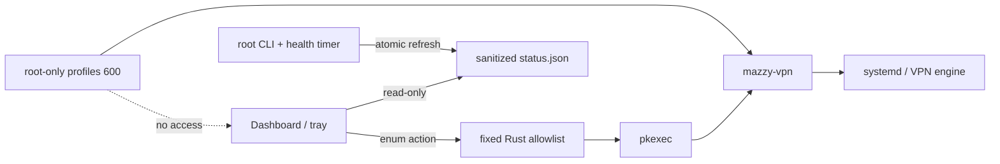

# Desktop Dashboard и tray

> Desktop 0.1 — функциональный Linux dashboard/companion, а не самостоятельный
> VPN-клиент. Сейчас ему требуется установленный CLI engine. Целевая модель,
> полный импорт/выбор профилей, режимы, services и installer описаны в
> [плане Desktop 1.0](Desktop-Full-Application-Plan).

Dashboard объединяет:

- состояние сервиса, туннеля и интернета;
- выбранную локацию/default-профиль;
- протокол, интерфейс и возраст handshake;
- публичный VPN IP с локальной кнопкой скрытия;
- autostart, health monitor и fallback;
- количество профилей по протоколам;
- события текущего UI-сеанса и возраст данных.

Интерфейс поддерживает `ru`, `en`, `de`, `zh`, `ja`, `ko`. Выбор остаётся в
локальном WebView storage.

## Tray menu

- **Open Dashboard**
- **Quick Connect**
- **Reconnect**
- **Disconnect**
- **Refresh Status**
- **Self-diagnostics**
- **Quit Mazzy VPN**

Закрытие окна скрывает его в tray. На Linux контекстное меню надёжнее открывать
правой кнопкой: событие обычного клика зависит от desktop environment.

## Модель привилегий

UI читает только `/run/mazzy-vpn/status.json`. Для изменяющих состояние действий
Rust backend передаёт `pkexec` фиксированные аргументы. Произвольной команды,
shell interpolation или поля для ввода команды нет.

---

# Desktop Dashboard and tray

> Desktop 0.1 is a functional Linux dashboard/companion, not a standalone VPN
> client. It currently requires the installed CLI engine. The bundled core,
> complete profile/mode/service UI and installer are tracked in the
> [Desktop 1.0 plan](Desktop-Full-Application-Plan#english).

Dashboard combines:

- service, tunnel and Internet state;
- selected location/default profile;
- protocol, interface and handshake age;
- public VPN IP with a local privacy toggle;
- autostart, health monitor and fallback;
- per-protocol profile counts;
- current UI-session events and data age.

The UI supports `ru`, `en`, `de`, `zh`, `ja` and `ko`. The selection remains
in local WebView storage.

The tray provides Open Dashboard, Quick Connect, Reconnect, Disconnect, Refresh
Status, Self-diagnostics and Quit. Closing the window hides it to the tray.
On Linux, use the right-click context menu because plain-click events depend on
the desktop environment.

The UI reads only `/run/mazzy-vpn/status.json`. State-changing enum actions map
to fixed arguments passed through `pkexec`. There is no arbitrary command,
shell interpolation or command-input field.
