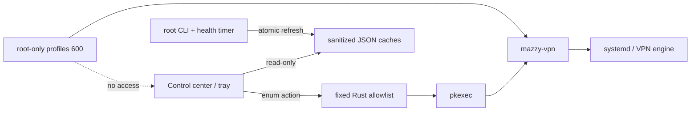

# Desktop control center и tray

> Desktop 0.2 — Linux control center preview со встроенным installer engine.
> Он сам проверяет зависимости и может установить/восстановить engine после
> явного разрешения. Versioned service API и остальные release gates описаны в
> [плане Desktop 1.0](Desktop-Full-Application-Plan).

Интерфейс объединяет:

- состояние сервиса, туннеля и интернета;
- выбранную локацию/default-профиль;
- протокол, интерфейс и возраст handshake;
- публичный VPN IP с локальной кнопкой скрытия;
- autostart, health monitor и fallback;
- количество профилей по протоколам;
- импорт файлов/папок, поиск и действия с профилями;
- validate, probe, transactional test, test-all и emergency;
- полный вывод Doctor, self-test и bounded logs;
- состояние зависимостей, установка/repair engine и настройки services;
- события текущего UI-сеанса и возраст данных.

Dashboard и общие элементы поддерживают `ru`, `en`, `de`, `zh`, `ja`, `ko`;
новые экраны полностью переведены на русский и английский, остальные языки
временно используют английский fallback. Выбор остаётся в WebView storage.

## Tray menu

- **Open Dashboard**
- **Quick Connect**
- **Reconnect**
- **Disconnect**
- **Refresh Status**
- **Self-diagnostics**
- **Quit Mazzy VPN**

Закрытие окна скрывает его в tray. На Linux контекстное меню надёжнее открывать
правой кнопкой: событие обычного клика зависит от desktop environment.

## Модель привилегий

UI читает только очищенные `/run/mazzy-vpn/status.json` и `profiles.json`.
Для изменяющих состояние действий Rust backend передаёт `pkexec`
типизированные фиксированные аргументы. Произвольной команды, shell
interpolation или поля для ввода команды нет.

---

# Desktop control center and tray

> Desktop 0.2 is a Linux control-center preview with a bundled engine installer.
> It checks dependencies and can install or repair the engine after explicit
> authorization. The versioned service API and remaining gates are tracked in the
> [Desktop 1.0 plan](Desktop-Full-Application-Plan#english).

The control center combines:

- service, tunnel and Internet state;
- selected location/default profile;
- protocol, interface and handshake age;
- public VPN IP with a local privacy toggle;
- autostart, health monitor and fallback;
- per-protocol profile counts;
- file/folder import, profile search and actions;
- validate, probe, transactional test, test-all and emergency;
- retained Doctor, self-test and bounded log output;
- dependency readiness, engine install/repair and service settings;
- current UI-session events and data age.

The dashboard and shared elements support `ru`, `en`, `de`, `zh`, `ja` and
`ko`. New screens are complete in Russian and English and temporarily use an
English fallback for the other languages.

The tray provides Open Dashboard, Quick Connect, Reconnect, Disconnect, Refresh
Status, Self-diagnostics and Quit. Closing the window hides it to the tray.
On Linux, use the right-click context menu because plain-click events depend on
the desktop environment.

The UI reads only the sanitized `/run/mazzy-vpn/status.json` and
`profiles.json` caches. Typed state-changing operations map to fixed arguments
passed through `pkexec`. There is no arbitrary command, shell interpolation or
command-input field.
