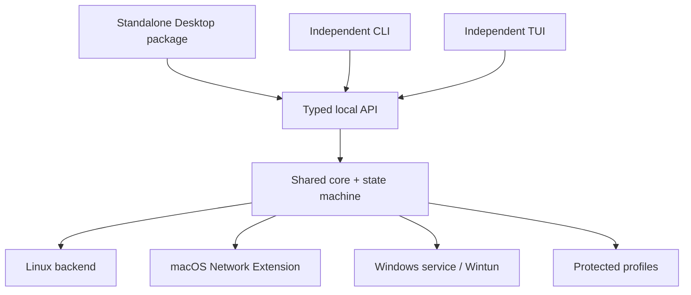
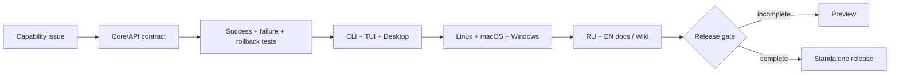

# Самостоятельный Desktop 1.0

Полный двуязычный план:
[DESKTOP_ROADMAP.ru.md](https://github.com/mazurovn/mazzy-vpn/blob/main/docs/DESKTOP_ROADMAP.ru.md).
Матрица паритета:
[FEATURE_PARITY.md](https://github.com/mazurovn/mazzy-vpn/blob/main/docs/FEATURE_PARITY.md).

## Главное решение

Desktop 1.0 включает общий core, системную службу, bootstrap зависимостей,
recovery и embedded CLI. Пользователь не устанавливает CLI отдельно. При этом
CLI и TUI остаются самостоятельными клиентами того же versioned API: VPN-логика
не копируется во frontend.

## Обязательные функции

- import file/folder/drag-and-drop с предварительным распознаванием;
- библиотека профилей, локации, поиск, default и quick connect;
- normal/test/emergency/fallback modes;
- validate/probe/test/test-all и transactional rollback;
- service/autostart/health/recovery control;
- doctor и только явно подтверждённые исправления;
- dependency detection/install/migrate/repair/uninstall;
- одинаковые события, ошибки и состояние в CLI, TUI и Desktop.

Текущий Desktop 0.1 остаётся preview, пока gate `desktop-linux-1.0`,
`desktop-macos-1.0` или `desktop-windows-1.0` не вычисляется как ready.

## Контроль синхронизации

Каждый pull request указывает capability ID из `docs/capabilities.json`. CI
проверяет полноту surfaces, существование test/doc references и запрещает
объявить release gate готовым при статусе `partial` или `planned`.

---

# Standalone Desktop 1.0

Full plan:
[DESKTOP_ROADMAP.en.md](https://github.com/mazurovn/mazzy-vpn/blob/main/docs/DESKTOP_ROADMAP.en.md).

Desktop 1.0 bundles the shared core, system service, dependency bootstrap,
recovery and an embedded CLI. The user does not install the CLI separately.
Independently installable CLI and TUI clients use the same versioned local API,
so VPN logic is never duplicated in a frontend.

Required parity includes profile/folder import, locations and default profile,
all operating modes, validation/probes/transactional tests, service controls,
doctor/fixes, dependency installation/migration and platform-native backends.

`docs/capabilities.json` is the machine-validated source of truth. Every change
updates applicable clients, tests, Russian/English docs and the release gate.
Desktop 0.1 remains preview until the appropriate standalone 1.0 gate passes.
