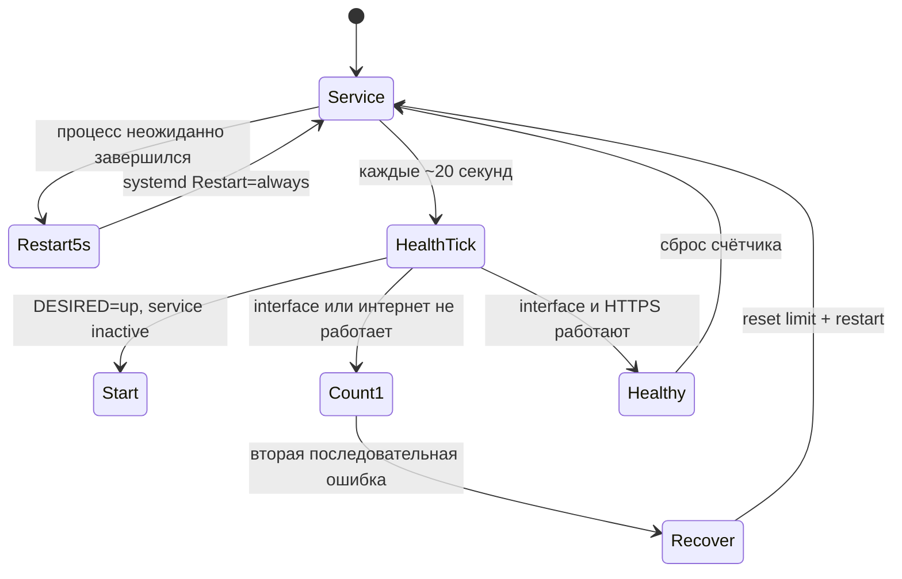

# Диагностика и автовосстановление

## Ручные проверки

```bash
sudo mazzy-vpn diagnose
sudo mazzy-vpn doctor
mazzy-vpn validate all
mazzy-vpn probe all --timeout 3 --jobs 4
mazzy-vpn verify
mazzy-vpn self-test --offline
mazzy-vpn protocols diagnose --json
```

`diagnose` проверяет default route, DNS, выбранный профиль, systemd service,
VPN-интерфейс, handshake и публичный IP через интерфейс. `doctor` проверяет
зависимости, protocol runtimes, units, профили и сохранённое состояние.
`verify` сравнивает interface-bound/default IPv4, два geo provider именно для
этого IP, DNS route и IPv6 signal. Один provider, расхождение country/IP,
другой default egress или неподтверждённый DNS дают warning, а не ложный OK.
Ожидаемая страна берётся только из явного `mazzy-country-code` в профиле:
название и город не угадываются; без metadata итог остаётся `warning`.
`--speed` отдельно запускает явный bounded 5-МБ sample.

## Два уровня восстановления



Ручной `disconnect` сначала сохраняет `DESIRED=down`, поэтому watchdog не
подключает VPN обратно против воли пользователя. Если `DESIRED=up`, но сервис
остановлен, он запускается уже на ближайшей health-проверке.

Транзакционные `test` и `test-all` имеют основной rollback, независимый
systemd timeout guard и boot recovery. Предыдущее managed или внешнее
соединение восстанавливается после ошибки, timeout, сигнала или перезагрузки.

## Recovery-required marker

Если API не смог доказать хотя бы восстановление сохранённого intent/service,
он создаёт root-only `/var/lib/vpnctl/api-recovery-required.json` и блокирует
следующие API mutations. Сначала оператор должен проверить фактическое
состояние, исправить сеть и сохранить диагностические данные:

```bash
sudo mazzy-vpn doctor
sudo mazzy-vpn diagnose
mazzy-vpn verify
sudo journalctl -u vpnctl.service -n 200 --no-pager
```

Только после ручной проверки текущего tunnel, routes и DNS marker снимается
явным административным подтверждением под общим mutation lock:

```bash
sudo mazzy-vpn _api-clear-recovery --acknowledge-current-state
```

Эта команда не ремонтирует соединение и не доказывает отсутствие leak; она
только подтверждает, что оператор принимает уже проверенное текущее состояние.

---

<a id="english"></a>

# Diagnostics and automatic recovery

```bash
sudo mazzy-vpn diagnose
sudo mazzy-vpn doctor
mazzy-vpn validate all
mazzy-vpn probe all --timeout 3 --jobs 4
mazzy-vpn verify
mazzy-vpn self-test --offline
mazzy-vpn protocols diagnose --json
```

`diagnose` checks the default route, DNS, selected profile, systemd service,
VPN interface, handshake and public IP through the interface. `doctor` checks
dependencies, protocol runtimes, units, profiles and saved state.
`verify` compares interface-bound/default IPv4, two location providers for
that exact IP, configured DNS routing and an IPv6 signal. One provider,
country/IP disagreement, a different default egress or unconfirmed DNS
produces a warning instead of a false OK. `--speed` separately starts an
explicit bounded five-megabyte sample. Expected country is read only from
explicit `mazzy-country-code` profile metadata; it is never guessed from a
profile name or city label, and missing metadata keeps the verdict at
`warning`.

There are two recovery layers. systemd uses `Restart=always` with a five-second
delay. Independently, a roughly 20-second health timer immediately starts an
inactive desired service and restarts a locally present but unusable tunnel
after two consecutive confirmed failures.

Manual disconnect writes `DESIRED=down` first, so the watchdog never undoes an
intentional disconnect. Transactional tests add a main rollback, independent
systemd timeout guard and boot recovery.

If `/var/lib/vpnctl/api-recovery-required.json` exists, further API mutations
are blocked. Run `sudo mazzy-vpn doctor`, `sudo mazzy-vpn diagnose`,
`mazzy-vpn verify` and inspect the service journal first. Only after manually
checking the tunnel, routes and DNS, acknowledge the current state with:

```bash
sudo mazzy-vpn _api-clear-recovery --acknowledge-current-state
```

This acknowledgment does not repair the network or prove leak freedom; it only
clears the fail-closed marker under the shared mutation lock.
