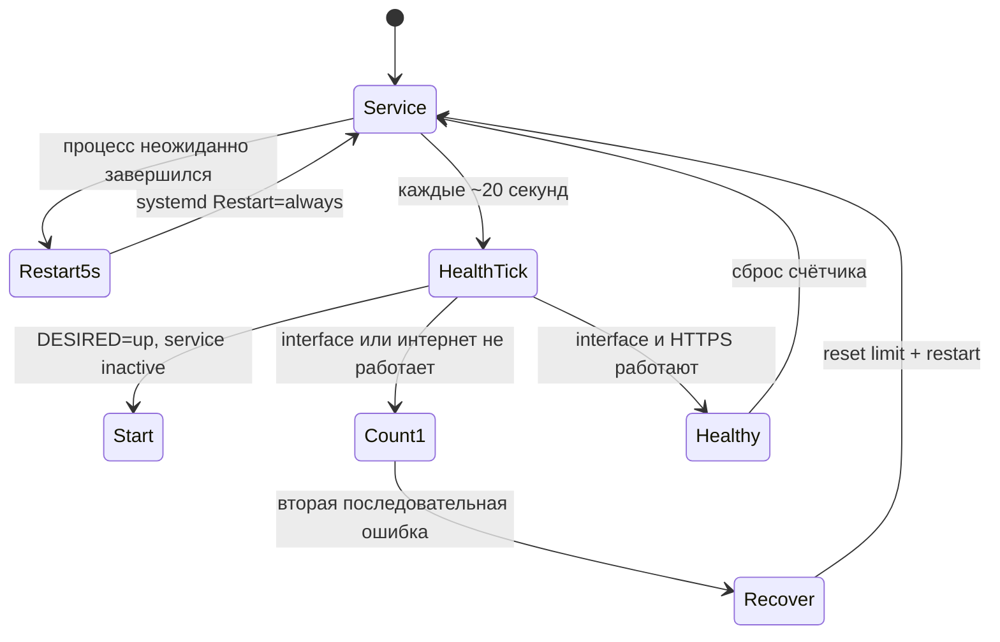

# Диагностика и автовосстановление

## Ручные проверки

```bash
sudo mazzy-vpn diagnose
sudo mazzy-vpn doctor
mazzy-vpn validate all
mazzy-vpn probe all --timeout 3
mazzy-vpn self-test --offline
```

`diagnose` проверяет default route, DNS, выбранный профиль, systemd service,
VPN-интерфейс, handshake и публичный IP через интерфейс. `doctor` проверяет
зависимости, protocol runtimes, units, профили и сохранённое состояние.

## Два уровня восстановления



Ручной `disconnect` сначала сохраняет `DESIRED=down`, поэтому watchdog не
подключает VPN обратно против воли пользователя. Если `DESIRED=up`, но сервис
остановлен, он запускается уже на ближайшей health-проверке.

Транзакционные `test` и `test-all` имеют основной rollback, независимый
systemd timeout guard и boot recovery. Предыдущее managed или внешнее
соединение восстанавливается после ошибки, timeout, сигнала или перезагрузки.

---

<a id="english"></a>

# Diagnostics and automatic recovery

```bash
sudo mazzy-vpn diagnose
sudo mazzy-vpn doctor
mazzy-vpn validate all
mazzy-vpn probe all --timeout 3
mazzy-vpn self-test --offline
```

`diagnose` checks the default route, DNS, selected profile, systemd service,
VPN interface, handshake and public IP through the interface. `doctor` checks
dependencies, protocol runtimes, units, profiles and saved state.

There are two recovery layers. systemd uses `Restart=always` with a five-second
delay. Independently, a roughly 20-second health timer immediately starts an
inactive desired service and restarts a locally present but unusable tunnel
after two consecutive confirmed failures.

Manual disconnect writes `DESIRED=down` first, so the watchdog never undoes an
intentional disconnect. Transactional tests add a main rollback, independent
systemd timeout guard and boot recovery.
